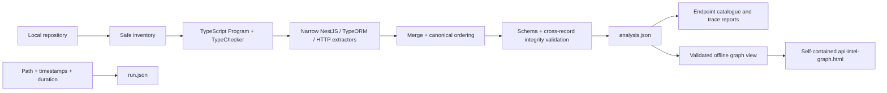

# Backend API Intelligence Engine

Backend API Intelligence Engine (`api-intel`) statically traces supported NestJS REST
endpoints through constructor-injected services to TypeORM table reads/writes and
outbound HTTP interactions, including cold Nest `HttpService` activation state, plus
configured exact/wildcard local `EventEmitter2` fan-out and separately classified
causal database effects, and bounded BullMQ queue/worker candidate paths whose
database effects remain distributed-conditional. Its
output is deterministic, runtime-validated, evidence-backed, and explicit about gaps.

The MVP analyzes source; it does not start the target application, import target
modules, connect to its database, or invoke its package scripts.

## What it produces

A scan writes:

```text
.api-intel/
  analysis.json       canonical, deterministic facts and evidence
  run.json            volatile path, timing, and execution metadata
  endpoints.md        endpoint catalogue
  contracts.md        declared contracts, columns, and bounded request-to-column influence
  traces/              one evidence-backed Markdown trace per unique endpoint
```

For a supported endpoint, a trace can connect:

```text
POST /users
  -> UsersController.create
  -> UsersService.create
  -> WRITE user
```

Each edge cites repository-relative source coordinates. See the current v3
[endpoint catalogue](docs/examples/current/endpoints.md),
[read trace](docs/examples/current/read-trace.md),
[write trace](docs/examples/current/write-trace.md), and
[canonical analysis summary](docs/examples/current/analysis-summary.json).

## Requirements

- Node.js 22.13 or newer, but earlier than Node.js 25
- pnpm 11.19.0 (the version declared by `packageManager`)
- A local TypeScript repository with its dependencies installed so
  the TypeScript checker can resolve NestJS and TypeORM declarations

Installing target dependencies is a separate setup action. When appropriate, use the
target's lockfile and disable lifecycle scripts; the analyzer itself never installs or
runs target code.

## Install and build

```powershell
corepack enable
pnpm install --frozen-lockfile
pnpm run build
node dist/cli/index.js --help
```

This repository is a private portfolio package and is not published to a registry.
Run the built CLI with `node dist/cli/index.js`, or use `pnpm run cli --` while working
in the repository.

## Usage

```powershell
# Analyze source and create canonical JSON plus Markdown reports.
pnpm run cli -- scan C:\code\my-nest-app

# Discover a strict api-intel.config.json at the repository root and generate its graph recipe.
pnpm run cli -- scan C:\code\my-nest-app --open

# Select or disable project configuration explicitly; CLI values take precedence.
pnpm run cli -- scan C:\code\my-nest-app --config C:\configs\api-intel.config.json --max-call-depth 2
pnpm run cli -- scan C:\code\my-nest-app --no-config

# Use an explicit project or separate output directory.
pnpm run cli -- scan C:\code\my-nest-app --tsconfig tsconfig.app.json --output C:\temp\api-intel-output

# Opt in to static PostgreSQL 18 raw-SQL table extraction.
pnpm run cli -- scan C:\code\my-nest-app --raw-sql-dialect postgresql-18

# Scan once and publish only the explicitly selected derived reports in one bundle.
pnpm run cli -- scan C:\code\my-nest-app --with-graph --with-controls --with-openapi C:\code\my-nest-app\openapi.json --open

# Read canonical JSON without rescanning source.
pnpm run cli -- endpoints C:\code\my-nest-app\.api-intel\analysis.json
pnpm run cli -- trace C:\code\my-nest-app\.api-intel\analysis.json --method GET --path /users/:id

# Recreate Markdown reports from canonical JSON alone.
pnpm run cli -- report C:\code\my-nest-app\.api-intel\analysis.json --output C:\temp\regenerated

# Compare two explicitly supplied canonical snapshots. Changes still exit successfully.
pnpm run cli -- diff C:\reports\before\analysis.json C:\reports\after\analysis.json --output C:\reports\comparison
pnpm run cli -- diff C:\reports\before\analysis.json C:\reports\after\analysis.json --format markdown --output C:\reports\comparison

# Explain potential endpoint impact using only those two snapshots.
pnpm run cli -- impact C:\reports\before\analysis.json C:\reports\after\analysis.json --output C:\reports\impact
pnpm run cli -- impact C:\reports\before\analysis.json C:\reports\after\analysis.json --format markdown --output C:\reports\impact

# Evaluate typed architecture policies; a baseline enables diagnostic comparison.
pnpm run cli -- check C:\reports\after\analysis.json --config C:\code\api-intel.config.json
pnpm run cli -- check C:\reports\after\analysis.json --baseline C:\reports\before\analysis.json --config C:\code\api-intel.config.json --format markdown

# Enrich an OpenAPI 3.x JSON copy using exact canonical endpoint matches.
pnpm run cli -- openapi C:\reports\after\analysis.json --document C:\code\openapi.json --path-prefix /api --output C:\reports\exports

# Export strict control-evidence JSON plus formula-safe CSV.
pnpm run cli -- controls C:\reports\after\analysis.json --policy-results C:\reports\policy-results.json --output C:\reports\exports

# Generate one self-contained offline interactive evidence graph.
pnpm run cli -- graph C:\reports\after\analysis.json --policy-results C:\reports\policy-results.json --impact-results C:\reports\impact.json --output C:\reports\graph

# Or compute the impact overlay directly from a canonical baseline without writing impact.json.
pnpm run cli -- graph C:\reports\after\analysis.json --baseline C:\reports\before\analysis.json --output C:\reports\graph

# Explicitly preview a successfully published graph in the default browser.
pnpm run cli -- graph C:\reports\after\analysis.json --output C:\reports\graph --open
```

`scan`, `endpoints`, and `report` accept exact `--controller` and normalized exact
`--route` view filters. A scan filter changes only reports, never canonical facts.
`scan --max-call-depth <1-3>` changes the bounded direct-call trace depth and records
the effective value in output metadata. Analysis settings can also come from a
version-2 or version-3 project configuration. Version 3 additionally records bounded
interaction-traversal limits; those settings do not enable extractors by themselves.
The supported eager/Nest `HttpService` outbound-HTTP, configured in-process event,
and BullMQ queue extractors run on every current scan.
Raw-SQL analysis remains disabled unless the CLI or configuration explicitly selects
`postgresql-18`.

Full scan/report command behavior is in [CLI and Reporting Workflow](docs/cli-workflow.md).
The [Documentation Index](docs/README.md) distinguishes current references and feature
guides from historical validation, benchmark, spike, and ADR records.
Strict version-3 defaults, exact-root discovery, path rules, precedence, and version-1/
version-2 compatibility are in [Project Configuration](docs/project-configuration.md).
Coherent selected-report publication and the final completeness manifest are in
[Selected Scan Bundles](docs/selected-scan-bundles.md).
Semantic matching, ambiguity, and diff output are documented in
[Analysis Comparison](docs/comparison.md).
Evidence-backed before/after reachability and its interpretation boundary are in
[Potential Change-Impact Analysis](docs/impact-analysis.md).
Static module metadata, global registrations, and effective guard state are in
[Nest Modules and Effective Guard State](docs/nest-modules-and-global-guards.md).
Typed configuration, four-state outcomes, built-in rules, and policy exit behavior are
in the [Architecture Policy Engine](docs/policy-engine.md).
Bounded fluent/variable flows, table provenance, terminals, and uncertainty are in
[TypeORM QueryBuilder Analysis](docs/typeorm-query-builder.md).
Opt-in PostgreSQL 18 parsing, supported raw-query APIs, direction rules, limits, and
fail-closed behavior are in [Static PostgreSQL Raw-SQL Analysis](docs/postgresql-raw-sql.md).
Declared Nest request/response shapes, DTO fields, TypeORM columns, and their runtime
honesty boundary are in
[Declared Request/Response Contracts and Entity Columns](docs/declared-contracts-and-columns.md).
Bounded same-method request origins, explicit TypeORM write sinks, influence states,
and uncertainty are in
[Intraprocedural Request-to-Column Provenance](docs/request-to-column-provenance.md).
Checker-resolved argument-to-parameter propagation, canonical call paths, resource
limits, and fail-closed boundaries are in
[Inter-Method Request-to-Column Provenance](docs/inter-method-request-provenance.md).
Checker-proven Axios/fetch/Undici calls, target normalization, redaction, and
uncertainty are in [Eager Outbound HTTP Analysis](docs/outbound-http.md).
Nest `HttpService` cold Observable activation and symbolic configuration/environment
targets are in [Nest HttpService and Symbolic Targets](docs/nest-http-service.md).
Exact and configured-wildcard EventEmitter2 identities, registration states, fan-out,
causal tracing, and limits are in
[In-Process Event Analysis](docs/in-process-events.md).
Checker-proven `@InjectQueue()` producers, queue-wide `WorkerHost` candidates, and
distributed-conditional effects are in
[BullMQ Queue Interactions](docs/bullmq-interactions.md).
The frozen, non-executable queue and microservice topology contracts that gate future
distributed extractors are documented in
[Distributed Gate D0](docs/distributed-gate-d0.md).
Exact OpenAPI enrichment and deterministic control-evidence JSON/CSV are documented in
[Structured Evidence Exports](docs/structured-evidence-exports.md).
Endpoint-centered interaction, offline/CSP protections, limits, and accessible fallback
are documented in the [Offline Interactive Graph Report](docs/offline-graph-report.md).

## Result states

| State                 | Meaning                                                                                            |
| --------------------- | -------------------------------------------------------------------------------------------------- |
| `completed`           | Analysis finished with no diagnosed gaps; a genuinely empty repository can be complete.            |
| `completed_with_gaps` | Trustworthy facts are available alongside explicit unsupported, unresolved, or unknown behavior.   |
| `failed`              | A fatal condition or error left no trustworthy facts; canonical output is not published by `scan`. |
| `canceled`            | The operation was interrupted and is distinct from failure.                                        |

Canonical input failures, endpoint misses, ambiguous selectors, analysis failure, and
cancellation have distinct exit codes documented in the CLI workflow.

## Supported MVP patterns

- Standard `@nestjs/common` controllers and REST decorators: `Get`, `Post`, `Put`,
  `Patch`, `Delete`, `Options`, `Head`, and `All`.
- Literal, no-substitution template, omitted, and one-hop immutable `const` paths.
- Checker-resolved class constructor injection and direct calls through bound members.
- Direct controller- and method-level `UseGuards` class arguments.
- Bounded `Module`/`Global` metadata, module imports/providers/exports/controllers,
  `APP_GUARD` `useClass`/`useExisting`, and direct bootstrap `useGlobalGuards` calls.
- TypeORM `Entity` table mappings and constructor-bound `InjectRepository` members.
- Repository reads: `find`, `findOne`, `findOneBy`, `findBy`, `count`, and `exists`.
- Repository writes: `save`, `insert`, `update`, `delete`, and `remove`.
- Bounded TypeORM QueryBuilder select/insert/update/delete chains from proven
  `Repository<T>`, `DataSource`, or `EntityManager` roots, including explicit entity
  joins and static table literals.
- Opt-in static PostgreSQL 18 table access from checker-proven TypeORM
  `Repository<T>`, `DataSource`, `EntityManager`, and `QueryRunner` `.query()`/`.sql`
  calls, including CTEs and nested DML reads.
- Checker-proven Nest `Body`, `Param`, and `Query` declarations; referenced
  class/interface fields; declared or checker-derived handler return shapes; and
  explicit manual-response/unknown states.
- Checker-proven TypeORM `Column`, `PrimaryColumn`, and `PrimaryGeneratedColumn`
  metadata, including bounded literal options and in-repository inheritance.
- Bounded request-to-column influence for decorated request fields reaching explicit
  repository insert/update or executed QueryBuilder values/set object properties.
- Bounded argument-position propagation of those origins through checker-resolved
  direct injected-member calls within the configured call depth.
- Checker-proven eager Axios, supported `axios.create()` instances, unshadowed global
  `fetch`, and Undici `fetch`, with sanitized exact/template/dynamic targets.
- Checker-proven injected Nest `HttpService` and `axiosRef`, with explicit
  eager/proven/cold/unknown activation and bounded symbolic ConfigService/environment
  targets.
- Checker-proven `EventEmitterModule.forRoot()`, injected `EventEmitter2`
  `emit`/`emitAsync`, exact producer identities, and `@OnEvent()` exact or configured
  `*`/`**` string patterns with default/custom delimiters, registration-aware local
  fan-out, and bounded causal table effects.
- Checker-proven `@nestjs/bullmq` `@InjectQueue()` plus `bullmq` `Queue.add()`
  producers, package-proven `@Processor()`/`WorkerHost.process()` queue-wide
  candidates, producer-only and consumer-only topologies, and
  distributed-conditional worker table effects.
- Exact OpenAPI 3.0/3.1 JSON enrichment plus strict match/evidence sidecars, and
  one-row-per-endpoint control-evidence JSON/CSV exports.
- A self-contained offline Cytoscape.js report over validated endpoint scenes, with
  evidence, uncertainty, optional policy/impact overlays, filters, and a table fallback.

The authoritative [supported-pattern table](docs/supported-patterns.md) maps every
canonical rule to executable tests.

## Deliberate limitations

- One TypeScript project/`tsconfig`; multiple statically visible HTTP bootstrap roots
  are inventoried, while monorepo-wide application graphs remain outside the MVP.
- Dynamic route expressions and custom route wrappers are not resolved.
- String/symbol DI tokens, factories, dynamic modules, and arbitrary provider graphs
  are not followed; bounded direct class/module metadata is modeled separately.
- Only direct injected-member calls are traced, to a maximum depth of three.
- QueryBuilder callbacks, CTEs, relation-string target inference, escaped/reassigned
  builders, dynamic/non-PostgreSQL raw SQL, and custom repositories are not persistence
  facts. Arbitrary HTTP clients/wrappers, general RxJS data flow, dynamic/manual
  EventEmitter listeners, legacy Bull, custom/raw BullMQ APIs, exact job-branch
  slicing, Nest microservices, and raw broker SDKs are outside the current interaction
  extractor. The frozen Distributed Gate D0 corpus remains the semantic contract for
  the supported BullMQ subset and the future microservice subset.
- Request-field influence is modeled as `direct`, `derived`, or `unknown` within one
  method and through bounded direct injected-member calls. Polymorphic/interface
  dispatch, callbacks, spread/rest mappings, pipes, runtime validation/transformation,
  serialized HTTP schemas, raw-SQL parameters, and exact stored values are not.
- Guard views distinguish direct declarations, proven global declarations, complete
  supported scans with no proven guard, and unknown global completeness. No supported
  declaration still never means `public`, and a guard is not automatically an
  authentication guard.
- `save()` and `remove()` prove table writes but not exact written columns.
- OpenAPI YAML/2.0, fuzzy route or operation-ID matching, PDF certification reports,
  and input-document overwrite are deliberately unsupported.
- The offline graph does not host or rescan a repository, request remote assets, infer
  missing edges, render an unbounded whole-repository graph, or create source links.
- The default table fallback is the frozen lowercase class name; project naming
  strategies are not inferred.

Unsupported or uncertain constructs either create diagnostics/non-resolved assertions
or remain explicitly documented outside the P0 fact graph. The tool never guesses a
relationship from a similar name.

## Architecture and trust boundary



Reports are derived views and cannot add facts to `analysis.json`. Canonical data has
no absolute checkout path or timing; volatile run metadata is separate. Publication
stages complete files, commits canonical analysis last, and preserves unrelated files.
See [Architecture](docs/architecture.md) and the [Canonical Model Contract](docs/model-contract.md).

The current scanner publishes strict analysis schema `3.0.0` and advertises
`outbound_http`, `in_process_event`, and `job_queue` as supported and enabled. Phase
30 originally introduced empty
interaction collections; frozen v1/v2 documents remain readable, and missing
historical interaction families normalize to unavailable rather than empty proof.

## Reproducible official-sample demo

The Phase 11 demonstration pins the official NestJS `05-sql-typeorm` sample at commit
`841df8792fbedd1fbba12c9fe999aee307a155c7`. It installs dependencies with lifecycle
scripts disabled, builds this analyzer, scans without starting the sample, prints its
catalogue, traces one read and one write, and regenerates reports:

```powershell
pnpm run demo
```

The script leaves its sparse checkout and artifacts under ignored `.demo/` paths. The
manual evidence audit and exact commands are recorded in
[Real Repository Validation](docs/real-repository-validation.md).

## Development gates

```powershell
pnpm run test
pnpm run lint
pnpm run typecheck
pnpm run build
pnpm run format:check
```

MVP version: `0.1.0`.
