# Backend API Intelligence - Interaction and Async Boundary Expansion Implementation Plan

## Purpose and authority

This is the execution plan for adding outbound-service and event-driven flow
intelligence after the completed core, post-MVP, and workflow-improvement phases.
It begins at **Phase 30**. Phase 29 remains closed and is not a dependency.

This document is written for the implementing agent. Use it to select the next
bounded unit of work, preserve the project's evidence-first semantics, and prevent
distributed-system claims from being inferred from repository-local syntax.

The preceding plans remain authoritative for their completed phases:

- `backend_api_intelligence_implementation_plan.md` records Phases 0-11;
- `backend_api_intelligence_post_mvp_implementation_plan.md` records Phases 12-24;
- `backend_api_intelligence_workflow_improvements_implementation_plan.md` records
  Phases 25-29.

This plan does not add source-control commands, repository-provider integrations,
remote repository discovery, CI bots, or any other Git-facing feature.

Planning baseline: 2026-08-25.

---

# 1. Executive decision

Adopt the proposed milestone structure with a mandatory fixture-and-contract gate
between local interactions and broker-mediated interactions:

1. **Interaction Milestone I1 - bounded local interactions:** Phases 30-34 add the
   v3 substrate, outbound HTTP, Nest `HttpService`, and in-process EventEmitter
   flows, then carry those facts through traces, impact, exports, and the offline
   graph.
2. **Distributed Gate D0 - corpus and contract curation:** freeze representative
   co-located, producer-only, and consumer-only queue/microservice cases before
   implementing a distributed extractor.
3. **Interaction Milestone I2 - distributed interactions:** gated Phases 35-37 add
   BullMQ-first queues, bounded Nest microservice facts, and distributed reporting
   and policy hardening.
4. **Documentation Gate D1 - current-contract reconciliation:** after Phase 35 and
   before Phase 36, reconcile the public documentation with the current writer,
   command, schema, and capability contracts; classify older material explicitly as
   historical; and add executable drift checks.

The plan deliberately does not call Milestone I1 "v0.3". The prior expansion plan
already used v0.3-v0.5 as release-train names, while `package.json` still has its own
version policy. A package or product release number must be chosen separately when
the milestone is ready.

## 1.1 Strategy ideas adopted

- Implement a canonical interaction substrate before any interaction extractor.
- Reserve the four currently accepted interaction kinds in analysis v3:
  `outbound_http`, `in_process_event`, `job_queue`, and
  `microservice_message`.
- Make generic consumers operate on shared interaction and handler relationships,
  with kind-specific labels and target summaries isolated behind projections.
- Stabilize HTTP and in-process event behavior before beginning queues or
  microservices.
- Require co-located, producer-only, and consumer-only fixtures for every
  broker-mediated feature.
- Define positive, negative, ambiguous, unsupported, and must-not-infer contracts
  before distributed extractor code.
- Treat local queue and microservice handlers only as in-repository delivery
  candidates.
- Keep synchronous database effects, local interaction effects, and distributed
  conditional effects separate in every derived consumer.

## 1.2 Strategy ideas modified

### Extensibility means bounded migration, not zero future work

The v3 schema will reserve all four kinds and provide a stable common envelope, but
this cannot guarantee "zero schema redesign." Phase 35 or 36 fixture work may reveal
that a kind-specific field is missing. Adding a kind also requires renderer labels,
semantic keys, integrity rules, tests, and possibly a compatible schema revision.

The actual target is:

- no redesign of the shared interaction/handler topology;
- no change to the meaning of already-published fields;
- additive kind-specific evolution where necessary;
- explicit reader compatibility rather than silent schema drift.

### In-process events are bounded-local, not absolutely closed-world

An EventEmitter2 listener executes in the same Node.js process when it is registered,
but repository-local `@OnEvent()` syntax alone does not prove that its provider is
reachable from a bootstrapped root module. Multiple application roots, excluded
files, dynamic modules, conditional providers, and manual listener registration can
all make listener availability uncertain.

Therefore local event handler links use one of these registration states:

- `proven_registered`: the supported root-module and provider path is proven;
- `declared_candidate`: a supported handler declaration matches, but activation is
  not proven;
- `registration_unknown`: a relevant registration boundary is dynamic or
  unsupported.

### Missing consumers are states, not assumptions

Do not emit `EXTERNAL_CONSUMER_ASSUMED`: the analyzer must not assume a remote
consumer exists. Do not treat `job_queue_unhandled_in_repository` as an error.
Instead, record `localHandlerState: none_proven` and a boundary such as
`external_or_unobserved`.

Similarly, a locally emitted EventEmitter event with no proven listener is not
automatically dead code. Expose `none_proven` in reports. A future opt-in policy may
require a local listener when an organization wants that convention.

### Pre-extractor expectations are semantic manifests

Distributed Gate D0 writes source cases and semantic expectations before extractor
code. It does not hand-author a complete canonical `analysis.json` whose IDs,
evidence ranges, and schema representation have not yet been implemented. Canonical
goldens are frozen after implementation satisfies the semantic manifest.

## 1.3 Explicitly excluded from this plan

- Raw broker SDK extraction (`kafkajs`, `amqplib`, AWS SQS SDK, and equivalents).
- Generic third-party SDK or arbitrary wrapper inference.
- Automatic discovery, cloning, or scanning of another repository.
- Runtime broker connections, HTTP requests, Nest bootstrap, target imports, or
  target code execution.
- Claims that a broker accepted, delivered, retried, ordered, or acknowledged a
  message.
- Exactly-once, at-least-once, or runtime failure-semantics inference.
- Payload-field-to-handler-field or payload-field-to-database-column lineage.
- BullMQ `FlowProducer`, sandboxed processor files, repeatable-job scheduling, and
  queue lifecycle listener semantics in the first queue release.
- gRPC method-schema analysis, protobuf interpretation, Kafka partition/key routing,
  RMQ exchange/binding simulation, or transport-specific broker topology.
- A generic interaction policy DSL.

---

# 2. Complexity and feasibility

| Work area                                    |  Complexity | Feasibility | Decision                        |
| -------------------------------------------- | ----------: | ----------: | ------------------------------- |
| Analysis v3 interaction substrate            |        High |        High | Required first                  |
| Direct Axios/fetch/Undici                    |      Medium |        High | Adopt                           |
| Nest `HttpService` and RxJS activation       | Medium-high |        High | Adopt                           |
| Symbolic `ConfigService`/environment targets | Medium-high |        High | Adopt                           |
| Exact EventEmitter string/symbol matching    | Medium-high |        High | Adopt                           |
| EventEmitter wildcard/fan-out traversal      |        High |        High | Adopt after exact matching      |
| BullMQ producer and `WorkerHost` inventory   |        High |      Medium | Gated, BullMQ-first             |
| Legacy Bull `@Process()` compatibility       |      Medium |      Medium | Optional sub-scope after BullMQ |
| Nest microservice boundary inventory         |   Very high |      Medium | Gated and deliberately bounded  |
| Generic SDK/cross-repository inference       |   Very high |         Low | Excluded                        |

Estimated focused effort:

- Phases 30-34: approximately **175-300 hours**;
- Distributed Gate D0: approximately **24-48 hours**;
- Phase 35: approximately **56-96 hours**;
- Phase 36: approximately **64-112 hours** after D0 narrowed the supported surface;
- Phase 37: approximately **32-56 hours**.

The estimates include schema/integrity work, negative fixtures, deterministic
goldens, all current derived consumers, CLI documentation, and regression
verification. They are planning ranges, not release promises.

---

# 3. Semantic architecture

## 3.1 Canonical versus derived ownership

Canonical analysis owns only source-derived declarations, interactions, handler
registrations, relationships, evidence, and explicit uncertainty. Comparison,
impact, endpoint/handler traces, policies, OpenAPI enrichment, control matrices, and
the HTML graph remain independently versioned derived artifacts.

No derived consumer may:

- discover a new interaction by rescanning TypeScript;
- upgrade a candidate delivery to proven delivery;
- infer a remote consumer from the absence of a local one;
- merge conditional database effects into synchronous endpoint effects;
- read environment values or secrets to improve a symbolic target.

## 3.2 Analysis schema v3

Keep v1 and v2 immutable. Add an analysis v3 reader/writer and pure normalization
path. Existing v1/v2 goldens must remain byte-identical and readable.

Phase 30 reserves these interaction kinds:

```ts
export const INTERACTION_KINDS = [
  'outbound_http',
  'in_process_event',
  'job_queue',
  'microservice_message',
] as const;
```

Reserving a kind means only that v3 can represent it. It does not mean the current
extractor supports it. Capability documentation and run metadata must list the
actually enabled extractors separately.

## 3.3 Canonical record families

### `ApplicationRecord`

Represents a statically observed application root or an explicitly unknown root:

- root module reference when proven;
- application kind: `http`, `microservice`, or `hybrid`;
- bootstrap evidence;
- statically known transport identity where applicable;
- root-resolution completeness.

Phase 30 creates the contract. Phase 33 uses it for EventEmitter provider
registration. Phase 36 extends extraction of microservice bootstrap facts.

### `InteractionRecord`

Stable common envelope:

- interaction ID and kind;
- source method;
- direction: outbound from the method;
- operation/mode;
- typed normalized target;
- activation state;
- boundary state;
- evidence references;
- optional application context;
- extractor rule version.

Kind-specific target shapes:

- `outbound_http`: HTTP method plus exact, templated, symbolic, or dynamic URL
  descriptor;
- `in_process_event`: string name, symbol declaration identity, or dynamic target;
- `job_queue`: technology, queue identity, and job identity;
- `microservice_message`: interaction mode, normalized pattern, client token, and
  statically known transport identity.

Do not store headers, cookies, authorization values, request/response bodies, URL
userinfo, URL fragments, or query values. Query-key names may be retained when
statically recoverable and useful.

### `InteractionHandlerRecord`

Represents a supported local handler declaration independently from any producer:

- handler kind;
- implementing method;
- normalized accepted target/pattern;
- application/module context when known;
- registration state;
- evidence and rule version.

Keeping handlers independent is required for consumer-only repositories and for
reporting locally declared handlers that have no local producer.

## 3.4 Canonical predicates

Add v3 predicates with fixed subject/target kinds:

```text
APPLICATION_USES_ROOT_MODULE       Application -> Module
METHOD_INITIATES_INTERACTION       Method -> Interaction
INTERACTION_MATCHES_LOCAL_HANDLER  Interaction -> InteractionHandler
HANDLER_IMPLEMENTED_BY             InteractionHandler -> Method
```

`INTERACTION_MATCHES_LOCAL_HANDLER` means that supported static identity and scope
rules found a local candidate. It does not mean that a broker delivered the message
or that the handler ran.

One-to-many fan-out is represented by multiple assertions. It is not `ambiguous`
when all matched listeners are valid candidates. `ambiguous` remains reserved for
cases where the analyzer cannot uniquely resolve a source identity or binding.

## 3.5 State vocabularies

Keep orthogonal concepts separate.

Activation state:

- `eager`: constructing the supported call initiates work, as with direct Axios or
  `fetch`;
- `proven_activated`: a cold producer is subscribed/awaited through a supported
  activation path;
- `constructed_cold`: the supported cold producer is created but no activation is
  proven;
- `unknown`: a relevant construct exists across an unsupported activation boundary.

Boundary state:

- `in_process`;
- `broker_or_worker_boundary`;
- `external_or_unobserved`;
- `unknown`.

Handler state:

- `proven_registered`;
- `declared_candidate`;
- `none_proven`;
- `registration_unknown`.

Dispatch timing, where supported:

- `synchronous`;
- `asynchronous`;
- `unknown`.

EventEmitter2's default listener execution and `emitAsync`/async listener behavior
must not be flattened into a single "async" claim merely because the causal edge is
event-driven.

## 3.6 Typed targets and normalization

HTTP target resolution classes:

- `exact`: complete static URL;
- `template`: stable literal segments with named/positional placeholders;
- `symbolic`: configuration token or environment key plus static relative path;
- `dynamic`: target cannot be bounded honestly.

Examples:

```text
https://payments.example/v1/charges
${config:PAYMENT_URL}/v1/charges/{id}
${env:AUTH_SERVICE_URL}/token
dynamic
```

Never read `.env` or process environment values. Preserve the token name, not its
runtime value.

Event targets resolve only from supported strings, string constants/enums, symbol
declarations, or arrays accepted by `@OnEvent()`. Payload classes are not event
identities.

Microservice object patterns use deterministic canonical JSON with recursively
sorted object keys. Dynamic properties, spreads, functions, class instances, or
non-serializable values remain unsupported/dynamic rather than guessed.

## 3.7 Trace topology

Extend traversal state rather than replacing the existing graph traversal:

```text
(methodId, interactionHop, synchronousDepthSinceBoundary, causalClass)
```

Configuration adds bounded fact-affecting settings:

- `maxInteractionHops`, default 2;
- `maxFanOutPerInteraction`;
- `maxInteractionTraceStates`;
- existing `maxCallDepth`, applied within each synchronous method segment.

Crossing from an interaction to a handler increments interaction hops and resets the
synchronous method depth. Cycle detection is path-aware and backed by a global state
limit. Repeated paths may be deduplicated for work, but the output must preserve all
distinct evidence-backed causal relationships required by the trace contract.

Terminal database effects carry causal classification:

- `synchronous`;
- `local_interaction_synchronous`;
- `local_interaction_asynchronous`;
- `distributed_conditional`.

Existing `dbReads`/`dbWrites` and mutation policy semantics stay synchronous unless
a consumer explicitly opts into another causal class.

## 3.8 Inbound-only entry points

An endpoint-centered view cannot represent a worker or microservice repository that
contains only consumers. Add a derived handler trace rooted at an
`InteractionHandlerRecord`. It follows the implementing method and existing method/
table assertions without inventing an HTTP endpoint.

The graph report may later add handler-rooted scenes in a new derived schema version.
Analysis v3 must not create synthetic HTTP endpoints for workers or message handlers.

---

# 4. Honesty and result-state rules

| Situation                                                  | Canonical/report behavior                    | Gap?                                                                |
| ---------------------------------------------------------- | -------------------------------------------- | ------------------------------------------------------------------- |
| Static direct HTTP target                                  | Record exact/template interaction            | No                                                                  |
| Symbolic config/env target                                 | Record symbolic target                       | No                                                                  |
| Dynamic HTTP target                                        | Record dynamic/unknown state plus diagnostic | Yes                                                                 |
| Cold `HttpService` Observable not proven active            | Record `constructed_cold`                    | No, unless activation analysis itself is incomplete                 |
| Exact local event handler proven registered                | Link handler and trace effect                | No                                                                  |
| Matching local event declaration with unknown registration | Link as declared candidate                   | Yes only when registration crosses a diagnosed unsupported boundary |
| No local EventEmitter listener proven                      | `none_proven`; optional policy finding       | No by default                                                       |
| Queue producer with no local worker                        | `external_or_unobserved`, `none_proven`      | No                                                                  |
| Queue worker with no local producer                        | Handler inventory and inbound handler trace  | No                                                                  |
| Microservice producer with no local handler                | External/unobserved boundary                 | No                                                                  |
| Dynamic event/queue/pattern identity                       | Dynamic state plus diagnostic                | Yes                                                                 |
| Fan-out or cycle limit reached                             | Preserve partial facts plus limit diagnostic | Yes                                                                 |

Do not add `resolved_remote` to assertion statuses. Resolution certainty, handler
registration, activation, and system boundary remain separate dimensions.

Candidate diagnostic vocabulary, finalized during the owning phase:

- `INTERACTION_RECEIVER_AMBIGUOUS`;
- `INTERACTION_TARGET_DYNAMIC`;
- `INTERACTION_ACTIVATION_UNKNOWN`;
- `INTERACTION_TRACE_LIMIT_REACHED`;
- `INTERACTION_CYCLE_TRUNCATED`;
- `EVENT_EMITTER_CONFIGURATION_UNKNOWN`;
- `EVENT_HANDLER_REGISTRATION_UNKNOWN`;
- `QUEUE_JOB_FILTER_UNKNOWN`;
- `MICROSERVICE_TRANSPORT_UNKNOWN`;
- `HTTP_TARGET_DYNAMIC`;
- `HTTP_OBSERVABLE_ACTIVATION_UNKNOWN`.

Absence of a local handler is a modeled state, not a diagnostic by default.

---

# 5. Dependency order and release gates

```mermaid
flowchart LR
  P30["Phase 30: v3 substrate"] --> P31["Phase 31: eager HTTP"]
  P31 --> P32["Phase 32: HttpService + config"]
  P32 --> P33["Phase 33: exact local events"]
  P33 --> P34["Phase 34: wildcard, fan-out, consumers"]
  P34 --> I1["Milestone I1 acceptance"]
  I1 --> D0["Distributed Gate D0: fixtures + contracts"]
  D0 --> P35["Phase 35: BullMQ-first queues"]
  P35 --> D1["Documentation Gate D1: current-contract reconciliation"]
  D1 --> P36["Phase 36: Nest microservices"]
  P36 --> P37["Phase 37: distributed policy/report hardening"]
```



Phases 35-37 are not automatically authorized by completion of Phase 34. Gate D0
must pass and the fixture evidence must still justify implementation. Phase 36 also
requires D1 so its design begins from accurate current contracts rather than stale
phase-era documentation.

---

# 6. Phase 30 - Analysis v3 interaction substrate

## Goal

Publish a strict, deterministic, backwards-readable canonical substrate that can
represent applications, interactions, and local handlers without implementing any
HTTP, event, queue, or microservice extractor yet.

## Estimated effort

32-56 focused hours.

## Work units

1. Record an ADR for analysis v3 compatibility and interaction semantics.
2. Add v3 model constants and the four reserved interaction kinds.
3. Add `ApplicationRecord`, `InteractionRecord`, and
   `InteractionHandlerRecord` with kind-specific strict target schemas.
4. Add stable ID kinds and semantic identity inputs for every new record family.
5. Add the four v3 predicates and exhaustive predicate endpoint validation.
6. Add runtime schema validation, global ID uniqueness, evidence closure, source/
   method/module references, status/object rules, and application-context integrity.
7. Extend canonical ordering and serialization without mutating extractor-owned
   arrays.
8. Add pure v1/v2/v3 normalization. Missing v3 facts in older inputs normalize to
   `unavailable`, not a proven empty collection.
9. Extend semantic comparison projections for the new records and predicates.
10. Add a generic interaction adjacency/index layer for trace and impact consumers;
    it must be empty and inert when a document contains no interactions.
11. Add project-config v3 support for interaction enablement and traversal limits.
    Existing v1/v2 config files retain their current meaning. Fact-affecting settings
    enter the analysis/run identity.
12. Add capability metadata that distinguishes schema-representable kinds from
    extractor-supported kinds.
13. Update model-contract, architecture, configuration, and supported-pattern docs.

## Deliberate boundaries

- No interaction extraction.
- No handler matching.
- No graph UI redesign beyond proving that generic empty interaction inputs are
  accepted safely.
- No inferred application root where bootstrap syntax is not statically supported.
- No fake queue or microservice record merely to exercise the reserved enum.

## Required tests

- Strict v3 positive and unknown-property rejection tests.
- V1 and v2 byte-golden regression tests.
- V1/v2/v3 reader and normalized-view tests.
- Stable ID collision, record-kind, reference, evidence, and predicate endpoint
  corruption tests.
- Deterministic ordering with reversed input discovery.
- Empty interaction arrays through catalogue, trace, impact, comparison, graph, and
  export consumers.
- Strict config v1/v2/v3 precedence and unknown-option tests.
- Capability metadata proves queue/microservice extraction is still disabled.

## Exit gate

- The normal scanner publishes validated v3 without changing any pre-v3 semantic
  conclusion.
- Existing v1/v2 fixtures remain readable and byte-stable.
- All generic consumers accept a valid v3 document containing no interactions.
- Reserved queue/microservice kinds do not appear as advertised supported features.

---

# 7. Phase 31 - Eager outbound HTTP core

## Goal

Extract high-confidence outbound HTTP interactions whose supported call expression
eagerly initiates a request.

## Estimated effort

32-48 focused hours.

## Supported initial surface

- TypeChecker-proven Axios default/named imports;
- supported Axios instances created by `axios.create()` with a statically bounded
  `baseURL`;
- `axios.get/post/put/patch/delete/head/options/request` and equivalent supported
  instance calls;
- global `fetch` only when it is not shadowed;
- TypeChecker-proven Undici `fetch` imports;
- static URLs and bounded template literals;
- literal request method configuration and the documented default method where
  applicable.

## Work units

1. Add an outbound HTTP extractor with package/symbol identity checks.
2. Resolve supported receiver bindings and reject same-named local clients.
3. Normalize HTTP methods and exact/template targets.
4. Join literal Axios `baseURL` and relative request paths without runtime URL
   evaluation.
5. Mark supported direct Axios/fetch calls `eager` regardless of whether the returned
   Promise is awaited; awaiting is not required for request initiation.
6. Record dynamic targets honestly and emit bounded diagnostics.
7. Add interaction evidence covering the call and target/method argument locations.
8. Integrate records into scan merge, result-state, ordering, comparison, catalogue,
   endpoint traces, basic Markdown, and generic graph projection.
9. Ensure headers, bodies, query values, and credentials never enter canonical
   output or snippets.

## Deliberate boundaries

- No `HttpService`; Phase 32 owns cold Observable semantics.
- No `got`, request libraries, arbitrary fluent HTTP clients, or third-party SDKs.
- No response-body lineage or status-code inference.
- No DNS resolution, network request, config-file execution, or environment lookup.
- No generic inference based only on a method named `get`, `post`, or `request`.

## Required fixtures and tests

- Default Axios, named import, instance `baseURL`, generic request config, fetch, and
  Undici positives.
- Static, relative, template, and fully dynamic targets.
- Shadowed `fetch`, local `axios` lookalike, unresolved instance, computed method,
  spread config, and dynamic `baseURL` negatives/unsupported cases.
- URL redaction tests for userinfo, fragments, query values, and secret-like headers.
- Endpoint reachability, uncalled helper, call-depth, comparison, graph, and
  deterministic scan tests.
- No-network and no-target-execution regression tests.

## Exit gate

Supported eager calls appear once with stable target classification and evidence;
unsupported lookalikes create no false interaction. Existing table/guard/provenance
facts remain unchanged.

---

# 8. Phase 32 - Nest HttpService and symbolic targets

## Goal

Add Nest `HttpService` and bounded symbolic URL construction while preserving the
difference between a cold Observable and an activated request.

## Estimated effort

32-56 focused hours.

## Supported initial surface

- TypeChecker-proven injected `HttpService` from `@nestjs/axios`;
- `HttpService` method calls and `axiosRef`;
- supported `firstValueFrom`, `lastValueFrom`, and direct `.subscribe()` activation;
- a returned controller Observable when the handler return path is statically
  proven;
- pipe chains that retain the underlying HTTP call without treating `.pipe()` itself
  as activation;
- `ConfigService.get()` token identity and `process.env.KEY` identity as symbolic
  values;
- concatenation/template composition of a symbolic base and static path.

## Work units

1. Resolve `HttpService` constructor injection and aliases using TypeChecker symbols.
2. Reuse Phase 31 target normalization for `axiosRef` and method calls.
3. Add bounded activation analysis for supported RxJS/Promise bridging patterns.
4. Distinguish `proven_activated`, `constructed_cold`, and `unknown`.
5. Add a symbolic string evaluator with expression-depth/value-count limits.
6. Preserve config/environment token names without reading their values.
7. Propagate symbolic bases through local readonly property initializers and simple
   constructor assignments only when identity and assignment are unique.
8. Add diagnostics for unknown activation or target construction boundaries.
9. Extend reports and graph details with activation and target-resolution labels.

## Deliberate boundaries

- `.pipe()` alone is not activation.
- No general RxJS data-flow engine, custom operator interpretation, callback
  execution, or subscription tracking across arbitrary containers.
- No reading `.env`, Nest runtime configuration, secret stores, or process values.
- No proof that a request completed, succeeded, or was consumed.

## Required tests

- Injected HttpService, aliases, `axiosRef`, all supported activation forms, and
  direct returned Observable positives.
- Pipe-only constructed-cold negative.
- Local lookalike service, ambiguous injection, callbacks, stored Observables,
  reassignment, and dynamic config cases.
- Symbolic `ConfigService`, `process.env`, template/concatenation, and redaction tests.
- Result-state, comparison, graph, trace, and deterministic output tests.

## Exit gate

The analyzer never describes a pipe-only cold Observable as an initiated request,
never reads configuration values, and still reports useful symbolic service targets.

---

# 9. Phase 33 - Exact in-process EventEmitter flows

## Goal

Extract exact, repository-local EventEmitter2 dispatches and handler declarations,
then build bounded causal branches to downstream database effects.

## Estimated effort

40-64 focused hours.

## Supported initial surface

- `EventEmitterModule.forRoot()` with statically recoverable basic configuration;
- TypeChecker-proven injected `EventEmitter2`;
- `emit()` and `emitAsync()`;
- string literals, unique string constants, string enum members, and symbol
  declaration identities;
- `@OnEvent()` string/symbol arguments and supported arrays;
- module-provider/root reachability when statically provable;
- one-to-many exact listener fan-out.

## Work units

1. Extract application roots needed to classify provider registration.
2. Extract EventEmitter module registration and completeness.
3. Extract handler declarations independently from producers.
4. Resolve supported event target expressions without using payload classes.
5. Match exact event identity to every eligible local handler.
6. Classify each handler as proven registered, declared candidate, or registration
   unknown.
7. Add handler-rooted and endpoint-rooted interaction traversal with separate hop and
   method-depth budgets.
8. Preserve dispatch timing where `emit`, `emitAsync`, or static listener options
   allow a bounded statement.
9. Carry local interaction terminal effects separately from synchronous endpoint
   terminal effects.
10. Add path-aware cycle detection and global trace-state enforcement.
11. Integrate semantic comparison keys, impact adjacency, Markdown traces, and basic
    graph interaction/handler nodes.

## Deliberate boundaries

- No class-constructor event identity.
- No payload-to-database lineage.
- No wildcard matching until Phase 34.
- No generic EventEmitter2 `.on()`/`.once()` data-flow or dynamically registered
  callbacks in the initial release.
- No claim that a declared provider is instantiated when root/module visibility is
  incomplete.

## Required fixtures and tests

- Exact string, constant, enum, symbol, array, and multiple-handler positives.
- `emit` versus `emitAsync` and supported async listener option cases.
- Same-named local decorator/emitter, payload class, dynamic name, unknown root,
  provider omitted from a module, unreachable module, and manual listener negatives.
- Event A -> handler -> Event A and longer cyclic cascades.
- Fan-out, interaction-hop, method-depth, and trace-state limits.
- One event reaching synchronous and local-interaction writes to the same table
  without merging the causal classes.

## Exit gate

Exact local fan-out is deterministic, cycles terminate, handler registration is not
overstated, and async/local causal database effects remain distinguishable from the
endpoint's synchronous effects.

---

# 10. Phase 34 - Wildcards, consumer integration, and Milestone I1 hardening

## Goal

Complete bounded-local interaction support by adding configured EventEmitter
wildcards and carrying HTTP/event facts through every supported derived consumer.

## Estimated effort

40-72 focused hours.

## Work units

1. Resolve `wildcard` and `delimiter` only from statically supported
   `EventEmitterModule.forRoot()` configuration.
2. Implement EventEmitter2-compatible `*` and `**` matching for supported static
   strings.
3. Match all listeners; do not rank wildcard matches as competing alternatives.
4. Apply deterministic fan-out selection and explicit omission/limit reporting.
5. Complete interaction-aware potential-impact traversal with a separate interaction
   hop budget.
6. Extend comparison output with stable interaction/handler semantic keys and
   add/remove/modify states.
7. Publish explicit trace fields for synchronous effects, local interaction effects,
   outbound interactions, and incompleteness.
8. Extend the offline graph with visually and textually distinct interaction,
   handler, external-target, and boundary nodes. Edge labels use `dispatches`,
   `matches local handler`, and `initiates`; never `delivered`.
9. Extend control-evidence JSON/CSV and OpenAPI vendor extensions with separate
   outbound and local-causal summaries.
10. Keep existing guard-on-write policy synchronous by default. Add interaction
    policy rules only if their evidence contract is independently defined and useful.
11. Benchmark scan, impact, and graph size/time against the integrated fixture.
12. Update README, CLI workflow, architecture, model contract, supported patterns,
    graph guide, impact guide, and export guide.

## Required tests

- Custom delimiter, `*`, `**`, multiple wildcard listeners, exact-plus-wildcard
  fan-out, wildcard disabled, dynamic config, and multiple-root cases.
- Byte-deterministic comparison, impact, controls, OpenAPI, Markdown, and HTML output.
- Graph CSP/no-network/injection/accessibility regression tests.
- Synchronous policy behavior unchanged in the presence of conditional/local
  interaction writes.
- Full built-CLI scan/report/impact/graph smoke tests using paths containing spaces.
- Performance baseline and explicit review thresholds.

## Milestone I1 exit gate

- Phases 30-34 pass all cross-phase verification.
- HTTP and in-process events have documented supported and unsupported pattern
  matrices.
- Every presentation is derived from validated v3 facts.
- No distributed interaction extractor exists yet.
- Existing endpoint security/write conclusions have not silently changed.
- A manual offline graph verification covers HTTP targets, local event fan-out,
  evidence inspection, uncertainty labels, keyboard navigation, and semantic table
  fallback.

Stop here for a release/adoption review. Do not proceed to Phase 35 merely because
the milestone passes technically.

---

# 11. Distributed Gate D0 - Fixture curation and contract freeze

## Goal

Establish realistic distributed topology cases and negative contracts before any
BullMQ or Nest microservice extractor code is written.

## Estimated effort

24-48 focused hours.

## Fixture format

Follow the existing frozen-corpus pattern:

- TypeScript source is stored as `.ts.txt` until a test harness copies it into a
  temporary TypeScript project.
- Pinned declaration stubs supply only the framework types needed by the compiler.
- Fixtures are never imported or executed.
- A semantic expectation manifest records case IDs, classification, must-emit,
  must-not-emit, boundary, activation, local-handler state, and expected causal
  class.
- Exact canonical JSON goldens are frozen only after the implemented extractor and
  integrity contracts exist.

Do not automatically clone or update official sample repositories. If an official
sample is used for additional validation, record its source URL, upstream revision,
license, local modifications, and copied-file inventory. Keep that validation corpus
separate from minimal deterministic unit fixtures.

## Mandatory topology matrix

Every distributed technology must cover:

| Topology          | Local producer | Local handler | Expected meaning                                                 |
| ----------------- | -------------- | ------------- | ---------------------------------------------------------------- |
| A - co-located    | Yes            | Yes           | In-repository delivery candidate; distributed conditional effect |
| B - producer-only | Yes            | No            | External/unobserved boundary; no local effect claimed            |
| C - consumer-only | No             | Yes           | Inbound handler inventory and handler-rooted conditional trace   |

## BullMQ fixture corpus

At minimum:

- `bullmq-colocated`: `POST /reports` adds `generate-pdf` to `reports`; a local
  `@Processor('reports')` `WorkerHost.process(job)` can write a table.
- `bullmq-producer-only`: local queue producer, no local processor; this is normal
  boundary behavior.
- `bullmq-consumer-only`: local `WorkerHost`, no local producer.
- `bullmq-job-filter`: `switch (job.name)` or equivalent supported/unsupported branch
  candidates.
- `bullmq-dynamic`: dynamic queue/job identity, ambiguous injection, unknown module
  registration, and duplicate processor candidates.
- `bull-legacy-process`: a separate optional compatibility fixture using
  `@nestjs/bull` and `@Process('job-name')`.

Do not combine BullMQ `WorkerHost` and legacy Bull `@Process()` in one fixture as if
they were interchangeable APIs.

## Microservice fixture corpus

At minimum:

- co-located, producer-only, and consumer-only cases;
- `ClientProxy.send()` activated and unactivated cold Observable cases;
- `ClientProxy.emit()` hot dispatch cases;
- controller `@MessagePattern()` and `@EventPattern()` handlers;
- scalar strings and canonicalizable object patterns;
- dynamic/spread/non-serializable pattern negatives;
- multiple matching handler candidates;
- `Transport.TCP`, `REDIS`, `RMQ`, and `KAFKA` declarations as inventory, without
  transport routing simulation;
- handler decorator on an unsupported provider location;
- multiple application roots and unknown client-to-application binding.

## Gate criteria

Gate D0 passes only when:

1. all three topologies exist for queues and microservices;
2. every positive case has a close negative or unsupported counterpart;
3. must-not-infer contracts cover remote delivery, missing consumer assumptions,
   branch over-attribution, and transport equivalence;
4. expected boundary and causal classifications are reviewed independently of the
   future extractor design;
5. fixture declarations are pinned and no target code executes;
6. the estimated value still justifies the remaining effort.

If these conditions do not pass, close or defer Phases 35-37 without changing the v3
local-interaction milestone.

---

# 12. Phase 35 - BullMQ-first queue interactions

## Status

Complete as of 2026-08-26. Milestone I1 and Distributed Gate D0 passed before work
began, and the bounded BullMQ implementation preserves the frozen D0 contracts.

## Goal

Extract bounded BullMQ queue/job producers and local worker candidates without
claiming broker delivery or job-specific database effects that the source does not
prove.

## Estimated effort

56-96 focused hours.

## Supported initial surface

- TypeChecker-proven `@InjectQueue()` bindings;
- BullMQ `Queue.add()` with bounded queue and job identities;
- `@Processor(queue)` classes extending `WorkerHost`;
- `process(job)` as the queue-level handler;
- `job.name` control flow is detected but remains queue-wide with an explicit
  informational diagnostic; and
- legacy Bull remains excluded pending a separate adoption decision.

## Work units

1. Activate the reserved `job_queue` target schema without changing its Phase 30
   field meanings.
2. Extract queue bindings, producer calls, processor declarations, and handler
   methods using package/symbol identity.
3. Match on queue identity first, then classify job filtering:
   `exact`, `queue_wide`, or `unknown`.
4. Treat a BullMQ `WorkerHost.process()` method as queue-wide unless bounded branch
   analysis proves a job-specific slice.
5. Emit distributed conditional causal paths to local candidate worker effects.
6. Inventory consumer-only handlers and publish handler-rooted traces.
7. Keep producer-only interactions as external/unobserved boundaries with no error.
8. Integrate comparison, impact, graph, exports, and diagnostics incrementally.
9. Evaluate the legacy Bull adapter separately; do not let it weaken BullMQ rules.

## Exit gate

- Every D0 BullMQ contract passes without weakening a must-not-emit case.
- Queue-wide workers do not attribute all database writes as exact job-specific
  effects.
- Producer-only and consumer-only repositories complete normally.
- No broker connection or target execution occurs.

---

# 12.1 Documentation Gate D1 - Current-contract reconciliation

## Status

Complete as of 2026-08-26. This gate changes documentation ownership and drift
verification; it does not activate `microservice_message` or alter Phase 35 semantics.

## Goal

Make the concise current documentation trustworthy before Phase 36 introduces
another distributed interaction kind, while preserving useful historical records
without presenting them as current instructions.

## Adopted structure

1. **Living references:** root/readme index, CLI workflow, architecture, model
   contract, project configuration, and supported-pattern table state the current
   writer and analyzer behavior.
2. **Operational feature guides:** active comparison, impact, policy, export, graph,
   persistence, provenance, HTTP, event, and BullMQ guides retain detailed bounded
   semantics and runnable repository commands.
3. **Historical records:** ADRs, benchmarks, spikes, D0 contracts, and the Phase 11
   external-repository validation remain in place and are explicitly labeled when a
   reader could otherwise mistake them for current output.

Temporary phase guides were not deleted merely because they originated in an older
phase. An active, accurate feature guide remains operational documentation; only
superseded claims are replaced. ADRs remain historical decision records.

## Executable gate criteria

- CLI synopsis text is checked against the command definitions.
- Current schema versions and supported interaction kinds are checked from exported
  source constants rather than duplicated only in tests.
- Every implemented extractor rule ID remains named in the authoritative supported-
  pattern table.
- Local Markdown links under the root README and `docs/` resolve.
- A repository-local current-output corpus is regenerated semantically from
  `example-nestjs-app`; only revision-derived run IDs and ordering among equivalent
  evidence/trace entries are normalized.
- Legacy examples and validation records carry an explicit historical label.
- The full documentation suite and repository-wide verification pass.

---

# 13. Phase 36 - Nest microservice boundary inventory

## Status

Complete as of 2026-08-27. Phase 35, Documentation Gate D1, and the independently
frozen Phase 36 portion of Gate D0 passed before implementation began.

## Goal

Extract bounded Nest `ClientProxy` interactions and controller handler patterns as
application-boundary facts and local delivery candidates.

## Estimated effort

64-112 focused hours after the D0 semantic review narrowed the supported surface.

## Supported initial surface

- TypeChecker-proven `ClientProxy` injection and supported `ClientsModule`
  registration;
- `send()` and `emit()` with bounded scalar/object patterns;
- supported activation of cold `send()` Observables;
- controller `@MessagePattern()` and `@EventPattern()` declarations;
- static TCP, Redis, RMQ, and Kafka transport inventory;
- application-root and client-token context where statically proven.

## Work units

1. Activate the reserved `microservice_message` target schema.
2. Extend application-root extraction for supported microservice/hybrid bootstrap.
3. Resolve client tokens and static transport registration without executing dynamic
   factories.
4. Canonicalize supported message/event patterns.
5. Distinguish cold `send()` construction/activation from hot `emit()` initiation.
6. Extract handlers only where the Nest contract supports them and preserve inbound-
   only roots.
7. Match local handlers using pattern, client/application context, and transport when
   proven; otherwise retain candidates or unknown state.
8. Never equate matching patterns across unproven application roots with delivery.
9. Publish handler-rooted traces and distributed conditional database effects.
10. Integrate derived consumers without transport-specific routing simulation.

## Exit gate

- All scalar/object and three-topology D0 contracts pass.
- Unactivated `send()` is not reported as sent.
- `emit()` is not described as acknowledged or consumed.
- Same-pattern handlers in unrelated/unknown application contexts are not promoted to
  proven local delivery.
- Each supported transport is an inventory label, not a simulated broker topology.

---

# 14. Phase 37 - Distributed policy, reporting, and hardening

## Status

Complete (2026-08-27). The Phase 35-36 re-audit found comparison, impact,
endpoint-trace, OpenAPI, and control-evidence integration already complete. Phase 37
therefore added only handler-rooted graph scenes plus three evidence-backed opt-in
policies; it did not redesign already-correct consumers.

## Goal

Complete derived-consumer support and policy/report semantics across all four
interaction kinds without changing the high-confidence Milestone I1 meanings.

## Estimated effort

32-56 focused hours.

## Work units

1. Finalize interaction-aware comparison and impact documents with explicit causal
   and boundary classifications.
2. Add handler-rooted graph scenes and navigation between producer and handler views.
3. Extend control-evidence JSON/CSV with local-handler state, activation, boundary,
   and distributed conditional effects.
4. Extend OpenAPI enrichment only for interactions reachable from a uniquely matched
   HTTP operation; inbound-only handlers remain outside OpenAPI operations.
5. Add bounded built-in policies where evidence supports them, potentially:
   - allowed outbound HTTP origins;
   - forbid dynamic external targets;
   - require a local listener for selected in-process event namespaces;
   - forbid selected queue/topic names from selected modules;
   - require statically visible HTTP timeout configuration, only if a sound rule is
     demonstrated.
6. Do not change existing guard-on-mutation or direct-repository policy results by
   default. Async/distributed inclusion requires a distinct rule or explicit option.
7. Complete benchmark, documentation, migration, deterministic output, security, and
   no-execution verification.

## Exit gate

Every consumer uses the same validated canonical interaction facts, distributed
effects remain conditional, normal open-world boundaries do not create false gaps,
and existing local/synchronous policy meanings remain backward compatible.

---

# 15. Cross-phase verification

Every implemented phase must pass:

1. Focused positive, close-negative, ambiguous, unsupported, integrity,
   cancellation, and limit tests.
2. The complete test suite with one worker.
3. Lint, typecheck, production build, and formatting check.
4. Compiled-CLI smoke verification using paths containing spaces.
5. Canonical and derived byte-determinism checks under reversed discovery order.
6. V1/v2 reader and golden compatibility checks after v3 exists.
7. No-network, no-target-import, no-Nest-bootstrap, and no-target-execution checks.
8. Evidence closure and source-range validation for every new fact.
9. Documentation fidelity checks for supported and unsupported patterns.
10. A measured benchmark when scan traversal, impact traversal, or graph size changes.
11. Dependency review before adding a package. Target framework packages should be
    represented by test declarations rather than analyzer runtime dependencies where
    possible.

---

# 16. Progress ledger

| Phase/gate | Status                | Intended outcome                                                  |
| ---------: | --------------------- | ----------------------------------------------------------------- |
|         30 | Complete (2026-08-25) | Analysis v3 application/interaction/handler substrate             |
|         31 | Complete (2026-08-25) | Eager Axios/fetch/Undici outbound HTTP                            |
|         32 | Complete (2026-08-25) | Nest HttpService activation and symbolic targets                  |
|         33 | Complete (2026-08-25) | Exact in-process EventEmitter flows                               |
|         34 | Complete (2026-08-26) | Wildcards, fan-out, all local-interaction consumers, Milestone I1 |
|         D0 | Complete (2026-08-26) | Distributed fixture matrix and semantic contract freeze           |
|         35 | Complete (2026-08-26) | BullMQ-first queue interactions                                   |
|         D1 | Complete (2026-08-26) | Current documentation reconciliation and drift automation         |
|         36 | Complete (2026-08-27) | Nest microservice boundary inventory                              |
|         37 | Complete (2026-08-27) | Distributed policies, handler graphs, and hardening               |

When a phase completes, append a completion record containing the date, exact
artifacts, test counts, verification commands, benchmark results where applicable,
remaining boundaries, and the next eligible phase. Do not mark a gated phase active
without recording the gate decision.

## 16.1 Phase 30 completion record

Completed on 2026-08-25.

Artifacts:

- `src/model/interactions.ts` defines the four reserved interaction kinds, strict
  application/interaction/handler unions, orthogonal state vocabularies, and stable
  target keys.
- `src/model/analysis.ts`, `src/model/schemas.ts`, `src/model/assertions.ts`,
  `src/model/ids.ts`, and `src/model/ordering.ts` publish strict analysis schema
  `3.0.0` while leaving v1/v2 validators, IDs, and canonical bytes frozen.
- `src/evidence/validate.ts` enforces v3 record kinds, references, evidence closure,
  application state, capability honesty, and resolved supporting assertions.
- `src/analysis/normalize-document.ts` and
  `src/tracing/interaction-indexes.ts` provide pure version normalization and inert
  generic interaction adjacency.
- Comparison semantic projections accept v3 records without changing the independent
  diff/impact document configuration contracts.
- Project configuration version 3 adds bounded interaction traversal settings;
  `schemas/api-intel.config.schema.json`, scan identity, and `run.json` record the
  effective values. Version-1 and version-2 project configurations retain their
  meanings.
- The scanner publishes empty v3 interaction collections with all four schema kinds,
  no supported/enabled kinds, and `state: not_run`.
- ADR 0003 plus the architecture, model, configuration, supported-pattern, workflow,
  and compatibility guides document the representational-only boundary.

Verification:

- `pnpm run typecheck`, `pnpm run lint`, `pnpm run build`, and
  `pnpm run format:check` pass.
- The focused Phase 30/config/comparison/impact/documentation suite passes 52/52 tests.
- The complete single-worker suite passes 245/245 tests across 97 files.
- Frozen analysis v2 remains byte-identical; repeated v3 scans are byte-identical
  under reversed discovery order.
- No-execution and framework-lookalike negative suites pass.
- A compiled CLI scan from a workspace path containing spaces published schema
  `3.0.0`, seven endpoints, zero interactions, and zero supported interaction kinds.

Benchmark:

- The compiled example scan completed in 5,973 ms on the verification host. Phase 30
  adds no source extractor or interaction traversal, so this is a smoke baseline rather
  than a new performance threshold.

Remaining boundaries:

- No outbound HTTP, EventEmitter, queue, or microservice extraction exists yet.
- Current endpoint traces, impact paths, policies, exports, and graph scenes remain
  interaction-inert.
- Distributed Gate D0 remains closed. Phase 31 is the next eligible phase.

---

## 16.2 Phase 31 completion record

Completed on 2026-08-25.

Artifacts:

- `src/extractors/outbound-http.ts` adds checker/package-proven eager extraction for
  Axios default/named imports, supported immutable `axios.create()` instances,
  direct/callable request forms, unshadowed global `fetch`, and Undici `fetch`.
- Exact, template, one-hop constant, relative/base-URL, and dynamic targets are
  normalized without runtime evaluation. Method defaults, query-key names, fixed
  target/template/key limits, and five bounded uncertainty diagnostics are canonical.
- Target userinfo, fragments, query values, headers, bodies, and response data are not
  retained. Resolution-basis evidence is coordinate-only, and shared declaration
  evidence now stops snippets at class/method body boundaries.
- The scan merger publishes `outbound_http` as the only supported/enabled interaction
  kind, includes interaction facts in result-state derivation, and leaves applications,
  handlers, and the other reserved kinds inert.
- Endpoint assertion indexes, bounded traces, catalogue/trace Markdown, semantic
  comparison projection, and endpoint-centered graph projection consume the new facts.
  Graphs containing interaction nodes use strict graph schema `2.0.0`; interaction-free
  graphs retain `1.0.0`.
- `test/fixtures/interactions/outbound-http.ts.txt` and its semantic expectation
  manifest cover positive clients, close negatives, dynamic/unsupported cases,
  redaction, uncalled helpers, endpoint reachability, and call-depth behavior without
  executing fixture code.
- `docs/outbound-http.md` plus README, architecture, model, supported-pattern,
  configuration, workflow, graph, fixture, and roadmap updates document the exact
  support and honesty boundaries. No runtime dependency was added.

Verification:

- `pnpm run typecheck`, `pnpm run lint`, `pnpm run build`, and
  `pnpm run format:check` pass.
- The focused extractor/model/graph/report/config suite passes 20/20 tests; the focused
  Phase 31 safety/documentation suite passes 7/7 tests.
- The complete single-worker suite passes 248/248 tests across 99 files.
- The initial fully parallel run passed 245 tests and hit only three existing
  scan-heavy wall-clock thresholds under resource contention; all three passed 6/6 in
  isolation and again in the complete single-worker run.
- Frozen analysis v2 remains byte-identical, repeated v3 scans are byte-identical, and
  semantic interaction keys have no collisions in the fixture.
- The no-execution fixture contains proven Axios/fetch calls plus top-level target code;
  scanning publishes both interactions without invoking the target or the installed
  failing network stub.
- A compiled CLI scan from a workspace path containing spaces published schema
  `3.0.0`, seven endpoints, zero fixture interactions, `outbound_http` as
  supported/enabled, and interaction state `complete`.

Benchmark:

- The compiled example scan completed in 5,454 ms on the verification host, compared
  with the Phase 30 smoke baseline of 5,973 ms. This is an 8.69% observed decrease,
  so the added source traversal creates no performance-regression signal on the
  integrated example. It is a smoke measurement, not a durable cross-host threshold.

Remaining boundaries:

- Nest `HttpService`, RxJS cold-producer activation, `ConfigService`/environment token
  target structure, and bounded symbolic concatenation remain Phase 32 work.
- Explicit interaction add/remove/modify diff fields, interaction-aware impact paths,
  structured exports, policies, and final graph hardening remain owned by Phase 34.
- No EventEmitter, queue, microservice, raw broker SDK, delivery, or remote-consumer
  inference exists. Distributed Gate D0 remains closed.
- Phase 32 is the next eligible phase.

---

## 16.3 Phase 32 completion record

Completed on 2026-08-25.

Artifacts:

- `src/extractors/nest-http-service.ts` adds checker/package-proven extraction for
  injected `@nestjs/axios` `HttpService` receivers and their `axiosRef`. Same-named
  local clients, ambiguous unions/tokens, and reassigned receivers fail closed.
- Cold `HttpService` calls distinguish `constructed_cold`, `proven_activated`, and
  `unknown`; `axiosRef` remains `eager`. Activation proof is bounded to supported
  RxJS bridges/subscription and direct returns from proven Nest route methods.
- The Phase 31 target evaluator now exposes shared normalization primitives. Phase 32
  composes bounded symbolic `{config:TOKEN}` and `{env:TOKEN}` bases through safe
  constants, readonly initializers, constructor assignments, templates, and string
  concatenation without reading runtime values.
- `OUTBOUND_HTTP_ACTIVATION_UNKNOWN` joins the canonical v3 diagnostics while frozen
  v1/v2 diagnostic vocabularies remain unchanged. External `HttpService` and
  `ConfigService` constructor dependencies no longer create unrelated generic class
  relationship noise.
- Scanner assembly merges both outbound extractors with collision validation. Trace,
  catalogue, semantic comparison, and graph projections retain resolution and
  activation as separate dimensions; graph labels expose both without changing the
  interaction schema.
- `test/fixtures/interactions/nest-http-service.ts.txt` and its semantic expectation
  manifest cover proven/cold/unknown/eager activation, symbolic configuration,
  redaction, limits, aliases, close negatives, and unsupported wrappers without
  executing fixture code.
- `docs/nest-http-service.md` plus the README, architecture, model, supported-pattern,
  configuration, workflow, graph, fixture, and roadmap documents state the exact
  support and honesty boundaries. No runtime dependency was added.

Verification:

- `pnpm run typecheck`, `pnpm run lint`, `pnpm run build`, and
  `pnpm run format:check` pass.
- The focused Phase 32 extractor suite passes 2/2 tests; the combined
  interaction/report/documentation regression suite passes 12/12 tests, and the
  compatibility scan suite passes 10/10 tests.
- The complete single-worker suite passes 251/251 tests across 101 files.
- Frozen analysis v2 remains byte-identical, repeated v3 scans are byte-identical,
  semantic interaction projections have no fixture collisions, and changing only
  activation produces a distinct comparison key.
- Runtime environment values seeded by the fixture test do not appear in canonical
  output. No-execution, framework-lookalike, evidence-closure, redaction, and dynamic
  or limit failure tests pass.
- A compiled CLI scan from a workspace path containing spaces published schema
  `3.0.0`, seven endpoints, zero example interactions, `outbound_http` as the sole
  supported/enabled kind, and interaction state `complete`.

Benchmark:

- The compiled example scan completed in 3,250 ms on the verification host, compared
  with the Phase 31 smoke measurement of 5,454 ms. The observed 40.41% decrease shows
  no performance-regression signal on this interaction-free example, but remains a
  smoke measurement rather than a durable cross-host threshold.

Remaining boundaries:

- Stored-Observable alias tracking, arbitrary RxJS wrapper/operator analysis, custom
  HTTP clients, response lineage, and third-party SDK semantics are intentionally
  unsupported.
- Explicit interaction add/remove/modify output, interaction-aware impact, exports,
  policies, wildcard event matching, and final graph hardening remain Phase 34 work.
- No EventEmitter, queue, microservice, raw broker SDK, delivery, or remote-consumer
  inference exists. Distributed Gate D0 remains closed.
- Phase 33 is the next eligible phase.

---

## 16.4 Phase 33 completion record

Completed on 2026-08-25.

Artifacts:

- `src/extractors/nest-event-emitter.ts` adds checker/package-proven application-root,
  `EventEmitterModule.forRoot()`, injected `EventEmitter2`, `emit()`/`emitAsync()`, and
  `@OnEvent()` extraction. It resolves bounded strings, constants, string enums,
  unique symbol declarations, and supported handler arrays without retaining event
  payloads.
- Independent interaction-handler records preserve `proven_registered`,
  `declared_candidate`, and `registration_unknown`; exact fan-out links every retained
  local candidate without asserting delivery. Dynamic identities, wildcard-shaped
  identities, unsupported configuration, ambiguous receivers, and uncertain
  registration fail closed with v3-only diagnostics.
- `src/tracing/endpoint-trace.ts` now follows proven local event branches with separate
  method-depth, interaction-hop, fan-out, and global-state bounds. Path-aware cycle
  diagnostics terminate cascades, and database terminals distinguish `synchronous`,
  `local_interaction_synchronous`, and `local_interaction_asynchronous` effects.
- `src/tracing/interaction-handler-trace.ts` provides a deterministic handler-rooted
  view for consumer-only repositories. Markdown traces expose event identity, timing,
  boundary, candidate states, evidence, and causal classes while preserving frozen
  v1/v2 table output.
- Semantic projections, integrity validation, impact adjacency, and the schema-v2
  offline graph understand event interactions and handler candidates through the
  canonical interaction predicates. No delivery or remote-consumer assertion is
  introduced.
- `test/fixtures/interactions/nest-event-emitter.ts.txt` and its expectation manifest
  cover roots, exact identities, arrays, fan-out, sync/async timing, direct and local
  writes to the same table, consumer-only and unreachable handlers, dynamic config,
  wildcard/manual-listener negatives, ambiguous/reassigned receivers, redaction,
  cycles, and every traversal limit.
- `docs/in-process-events.md` plus the README, architecture, model, supported-pattern,
  configuration, workflow, impact, graph, and fixture documents define the supported
  surface and Phase 34 boundary. No runtime dependency was added.

Verification:

- `pnpm run typecheck`, `pnpm run lint`, `pnpm run build`, and
  `pnpm run format:check` pass.
- The focused event/model suite passes 6/6 tests. The complete single-worker suite
  passes 254/254 tests across 103 files.
- Frozen analysis v2 and Phase 9 report output remain byte-identical. Repeated v3
  scans are byte-identical, interaction/application/handler semantic IDs have no
  fixture collisions, and all canonical evidence/integrity checks pass.
- The non-executable fixture proves package-symbol lookalike rejection, payload
  redaction, exact fan-out, consumer-only inventory, causal-class separation, cycle
  truncation, and fan-out/hop/method-depth/state limits.
- A compiled CLI scan from a workspace path containing spaces published schema
  `3.0.0`, seven endpoints, one application, zero interactions/handlers,
  `in_process_event` plus `outbound_http` as supported/enabled, and interaction state
  `complete`.

Benchmark:

- The compiled example scan completed in 3,602 ms on the verification host, compared
  with the Phase 32 smoke measurement of 3,250 ms. The observed 10.83% increase is not
  a regression signal on a single interaction-free smoke fixture and remains below
  the Phase 31 measurement; it is not a durable cross-host threshold.

Remaining boundaries:

- Configured EventEmitter2 `*`/`**` semantics and delimiters remain Phase 34 work.
  Wildcard-shaped handlers are retained as dynamic declarations and never matched in
  Phase 33.
- Arbitrary runtime `.on()`/`.once()` registration, class-constructor identities,
  payload-to-database lineage, stored emitter aliases, and callback-contained producer
  discovery remain intentionally unsupported.
- Explicit interaction/handler add-remove-modify comparison output, structured
  exports, policy semantics, and final graph/impact/report hardening remain Phase 34.
- Queue and microservice source fixtures remain gated. Distributed Gate D0 is still
  closed; Phase 34 is the next eligible phase.

---

## 16.5 Phase 34 completion record

Completed on 2026-08-26. Milestone I1 passes.

Artifacts:

- `src/extractors/nest-event-emitter.ts` resolves supported static
  `EventEmitterModule.forRoot()` wildcard and delimiter configuration. Exact, `*`,
  `**`, custom-delimiter, disabled, dynamic/spread, and multiple-root cases retain
  explicit evidence and fail closed when configuration is not proven.
- `src/model/interactions.ts` publishes bounded EventEmitter2-compatible matching.
  Exact and every matching wildcard listener remain independent fan-out candidates;
  no delivery claim or ambiguity ranking is introduced.
- Endpoint traces now publish an explicit causal summary that separates synchronous
  database effects, local-interaction effects, outbound interactions, and incomplete
  traversal. Frozen v1/v2 analysis meanings remain unchanged.
- Comparison schema v2 reports interaction and handler add/remove/modify states using
  stable semantic projections. Potential impact traverses the validated interaction
  graph and emits interaction/handler reason codes without weakening existing path
  limits.
- Control-evidence and OpenAPI export schema v2 separate outbound interactions, local
  interactions, and local causal effects. The existing guard-on-write policy remains
  synchronous by definition and is regression-tested against event-triggered writes.
- Offline graph schema v3 renders distinct interaction, interaction-handler,
  external-target, and boundary nodes. Edges say `initiates`, `dispatches`, and
  `matches local handler`; no edge claims `delivered`. The accessible semantic table
  and evidence inspector carry the same validated facts.
- `test/fixtures/interactions/nest-event-emitter-wildcard.ts.txt`, its expectation
  manifest, and `test/integration/phase34-local-interactions.test.ts` cover wildcard
  semantics and the combined HTTP/event presentation without importing or executing
  fixture code.
- README, architecture, model, CLI, supported-pattern, comparison, impact, policy,
  export, HTTP, event, and graph guides document the final bounded-local contract.
  `docs/benchmarks/phase34-local-interactions.md` records the measured baseline.

Verification:

- `pnpm run typecheck`, `pnpm run lint`, `pnpm run build`, and
  `pnpm run format:check` pass.
- The complete single-worker suite passes 258/258 tests across 106 files with no
  failures. Determinism, frozen-reader compatibility, evidence closure, CSP,
  injection, no-network, no-execution, limit, policy, comparison, impact, export, and
  documentation checks all pass.
- The production CLI completes scan/report/impact/graph smoke verification from an
  output path containing spaces. Repeated analyses, impact documents, and integrated
  graph reports are byte-identical.
- Manual interaction testing of the self-contained graph covers outbound HTTP
  targets and boundaries, five-listener exact/wildcard event fan-out, five local
  causal writes, retained evidence, explicit uncertainty wording, search filtering,
  keyboard focus navigation, and the semantic table fallback. The browser console
  reports no warnings or errors.

Benchmark:

- The focused integrated fixture setup/scan/project/render test completed in 1,021 ms
  and produced a 165,252-byte analysis plus a 614,780-byte manual graph.
- Across three production built-CLI self-comparisons, median impact time was 610.71 ms
  and median graph time was 615.88 ms. Each impact artifact was 1,606 bytes and each
  impact-enriched graph was 614,782 bytes; complete bytes were identical across runs.
- The path-containing-spaces example workflow completed scans in 2,750.60 ms and
  2,724.78 ms, report in 620.98 ms, impact in 628.07 ms, and graph in 599.74 ms. These
  are workstation smoke measurements, not durable service-level thresholds.

Remaining boundaries and gate decision:

- Raw listener registration, arbitrary wrapper/client recognition, response or event
  payload lineage, job queues, Nest microservices, and raw broker SDKs remain outside
  Milestone I1.
- No distributed extractor exists, and endpoint security/write conclusions retain
  their pre-interaction meanings. This completes the bounded local milestone without
  silently reclassifying conditional writes as synchronous writes.
- At the time Phase 34 completed, Distributed Gate D0 had not yet passed because the
  mandatory distributed fixture corpus and review record did not exist. Section 16.6
  records the later D0 completion without rewriting that historical gate decision.

---

## 16.6 Distributed Gate D0 completion record

Completed on 2026-08-26. Both the Milestone I1 prerequisite and D0 pass; Phase 35 is
eligible but has not started.

Artifacts:

- `test/helpers/distributed-gate-manifest.ts` defines a strict, canonical semantic
  manifest schema with stable topology, activation, boundary, causal, uncertainty,
  and must-not-infer vocabularies. Expectations describe future extractor behavior
  without freezing unimplemented record IDs or diagnostic names.
- `test/helpers/nest-project.ts` supplies minimal pinned declaration surfaces for
  `@nestjs/bullmq` 11.0.5, BullMQ 6.2.1, Nest 11.2.1, and RxJS 7.8.2. No analyzer
  runtime dependency was added.
- Five isolated BullMQ `.ts.txt` fixtures and an 11-case manifest cover co-located,
  producer-only, consumer-only, job-branch, dynamic identity, ambiguous receiver,
  registration, duplicate-candidate, and framework-lookalike contracts.
- Seven isolated Nest microservice `.ts.txt` fixtures and a 23-case manifest cover
  co-located, producer-only, consumer-only, cold/hot activation, scalar/object
  patterns, duplicate candidates, application/transport bindings, dynamic patterns,
  unsupported providers, and framework lookalikes.
- `test/unit/fixtures/distributed-gate-d0.test.ts` mechanically validates canonical
  manifests, topology and negative-case closure, mandatory non-inference rules,
  pinned package versions, isolated zero-diagnostic compilation, marker coverage,
  fixture inventory closure, execution sentinels, and the no-import rule.
- `docs/distributed-gate-d0.md`, the fixture README, architecture, supported-pattern,
  and root documentation record the reviewed compatibility target and honesty
  boundary. Legacy Bull, raw broker SDKs, NATS, gRPC, routing simulation, and delivery
  claims remain outside the gate.

Verification:

- `pnpm run typecheck`, `pnpm run lint`, `pnpm run build`, and
  `pnpm run format:check` pass.
- The focused D0 mechanical and documentation suite passes 15/15 tests across two
  files. All 12 frozen source fixtures type-check in isolated temporary projects and
  none is imported or evaluated.
- The complete single-worker suite passes 273/273 tests across 108 files with no
  failures.
- No production source, analysis schema, extractor state, interaction semantics, or
  runtime dependency changed. `job_queue` and `microservice_message` remain reserved,
  unsupported kinds with extractor state `not_run`.

Gate decision:

- Topologies A/B/C exist for both distributed technologies.
- Every positive case has a close negative or unsupported counterpart.
- The manifests explicitly prohibit delivery guarantees, missing-consumer failures,
  branch-write over-attribution, transport equivalence, and arbitrary single-consumer
  selection.
- Boundary and causal classifications were reviewed independently of future
  extractor representation, and the pinned inert declarations compile cleanly.
- The reviewed value/effort ranges remain justified: 56-96 focused hours for Phase
  35 and 64-112 for Phase 36.
- D0 therefore passes. This authorizes only the bounded BullMQ-first Phase 35 scope;
  Phase 36 and Phase 37 remain gated by their own prerequisites.

---

## 16.7 Phase 35 completion record

Completed on 2026-08-26. The implementation activates only the bounded BullMQ-first
surface authorized by D0.

Artifacts:

- `src/extractors/nest-bullmq.ts` proves package `@InjectQueue()`/`Queue` receiver
  bindings, extracts bounded `Queue.add()` producers, inventories package
  `@Processor()` plus `WorkerHost.process()` handlers, classifies module-provider
  registration, and creates same-queue candidate assertions.
- `src/model/interactions.ts`, diagnostics, schema integrity, canonical ordering, and
  scanner capability metadata activate `job_queue` without changing the reserved v3
  target meanings or enabling `microservice_message`.
- Endpoint and handler-rooted traces preserve the broker/worker boundary as
  `distributed_conditional`; queue-wide workers never publish exact job-specific
  effects. Comparison, impact, Markdown/catalogues, graph scenes, OpenAPI enrichment,
  and control JSON/CSV consume those facts.
- Structured evidence schema `3.0.0` adds distributed interactions and conditional
  effects only when queue records exist. Earlier export shapes remain selected for
  analyses without queues.
- `test/unit/extractors/nest-bullmq.test.ts` executes all five frozen BullMQ fixture
  projects and covers co-located, producer-only, consumer-only, branch-filtering,
  dynamic, ambiguous, duplicate, lookalike, and registration cases plus deterministic
  output and derived consumers.
- `docs/bullmq-interactions.md`, the architecture/model/report documentation, the
  supported-pattern table, and the Phase 35 documentation contract publish the exact
  supported and excluded surface.

Verification:

- `pnpm run typecheck`, `pnpm run lint`, `pnpm run build`, and
  `pnpm run format:check` pass.
- The focused Phase 35 extraction/documentation suite passes 6/6 tests across two
  files; the complete D0 mechanical/documentation suite still passes.
- The complete single-worker suite passes 279/279 tests across 110 files with no
  failures.
- `docs/benchmarks/phase35-bullmq.md` records the end-to-end co-located fixture and
  built-CLI impact/graph measurements, deterministic artifact sizes, and hashes.

Remaining boundaries:

- No target fixture is imported or executed; no Redis connection, worker start,
  enqueue, delivery, retry, acknowledgement, completion, or remote-consumer fact is
  claimed.
- Dynamic queue/job identities remain explicit gaps. `job.name` conditions produce
  `JOB_QUEUE_FILTER_UNPROVEN`; all worker effects remain queue-wide conditional.
- Legacy `@nestjs/bull`, exact branch slicing, custom/raw BullMQ APIs, Nest
  microservices, raw broker SDKs, and cross-repository discovery remain excluded.

Gate decision:

- Every frozen D0 BullMQ case passes without weakening its must-not-emit or
  must-not-infer contracts. Producer-only and consumer-only scans complete normally,
  duplicate workers remain bounded candidates, and lookalikes fail closed.
- Phase 35 therefore passes. Because the independently frozen microservice portion of
  D0 remains valid, Phase 36 is eligible but has not started; Phase 37 remains gated.

---

## 16.8 Documentation Gate D1 completion record

Completed on 2026-08-26. D1 passes and unblocks documentation-accurate Phase 36
planning; it does not authorize a broader microservice surface than D0 froze.

Artifacts:

- `docs/README.md` defines the current source-of-truth hierarchy and separates living
  references, operational guides, current examples, and historical records.
- The root README and living CLI, architecture, model, configuration, and supported-
  pattern references now describe analysis v3, graph/export version selection, and
  the currently enabled `outbound_http`, `in_process_event`, and `job_queue` kinds.
  `microservice_message` remains explicitly schema-only.
- Active feature guides use phase-neutral current introductions and repository-
  runnable `pnpm run cli -- ...` examples. The CLI reference retains bare
  `api-intel ...` only as the installed-binary synopsis.
- `docs/examples/current/` contains a current endpoint catalogue, read/write traces,
  and compact analysis summary for `example-nestjs-app`. Its conformance test
  normalizes only revision-derived identity and semantically equivalent evidence
  ordering.
- The Phase 11 official-repository output and validation document are retained but
  clearly labeled historical. ADRs, benchmark records, spikes, D0 contracts, and
  useful active feature guides were not deleted or rewritten as current proof.
- `SUPPORTED_INTERACTION_KINDS` is exported from scanner assembly and drives both
  capability metadata and documentation assertions.
- `test/unit/documentation/documentation-gate-d1.test.ts` checks command synopses,
  source-owned schema/capability facts, local links, and historical labels.
  `test/integration/documentation-current-examples.test.ts` checks the current
  generated example corpus. The supported-pattern contract now covers every current
  HTTP, EventEmitter, BullMQ, Nest, TypeORM, and provenance rule constant.

Verification:

- `pnpm run format`, `pnpm run typecheck`, `pnpm run lint`, `pnpm run build`, and
  `pnpm run format:check` pass.
- The complete documentation/current-example suite passes 33/33 tests across 27
  files: 26 documentation-unit files plus one integration file.
- The clean complete single-worker suite passes 284/284 tests across 112 files.
- The first full run reached 283/284 because one existing Phase 18 raw-SQL consumer
  assertion failed transiently; that test passed immediately in isolation and the
  complete clean rerun then passed 284/284.
- The command-synopsis, schema/capability, supported-rule, local-link, current-output,
  and historical-label conformance checks all pass.

Benchmark decision:

- No benchmark is required. D1 adds documentation and conformance automation; the
  scanner change exports and reuses its existing capability list without adding
  traversal, extraction, or report work.

Remaining boundaries and gate decision:

- Documentation tests cannot prove every paragraph true; implementation constants,
  strict schemas, focused feature tests, and reviewed living references remain the
  layered source of truth.
- Current generated examples intentionally use the small local Nest application and
  therefore advertise all supported interaction kinds while containing zero
  interaction records. The dedicated HTTP, event, and BullMQ fixtures remain the
  feature ground truth.
- D1 passes. Phase 36 is eligible but not started and must still remain within the
  frozen D0 microservice contracts. Phase 37 remains gated.

---

## 16.9 Phase 36 completion record

Completed on 2026-08-27. The independently frozen Nest microservice portion of D0
and Documentation Gate D1 passed before implementation; Phase 36 consumes those
contracts without broadening them.

Artifacts:

- `src/extractors/nest-microservices.ts` adds checker/package-proven extraction for
  direct and bounded hybrid application roots, static TCP/Redis/RMQ/Kafka inventory,
  injected `ClientProxy.send()`/`emit()` producers, canonical scalar/plain-JSON
  patterns, and controller pattern handlers.
- Cold `send()` distinguishes `constructed_cold`, `proven_activated`, and `unknown`;
  `emit()` remains eager. No state claims broker acceptance, delivery,
  acknowledgement, handler execution, or completion.
- Local candidates require equal mode, canonical pattern, resolved application, and
  compatible proven transport. Events retain all candidates; duplicate request
  handlers publish ambiguous, non-traversable assertions rather than request fan-out.
- Producer-only and consumer-only repositories remain normal open-world topologies.
  Handler-rooted and endpoint-reachable effects cross a broker/worker boundary as
  `distributed_conditional` only.
- Canonical integrity, endpoint/handler traces, comparison, impact, Markdown
  catalogue/trace reports, graph scenes, OpenAPI enrichment, and control-evidence
  JSON/CSV consume `microservice_message` records. Structured export schema `3.0.0`
  now applies to either queue or microservice distributed records.
- Five new microservice diagnostics plus existing interaction receiver/target/limit
  diagnostics distinguish unknown/mismatched transports, unknown cold activation,
  registration uncertainty, ambiguous request handlers, and generic static gaps.
- `test/unit/extractors/nest-microservices.test.ts` covers every frozen topology,
  activation state, canonical/dynamic pattern, event/request multiplicity, supported
  transport, mismatch, ambiguous binding, provider/lookalike negative, determinism,
  comparison/impact, exports, graph, and bounded hybrid bootstrap without executing
  target code.
- `docs/nest-microservices.md`, the living D1 references, supported-pattern table,
  Phase 36 benchmark, and documentation contract publish the exact current surface
  and exclusions. No runtime dependency was added.

Verification:

- `pnpm run typecheck`, `pnpm run lint`, `pnpm run build`, and
  `pnpm run format:check` pass.
- The focused Phase 36 extraction suite passes 8/8 tests. The D0 corpus audit passes
  14/14 tests, including static compilation of all seven microservice fixtures.
- The complete single-worker suite passes 293/293 tests across 114 files after four
  older capability expectations and one documentation phrase were updated for the
  fourth supported interaction kind.
- Repeated negative scans are byte-identical, comparison/impact target changes are
  deterministic, graph edges never use `delivered`, and request-handler ambiguity is
  excluded from endpoint/impact traversal.
- A built-CLI scan into a path containing spaces publishes schema `3.0.0`, seven
  endpoints, zero interactions, and all four supported/enabled kinds.

Benchmark:

- The eight Phase 36 test bodies completed in 6,763 ms; the persisted activation case
  completed in 1,313 ms and produced a 34,886-byte analysis plus a 477,038-byte graph.
- Three built-CLI self-impact/graph runs produced byte-identical files. Median impact
  time was 592.29 ms and median graph time was 580.15 ms.
- The path-containing-spaces example scan completed in 3,161.21 ms. These workstation
  measurements are smoke baselines, not durable performance thresholds.

Remaining boundaries and gate decision:

- Dynamic module/client factories, arbitrary wrappers, unsupported transports,
  transport-specific routing, gRPC/protobuf semantics, raw SDKs, payload lineage,
  cross-repository discovery, and every runtime broker guarantee remain excluded.
- A handler candidate is not a delivery fact. Static co-location does not prove one
  deployment, and absent local peers do not prove missing runtime consumers.
- Phase 36 passes. All four reserved interaction kinds now have bounded extractors;
  Phase 37 is eligible but has not started.

---

## 16.10 Phase 37 completion record

Completed on 2026-08-27.

Artifacts:

- The policy model, strict configuration/schema, evaluator, validator, and docs add
  opt-in `forbid-dynamic-interaction-target`,
  `require-proven-interaction-activation`, and
  `require-local-in-process-event-handler` rules. Each evaluates canonical
  interaction subjects with pass/fail/unknown/not-applicable outcomes and retained
  evidence; existing synchronous rules are unchanged.
- Graph report schema `4.0.0` adds exactly one bounded handler-rooted scene per
  canonical interaction handler, handler summary counts, evidence closure, and
  integrity checks. Historical graph v1-v3 schemas remain readable.
- The offline UI switches between endpoint producers and interaction handlers,
  navigates from a handler node to its handler scene and from an interaction in a
  handler scene to a related endpoint when available, and keeps consumer-only
  repositories visible without inventing endpoints or remote producers.
- `docs/phase37-distributed-policy-report-hardening.md`, the policy/graph/model/
  supported-pattern references, the generated configuration JSON Schema, and
  executable documentation tests record the adopted and rejected scope.
- The Phase 37 re-audit confirmed that comparison, impact, endpoint traces, OpenAPI,
  and control-evidence exports already consume the Phase 35-36 generic facts. No
  duplicate projection or format churn was introduced.

Verification:

- TypeScript typecheck, ESLint with zero warnings, Prettier check, production build,
  all 115 test files / 296 tests, and deterministic graph/config contracts pass.
- Focused event, BullMQ, and microservice graph tests prove local, distributed,
  producer-only, and consumer-only scenes without executing application code.
- Built-CLI scan, check, and graph smoke commands publish analysis v3, policy results
  v1, and graph v4 through paths containing spaces.

Benchmark:

- The Phase 37 focused policy/graph/distributed suite completed 27 tests across six
  files in 10.06 seconds on the documented Windows/Node workstation. A persisted
  graph-v4 benchmark and deterministic built-CLI measurements are recorded in
  `docs/benchmarks/phase37-distributed-hardening.md`.

Remaining boundaries and decision record:

- Allowed-origin, queue/topic/module allowlists are not adopted without typed rule
  parameters and stable ownership evidence. HTTP-timeout enforcement is not adopted
  without canonical timeout evidence across clients and configuration layers.
- The local-listener rule is intentionally closed-world and applies only to
  in-process events. Missing BullMQ or microservice consumers remain normal
  open-world topology and never become a default gap or failure.
- Static target, activation, candidate matching, and local co-location never prove
  delivery, acknowledgement, response, completion, retry behavior, deployment
  topology, or remote ownership.
- Phase 37 and the interaction-expansion roadmap are complete. Further protocol or
  policy expansion requires a separately reviewed evidence contract and plan.

---

# 17. Immediate next action

No phase in this interaction-expansion plan remains eligible. Preserve the completed
contracts and treat any raw broker SDK, cross-repository discovery, transport
simulation, configurable allowlist, or timeout-policy proposal as a new gated roadmap
rather than an implicit continuation.
