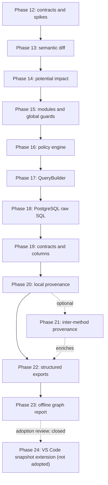

# Backend API Intelligence - Post-MVP Expansion Implementation Plan

## Purpose and authority

This is the execution plan for extending the completed v0.1/P0 implementation in
`backend_api_intelligence_implementation_plan.md`. It evaluates the proposed deeper
analysis, automation, and reporting deliverables and converts the viable parts into a
dependency-ordered sequence of bounded phases.

This document is written for the implementing agent. It should be used to choose the
next unit of work, define its exact honesty boundary, and prevent consumer features
from being built before the facts they need are trustworthy.

The original personal project plan remains the product rationale and the original
implementation plan remains the completion record for Phases 0-11. This plan starts
at **Phase 12** so future requests cannot be confused with the completed MVP phases.

Planning baseline: 2026-08-17.

---

# 1. Executive decision

The proposed roadmap is feasible only after restructuring it around four foundations:

1. an analysis-snapshot-independent semantic comparison layer;
2. a bounded Nest module and effective-guard model;
3. query extraction rules that separate TypeORM QueryBuilder semantics from SQL
   parsing;
4. explicit confidence and uncertainty for data provenance.

The roadmap should not be implemented as independent deliverables. Policy checks,
exports, graph views, and editor lenses are all derived consumers. They must read
validated canonical analysis or another versioned derived artifact and must never
independently infer facts.

## 1.1 Adopted ideas

- Analysis-to-analysis endpoint diff and potential change-impact analysis.
- Static Nest module metadata and bounded `APP_GUARD`/bootstrap global-guard
  recognition.
- A typed, built-in policy engine configured by strict JSON.
- TypeORM QueryBuilder table-access extraction for a deliberately small set of proven
  builder shapes.
- PostgreSQL raw-SQL extraction for statically recoverable TypeORM `.query()` and
  tagged `.sql` calls.
- Request parameter, DTO, declared response type, and entity-column inventories.
- Bounded request-field-to-write-column provenance.
- OpenAPI 3.x enrichment and a control-evidence CSV/JSON matrix.
- A self-contained offline interactive HTML report using Cytoscape.js.

## 1.2 Ideas accepted only after modification

- **"Exact DTO-to-column lineage"** becomes evidence-backed `direct` or `derived`
  provenance. Exact runtime SQL columns are claimed only for narrow explicit
  `insert`/`update` object-literal sinks. `save()`, subscribers, dynamic mappers,
  spreads, and computed keys remain unknown.
- **"Architecture policy engine"** becomes a registry of versioned built-in rules,
  not a generic graph query language. `max-call-depth` moves to analysis settings; it
  is not an architecture rule.
- **"Interactive web app"** becomes an offline, generated HTML artifact. A hosted
  service, accounts, storage, and deployment are not justified by the local-first
  project.
- **"Compliance report"** becomes a control-evidence matrix. The tool inventories
  evidence and policy outcomes; it does not certify compliance.
- **"IDE plugin"** was narrowed to a conditional VS Code snapshot viewer, then closed
  at the Phase 24 adoption review on 2026-08-24. Saved reports currently satisfy the
  workflow, so no editor extension is scheduled.

## 1.3 Excluded from the scheduled roadmap

- Full dynamic-module execution or emulation (`forRootAsync`, arbitrary factories,
  runtime-computed provider arrays).
- General global-interceptor semantic analysis. `APP_INTERCEPTOR` may be inventoried
  later, but interceptors can transform control flow and responses and currently have
  no trustworthy consumer in this project.
- A user-defined policy DSL capable of arbitrary graph traversal.
- Generic multi-dialect raw-SQL parsing in the first SQL release.
- Runtime SQL generation, database connection, Nest bootstrap, or target code
  execution.
- Exact `save()` column lineage or database-to-response field lineage.
- A hosted/multi-user graph service.
- A PDF labelled as a compliance certification or attestation.
- Simultaneous real-time support for VS Code, Cursor, and JetBrains.
- A JetBrains plugin in this plan. Its Code Vision API is still documented as
  experimental and it requires a separate Kotlin/IntelliJ implementation.
- All source-control and provider integrations: Git commands, change discovery from
  commits/branches, GitHub Actions, GitLab CI, pull/merge-request comments, webhooks,
  tokens, checks, and repository-provider APIs.

---

# 2. Current-state constraints discovered in the implementation

The v0.1 implementation is a strong base, but its present contracts affect the order
of all expansion work:

- Canonical IDs are scoped to an analyzed snapshot directly or transitively. A raw ID
  in one snapshot therefore cannot be used to match the same semantic endpoint,
  method, assertion, evidence item, or diagnostic in another snapshot.
- This expansion adds no source-control metadata collection or VCS operation;
  comparison accepts two analysis files supplied explicitly by the user.
- `analysis.json` uses a strict `1.0.0` schema. New record arrays such as modules,
  columns, contracts, and provenance require a versioned schema migration rather than
  silently adding fields.
- The current graph proves direct routes, direct guards, class injection, direct
  method calls, entity/table mappings, and common repository method table access.
- Guard output deliberately says `none_declared` plus unknown global policy. It does
  not currently describe an effective guard set.
- Table facts do not yet include entity-column records, QueryBuilder operations,
  literal SQL tables, or request data origins.
- Reports are deterministic views of canonical JSON. This boundary must remain true
  for every new export and UI.

The diff phase must therefore introduce semantic matching projections. It must not
compare raw stable IDs and should not redesign all v0.1 IDs merely to make comparison
convenient.

---

# 3. Current ecosystem findings

These findings were checked against primary documentation on 2026-08-17 and influence
the scope choices above.

- Nest documents that an `APP_GUARD` provider is global regardless of the module in
  which it is registered, and that guard execution proceeds global, controller, then
  route. This makes static `APP_GUARD` recognition useful even when some module-tree
  edges remain unknown:
  [Nest guards](https://docs.nestjs.com/guards) and
  [Nest request lifecycle](https://docs.nestjs.com/faq/request-lifecycle).
- TypeORM describes QueryBuilder as capable of queries of almost any complexity and
  documents multiple aliases, joins, subqueries, CTEs, and separate select/write
  builders. A sound first rule must therefore recognize only bounded builder chains:
  [TypeORM SelectQueryBuilder](https://typeorm.io/docs/query-builder/select-query-builder/).
- Current TypeORM also exposes a tagged `sql` API on `DataSource`, `EntityManager`,
  `Repository`, and `QueryRunner`; raw-query analysis cannot reasonably cover only
  `.query()` strings:
  [TypeORM SQL tag](https://typeorm.io/docs/guides/sql-tag/).
- TypeORM column names can differ from property names, values can pass through column
  transformers, and listeners/subscribers can mutate or add behavior around writes.
  These are hard limits on claims of exact runtime lineage:
  [TypeORM entities](https://typeorm.io/docs/entity/entities/) and
  [listeners/subscribers](https://typeorm.io/docs/listeners-and-subscribers/).
- OpenAPI explicitly permits `x-` specification extensions, so a versioned
  `x-api-intel` operation object is standards-compatible:
  [OpenAPI 3.1 specification extensions](https://spec.openapis.org/oas/v3.1.0.html#specification-extensions).
- Cytoscape.js is designed for graph visualization and traversal and accepts a JSON
  graph model. It is a better conceptual fit here than a node-editor library:
  [Cytoscape.js documentation](https://js.cytoscape.org/).
- VS Code has a stable CodeLens provider API, while JetBrains currently describes its
  Code Vision provider API as experimental:
  [VS Code extension capabilities](https://code.visualstudio.com/api/extension-capabilities/overview)
  and
  [IntelliJ inlay hints and Code Vision](https://plugins.jetbrains.com/docs/intellij/inlay-hints.html).

---

# 4. Complexity and feasibility assessment

## 4.1 Scale

| Rating | Meaning                                                                         |
| ------ | ------------------------------------------------------------------------------- |
| S      | A few bounded rules or one reporter; roughly 1-3 focused days                   |
| M      | A new model/view plus fixtures and CLI surface; roughly 1-2 focused weeks       |
| L      | Multiple semantic rules and integration surfaces; roughly 2-4 focused weeks     |
| XL     | Research-heavy data-flow, ecosystem, or cross-platform work; one or more months |

Feasibility is assessed for a sound, evidence-first implementation, not a demo that
silently guesses.

## 4.2 Deliverable decisions

| Proposed idea                                     | Complexity as proposed | Feasibility as proposed | Decision and viable boundary                                                                                                                                |
| ------------------------------------------------- | ---------------------: | ----------------------: | ----------------------------------------------------------------------------------------------------------------------------------------------------------- |
| QueryBuilder and raw SQL together                 |                     XL |                  Medium | Split. QueryBuilder is L/high-feasibility when receiver and chain state are proven. Raw SQL is L-XL/medium and starts PostgreSQL-only after a parser spike. |
| Exact request/response DTO-to-column lineage      |                     XL |                     Low | Replace with contract inventory plus bounded request-to-write provenance. Do not schedule database-to-response field lineage.                               |
| Full module tree, global guards, and interceptors |                     XL |              Medium-low | Implement static module metadata and `APP_GUARD`/simple bootstrap guards. Defer dynamic modules and interceptor semantics.                                  |
| Declarative architecture policy engine            |                      L |         High if bounded | Implement strict JSON configuration and versioned built-in rules. Exclude a generic DSL.                                                                    |
| Real-time VS Code/Cursor/JetBrains lenses         |                     XL |                     Low | Not adopted at the Phase 24 review. Reconsider only from measured demand for fresh, hash-safe editor-local facts; JetBrains remains excluded.               |
| Standalone interactive graph web app              |                   L-XL |                  Medium | Generate a self-contained offline HTML report. Defer hosted service concerns.                                                                               |
| OpenAPI enrichment                                |                    M-L |                    High | Support OpenAPI 3.0/3.1 JSON first with exact method/path matching and one `x-api-intel` object.                                                            |
| Compliance CSV/PDF                                |     CSV: S-M; PDF: M-L |  CSV: High; PDF: Medium | Ship deterministic control-evidence CSV/JSON. Defer PDF until a real audit template exists; never call it certification.                                    |

## 4.3 Overall estimate

The pre-implementation estimate for required phases through v0.5 was approximately
**420-677 focused engineering hours**, with **50-90 hours** for the then-conditional
inter-method provenance phase. The separate **45-80 hour** editor estimate is retained
only as historical planning context: Phase 24 was not adopted and is not part of the
executed or scheduled roadmap. These are planning ranges, not calendar promises; they
include model/schema work, negative fixtures, deterministic golden tests, CLI
integration, and documentation.

The work is intentionally divided into independently useful release trains. Stopping
after v0.2, v0.3, or v0.5 still leaves a coherent product.

---

# 5. Target architecture

## 5.1 Dependency direction



Phase 21 passed its go/no-go gate. Phase 24 did not pass its adoption gate and is
closed without implementation. Phase 22 could proceed directly from Phase 20 if
inter-method provenance had been rejected or deferred.

## 5.2 Canonical versus derived documents

The architecture will use four versioned layers:

1. **Canonical analysis** - source-derived facts, evidence, diagnostics, and explicit
   uncertainty.
2. **Semantic projection** - snapshot-independent keys and query indexes derived from
   one canonical document.
3. **Comparison and policy documents** - `diff.json`, `impact.json`, and
   `policy-results.json`, each with its own strict schema.
4. **Presentations** - Markdown, CSV, enriched OpenAPI, HTML graph, and editor lenses.
   Presentations cannot create new facts.

The first canonical extension that adds modules/contracts/columns will use analysis
schema `2.0.0`. Readers must accept `1.0.0` and `2.0.0`, migrate both into an internal
normalized view, and retain v1 golden compatibility. The diff, impact, policy, and
report schemas are independently versioned.

## 5.3 Semantic identity across analysis snapshots

Semantic keys are comparison aids, not canonical IDs. They must be explicit,
human-auditable tuples such as:

- source file: normalized repository-relative path;
- class: source path plus qualified name;
- method: class semantic key plus method name and normalized signature;
- endpoint exact key: HTTP method, normalized path, and handler semantic key;
- endpoint route slot: HTTP method plus normalized path;
- table: normalized schema/name pair and provenance kind;
- diagnostic: code plus semantic subject plus rule/evidence location projection.

The comparison engine keeps before and after canonical IDs for evidence lookup but
matches on these snapshot-independent tuples. Duplicate route slots or ambiguous
semantic keys remain explicit ambiguity; they are never resolved by array order.

## 5.4 Claim vocabulary

New features must distinguish these concepts:

- **observed declaration** - syntax and package identity are proven;
- **resolved relationship** - a supported semantic rule proves both endpoints;
- **effective metadata** - direct plus proven global declarations;
- **potential impact** - a changed fact is reachable from an endpoint; this is not
  proof that runtime behavior changed;
- **direct provenance** - a request origin is assigned directly to a proven sink
  property;
- **derived provenance** - an expression depends on the request origin but may
  transform it;
- **unknown** - a relevant construct exists but crosses an unsupported boundary.

The words `public`, `authenticated`, `compliant`, `exact runtime SQL`, and `runtime
blast radius` must not appear as positive claims unless the analyzer has a separate,
specific proof for them.

## 5.5 Configuration boundary

Use a strict, versioned `api-intel.config.json`. Do not support executable JavaScript
or TypeScript configuration because loading it would violate the no-target-execution
principle.

Configuration categories are separate:

- `analysis`: call depth, SQL dialect, file limits, and feature flags;
- `matching`: optional OpenAPI path-prefix mapping;
- `rules`: policy rule severity and typed options;
- `reporting`: bounded presentation choices only.

Unknown properties and unknown rule IDs fail configuration validation with a usage
error. Configuration is normalized into `run.json`; only fact-affecting settings enter
analysis identity.

---

# 6. Release trains

| Release train                   |                Phases | Useful outcome                                                           |                         Estimated effort |
| ------------------------------- | --------------------: | ------------------------------------------------------------------------ | ---------------------------------------: |
| v0.2 - Change intelligence      |                 12-16 | Analysis diffs, potential impact, effective guards, and policies         |                            155-242 hours |
| v0.3 - Deeper persistence       |                 17-18 | Bounded QueryBuilder and PostgreSQL raw-SQL table access                 |                             95-155 hours |
| v0.4 - Contracts and provenance | 19-20; 21 conditional | DTO/parameter/response inventory and bounded request-to-write provenance | 85-140 hours required; 50-90 conditional |
| v0.5 - Reports and exploration  |                 22-23 | OpenAPI/control-evidence exports and offline interactive graph           |                             85-140 hours |
| v0.6 - Editor view              |                    24 | Closed at adoption review; no editor extension implemented               |                            Not scheduled |

Reassess scope and measured value at every release boundary. Do not continue merely
because a later phase is listed.

---

# 7. Phase 12 - Expansion contracts, corpus, and technical spikes

## Goal

Freeze the post-MVP honesty boundaries and de-risk the external dependencies before
changing the canonical schema.

## Estimated effort

16-24 focused hours.

## Work units

1. Record an ADR for v1/v2 schema compatibility and derived-document versioning.
2. Record an ADR for snapshot-independent semantic keys. Explicitly retain current
   snapshot-scoped canonical IDs unless another independent integrity reason requires a
   change.
3. Create focused fixture directories for:
   - endpoint rename/add/remove/modify comparisons;
   - changed but unreachable services;
   - module imports/exports, `APP_GUARD`, `useClass`, and `useExisting`;
   - QueryBuilder select/insert/update/delete chains and unsupported chains;
   - static/dynamic `.query()` and tagged `.sql` calls;
   - DTO parameters, entity columns, and explicit update/insert sinks.
4. Add mutation expectations before implementation, including tempting false edges.
5. Benchmark the current analyzer on the integrated fixture and official Nest sample.
   Store commands, corpus version, elapsed-time summary, and output sizes outside
   canonical analysis.
6. Spike PostgreSQL parser candidates:
   - preferred: a PostgreSQL-native parser exposed through WASM, such as
     `libpg-query`/`pgsql-parser`;
   - compare Node 22+ ESM loading, install size, parse latency, PostgreSQL version
     selection, AST traversal ergonomics, license, and CTE/write coverage;
   - retain `node-sql-parser` only as a possible future multi-dialect adapter, not as
     an automatic fallback.
7. Spike a single-file Cytoscape.js bundle without CDN/network access.

## Tests and artifacts

- ADRs under `docs/adr/`.
- Frozen fixture expectation files, initially marked pending rather than weakened to
  match incomplete output.
- A parser spike report with representative PostgreSQL statements and parse failures.
- A baseline performance report.

## Exit gate

- The parser candidate and supported PostgreSQL major-version policy are chosen or raw
  SQL Phase 18 is explicitly deferred.
- Every later schema has an owner and versioning policy.
- Each later extractor has positive, negative, ambiguous, and unsupported examples.
- No production analysis feature has been added during the spike.

---

# 8. Phase 13 - Cross-analysis semantic projection and deterministic diff

## Goal

Compare two explicitly supplied canonical analysis snapshots without relying on
snapshot-scoped IDs or querying a source-control system.

## Estimated effort

35-55 focused hours.

## Scope

Implement a reusable semantic projection/index and a versioned `DiffDocument` exposed
through:

```text
api-intel diff before-analysis.json after-analysis.json
```

The first diff reports:

- added, removed, and modified endpoint route slots;
- handler changes;
- direct/effective guard fact changes that are available in the input schemas;
- added/removed read and write terminals;
- assertion resolution-state changes;
- new, resolved, and changed diagnostics.

## Matching algorithm

1. Match exact endpoint semantic keys.
2. For unmatched records, match a route slot only when both sides contain exactly one
   endpoint for the HTTP method/path. Treat a handler change as `modified`.
3. If either side has duplicate route slots or keys, report comparison ambiguity and
   leave the records added/removed rather than guessing.
4. Compare normalized projections, not display strings or canonical IDs.
5. Keep before/after IDs and evidence references in the diff so a consumer can inspect
   both source documents.

## Implementation checklist

- Define semantic-key types and deterministic encoders.
- Build lookup indexes with collision/ambiguity reporting.
- Define and validate `diff.schemaVersion` independently of analysis schema.
- Implement canonical diff ordering and serialization.
- Add `--format json|markdown` and an output-directory option.
- Make v1-to-v1 and later v1-to-v2 comparisons legal when their projected facts are
  comparable.
- Define exit behavior separately from policy failure; a diff with changes is not a
  CLI error.

## Required tests

- Unchanged source represented by independently produced snapshots creates an empty
  semantic diff even when snapshot-scoped canonical IDs differ.
- Endpoint add/remove, handler rename, path change, guard change, and terminal change.
- Same-named handlers in different files do not collide.
- Duplicate route slots produce ambiguity, not arbitrary matching.
- Shuffled canonical arrays produce byte-identical `diff.json`.
- Diagnostics whose evidence IDs change only because snapshot metadata changed still match
  semantically where their code/subject/location is stable.

## Exit gate

Two fixture snapshots produce a deterministic, reviewable endpoint diff with no raw-ID
matching. Markdown is generated only from the validated `DiffDocument`.

---

# 9. Phase 14 - Potential change-impact analysis

## Goal

Identify endpoints that may be affected by changed services, methods, entity files, or
table-access facts, while avoiding the phrase "runtime blast radius."

## Estimated effort

24-38 focused hours.

## Model

Compare source files by normalized path and content hash, then traverse the **before
and after** assertion graphs in reverse toward endpoints. The only inputs are the two
user-supplied analysis documents. The phase does not inspect a working tree, discover
changed files externally, or call any source-control command/API; added, removed, and
changed paths are derived solely from the source-file records and hashes already
present in those documents.

Emit a versioned `ImpactDocument` with separate categories:

- `direct_endpoint_change`;
- `reachable_method_file_change`;
- `entity_declaration_file_change`;
- `table_access_fact_change`;
- `diagnostic_or_resolution_change`;
- `unknown_due_to_incomplete_trace`.

An impacted endpoint record contains the changed semantic subject, traversal path,
before/after evidence where available, and a reason code. It does not state that
behavior definitely changed.

## Implementation checklist

- Derive added, removed, and content-changed source paths from the two analyses.
- Build reverse adjacency for endpoint-handler, method-call, repository/entity, and
  method-table facts.
- Traverse both documents with cycle protection and configured depth semantics.
- Distinguish a directly modified endpoint from a transitively reachable changed
  service.
- Include changed but unreachable files in a separate summary so absence of impact is
  explainable.
- Render deterministic JSON and concise Markdown grouped by endpoint.

## Required tests

- A changed helper reached by two endpoints impacts both.
- A same-named but uncalled changed method impacts neither.
- A changed entity file impacts endpoints that reach its mapped table in either graph.
- A deleted call path is visible by traversing the before graph.
- A new call path is visible by traversing the after graph.
- Cycles terminate and incomplete traces carry uncertainty.

## Exit gate

The fixture report distinguishes endpoint diffs from potential transitive impact and
can explain every impact through a finite evidence-backed path.

---

# 10. Phase 15 - Static Nest module graph and effective global guards

## Goal

Replace unconditional unknown-global-guard output with a bounded, evidence-backed
global guard state and establish module metadata needed by later policies.

## Estimated effort

45-70 focused hours.

## Supported module boundary

Recognize checker-resolved `@nestjs/common` `Module` metadata when the decorator
argument is an object literal and the relevant fields can be resolved from:

- direct array literals;
- direct class references;
- one-hop local `const` arrays without mutation;
- bounded array spreads whose source resolves by the same rule;
- `forwardRef(() => ModuleClass)` when the package identity and returned class are
  statically proven.

Record imports, providers, exports, controllers, and `@Global` declaration state.
Dynamic module calls, computed metadata, and arbitrary factory output produce module
diagnostics and completeness state; they do not produce guessed edges.

## Global guard boundary

Support:

- `{ provide: APP_GUARD, useClass: GuardClass }`;
- `{ provide: APP_GUARD, useExisting: GuardClass }` where the existing provider class
  is statically resolvable;
- multiple guards in provider-array order;
- direct bootstrap calls of the proven form
  `app.useGlobalGuards(new GuardClass(...))` when `app` is uniquely bound to a
  `NestFactory.create(...)` result and each guard class is resolvable.

Do not support `useFactory`, dynamic `useValue`, arbitrary application aliases, custom
container wrappers, or runtime conditional registration in this phase.

## Model changes

Introduce analysis schema v2 records/predicates sufficient for:

- modules and their source declarations;
- module imports/providers/exports/controllers;
- application-global guard declarations and registration order;
- global-analysis completeness.

Derived endpoint views expose:

- direct guards;
- proven global guards;
- `globalGuardState: declared | none_proven | unknown`;
- `effectiveGuardState: guard_declared | no_supported_guard_proven | unknown`.

`no_supported_guard_proven` still does **not** mean public, unauthenticated, or
unprotected. A guard is not automatically an authentication guard.

## Required tests

- Root and imported module metadata.
- Re-exported provider and `@Global` module inventory.
- `APP_GUARD` in a feature module still appears globally.
- `useClass`, `useExisting`, multiple guards, and bootstrap registration.
- `forwardRef` is bounded and cycle-safe.
- `forRoot`, `forRootAsync`, `useFactory`, computed arrays, and conditional bootstrap
  registration remain explicit unknowns.
- Global, controller, and method guard order is deterministic.
- A v1 analysis remains readable and preserves unknown-global behavior.

## Exit gate

The integrated fixture distinguishes proven global guards, no supported global
declaration found after a complete supported scan, and unknown global policy. This is
not presented as proof that no runtime guard exists. No dynamic module is executed.

## Deferred

`APP_INTERCEPTOR`, pipes, middleware, filters, and interceptor-driven call or response
semantics.

---

# 11. Phase 16 - Typed architecture policy engine

## Goal

Turn canonical/diff facts into reproducible architecture-policy outcomes with evidence
and stable CLI behavior.

## Estimated effort

35-55 focused hours.

## Configuration shape

Use a strict shape similar to:

```json
{
  "$schema": "./api-intel.config.schema.json",
  "version": 1,
  "analysis": {
    "maxCallDepth": 3
  },
  "rules": {
    "no-repository-access-in-controller": "error",
    "require-guard-on-write-endpoint": ["error", { "onUnknown": "error" }],
    "require-complete-write-trace": "warn",
    "no-new-diagnostics": ["warn", { "minimumSeverity": "warning" }]
  }
}
```

This example is provisional until Phase 12 freezes the JSON schema. The rule names and
option types become public contracts once shipped.

## First built-in rules

1. `no-repository-access-in-controller`
   - Uses proven controller role plus direct repository injection/table-access facts.
   - Does not fail a controller merely because a downstream service uses a repository.
2. `require-guard-on-write-endpoint`
   - Applies to endpoints with a proven reachable write terminal.
   - Accepts direct or proven global guards.
   - Calls this a guard policy, not an authentication guarantee.
3. `require-complete-write-trace`
   - Fails/warns when a mutation endpoint reaches an ambiguous, unresolved,
     unsupported, or depth-limited branch relevant to persistence.
4. `no-new-diagnostics`
   - Operates on a `DiffDocument` with a configurable minimum diagnostic severity.

## Policy result model

Each evaluated subject produces exactly one of:

- `pass`;
- `fail`;
- `unknown`;
- `not_applicable`.

Results include rule version, severity, subject semantic key, message, canonical IDs,
evidence references, and reason code. Unknown handling is configured per rule; it is
never silently converted to pass.

## CLI and outputs

```text
api-intel check analysis.json --config api-intel.config.json
api-intel check analysis.json --baseline before.json --config api-intel.config.json
```

Provide JSON and Markdown. Reserve a stable policy-violation exit code distinct from
invalid input, internal failure, and a successful diff containing changes.

## Explicit exclusions

- Arbitrary expressions or user code in config.
- A generic graph-query language.
- Regex-based classifying of a guard as authentication by default.
- `max-call-depth` as a pass/fail policy rule; it remains an analysis setting.

## Exit gate

All four built-in rules have positive, negative, unknown, and not-applicable fixtures;
rule order does not affect canonical `policy-results.json`; invalid config fails before
evaluation.

---

# 12. Phase 17 - Bounded TypeORM QueryBuilder extraction

## Goal

Prove table reads and writes for common, statically resolvable TypeORM QueryBuilder
chains without parsing generated SQL.

## Estimated effort

45-70 focused hours.

## Supported roots

- Proven injected repository member `.createQueryBuilder(alias)`; the repository
  entity supplies the initial table.
- Checker-proven TypeORM `DataSource` or `EntityManager` builder with an explicit
  entity class or static table literal.
- `createQueryBuilder().select(...).from(EntityOrLiteral, alias)`.
- Insert/update/delete builders whose `.into(...)`, `.update(...)`, or `.from(...)`
  target is a proven entity class or static literal.

## Supported flow

- A direct fluent chain in one expression.
- A method-local builder variable with one dominating assignment, no conditional
  reassignment, and no escape to an unknown call/property.
- Select terminals such as `getOne`, `getMany`, `getRawOne`, `getRawMany`, `getCount`,
  and `stream` produce reads.
- Insert/update/delete `.execute()` produces a write according to the proven builder
  state.
- Explicit entity-class joins add read tables.

## Deliberate boundaries

- Relation-string joins such as `"user.photos"` remain unknown until entity relation
  metadata exists and the relation target can be proved.
- Callback subqueries, CTE bodies, `addFrom` with dynamic expressions, builder helper
  functions, conditional construction, reassigned aliases, and builder escape produce
  diagnostics.
- `getSql()`/`getQuery()` is not an execution terminal.
- A method named `createQueryBuilder` on an arbitrary object is ignored.
- Static table literals create table facts with a distinct name-source provenance;
  they are not silently attached to a similarly named entity.

## Implementation design

- Add a small QueryBuilder state machine independent of presentation.
- Resolve package symbols through the checker.
- Emit existing method-read/write-table assertions where possible, with new rule IDs
  and evidence spanning the root, table source, builder-kind transition, and terminal.
- Add diagnostics for ambiguous state, unsupported flow, unresolved table, and missing
  execution terminal.
- Keep operation detail internal or in a dedicated record only if needed to explain
  uncertainty; do not add a large query AST to canonical analysis.

## Required tests

- Repository select chain and assigned-variable select.
- DataSource select/from, insert/into, update, and delete/from.
- Read joins to explicit entity classes.
- Same-named custom builder lookalike is ignored.
- Builder reassignment, callbacks, relation-string joins, CTEs, and dynamic table names
  remain unsupported.
- Existing repository-method analysis is unchanged.
- Trace, diff, impact, and policy views consume the new terminals without special
  inference.

## Exit gate

Every resolved QueryBuilder terminal has a proven TypeORM receiver, builder state,
table source, execution direction, and evidence. Unsupported complexity creates no
table fact.

---

# 13. Phase 18 - Static PostgreSQL raw-SQL extraction

## Goal

Extract physical table reads and writes from statically recoverable PostgreSQL issued
through proven TypeORM raw-query APIs.

## Estimated effort

50-85 focused hours.

## Preconditions

- Phase 12 selected a parser that passes the corpus and packaging gates.
- Configuration explicitly selects PostgreSQL and its supported major version or a
  documented compatible parser mode. Do not infer dialect by executing a DataSource
  configuration.
- Query operation/table provenance from Phase 17 is available.

## Supported call sites

- Checker-proven TypeORM `Repository.query`, `DataSource.query`,
  `EntityManager.query`, and `QueryRunner.query`.
- Checker-proven TypeORM tagged `sql` templates on the same receiver families.
- First SQL argument as a string literal, no-substitution template, or uniquely
  initialized one-hop local `const`.
- Tagged templates whose ordinary value expressions can be replaced with safe parser
  placeholders without changing identifiers or SQL structure.

## Statement boundary

Initially support physical-table extraction for:

- `SELECT`, including joins and nested selects;
- `INSERT`, including read sources in `INSERT ... SELECT`;
- `UPDATE`, including read sources in `FROM`/subqueries;
- `DELETE`, including read sources in `USING`/subqueries;
- `WITH`/CTEs while distinguishing CTE aliases from physical tables;
- multiple statements only when every statement parses independently and output
  direction remains explainable.

DDL, `CALL`, procedural bodies, temporary table lifecycle, dynamically constructed
identifiers, vendor extensions outside the selected parser version, and parser errors
produce diagnostics and no guessed facts.

## Tagged-template rule

Normal interpolations become value placeholders. Function-wrapped raw fragments used
by TypeORM for unescaped identifiers or SQL fragments are unsupported unless the
function body is a proven constant fragment and a later dedicated rule explicitly
allows it. Never concatenate an arbitrary expression and then feed it to the parser as
if it were source truth.

## Implementation checklist

- Create a dialect-adapter interface even though only PostgreSQL ships initially.
- Keep the parser behind a narrow table-access visitor; do not expose its unstable AST
  as canonical output.
- Preserve schema-qualified table names.
- Record parser/dialect version in tool/run metadata.
- Bound SQL literal length, statement count, parser time/memory, and diagnostic
  snippets.
- Use no regex fallback after parser failure.
- Emit separate evidence for receiver proof, SQL literal, and parsed statement/table
  locations where the parser provides offsets; otherwise cite the bounded SQL literal
  and state the location limitation.

## Required tests

- All supported statement/direction combinations.
- CTE names are not counted as physical tables.
- `INSERT ... SELECT`, `UPDATE ... FROM`, and `DELETE ... USING` produce both read and
  write facts correctly.
- Schema-qualified and quoted identifiers.
- Parameter placeholders and safe tagged-template substitutions.
- Dynamic identifiers, interpolation fragments, invalid SQL, unsupported statements,
  and dialect mismatch.
- Arbitrary `.query()` lookalikes are ignored.
- Parser output/order is deterministic on supported Windows and Linux test
  environments.

## Exit gate

The PostgreSQL corpus has exact expected physical tables and directions, every parse
failure is visible, and non-PostgreSQL input never receives a PostgreSQL-derived fact
unless configuration explicitly selected that dialect.

---

# 14. Phase 19 - Request/response contracts and entity-column metadata

## Goal

Inventory the static contracts required for later provenance without claiming runtime
validation or serialization behavior.

## Estimated effort

40-65 focused hours.

## Entity columns

Extract checker-proven TypeORM column declarations, including:

- property name and declaring entity;
- explicit `@Column({ name })` database name or the documented fallback;
- primary/generated column decorators within a frozen supported set;
- insert/update flags where literal options are recoverable;
- transformer-presence flag without evaluating the transformer;
- inheritance where the checker proves an in-repository base declaration.

Naming strategies, embedded prefixes, `EntitySchema`, dynamic options, relations,
virtual columns, and database-generated side effects remain outside the first column
model unless separately proven.

## Request parameters and DTOs

Support standard checker-proven Nest decorators:

- `@Body()`;
- `@Param()`;
- `@Query()`.

Record parameter index/name, source kind, optional literal selector, declared type,
and method relationship. Resolve in-repository class/interface properties and inherited
properties through checker symbols. When mapped types or generated declarations lack a
clear source declaration, preserve the visible type shape with unknown/derived
evidence rather than fabricating a DTO declaration.

Class-validator decorators may be inventoried as **declared constraints** only. They do
not prove that a global/local validation pipe is active or that transformation occurs.

## Declared response contracts

Record the handler's declared/checker return type, unwrap a bounded `Promise<T>`, and
represent simple arrays/unions. Mark `@Res()`/manual response handling, `any`, unknown,
and complex generic expansion explicitly. This is a declared handler contract, not
proof of the serialized HTTP response after interceptors or class-transformer.

## Required tests

- Body/Param/Query whole-object and literal-property selectors.
- DTO class/interface fields, inheritance, optional/readonly fields, and same-named
  types in different files.
- Declared class-validator constraints without a claim of effective validation.
- Entity property/database-name overrides, column transformers, and insert/update
  flags.
- Promise, array, union, void, `any`, and manual-response handler returns.
- Mapped/dynamic DTO and entity metadata produce explicit limitations.

## Exit gate

Endpoint contract reports list request sources, declared DTO fields, declared return
types, and entity columns with evidence, while clearly separating declarations from
runtime validation/serialization.

---

# 15. Phase 20 - Intraprocedural request-to-write provenance

## Goal

Prove useful request-field influence on explicit write columns within one method before
attempting inter-method propagation.

## Estimated effort

45-75 focused hours.

## Supported origins

- A handler/service method parameter already associated with a request origin.
- A selected property such as `@Body('title') title`.
- A property access such as `dto.title` where the DTO field is known.
- One-hop local aliases and destructuring with unique, non-mutated bindings.

## Supported sinks

- `repository.insert({ ... })` explicit object literal.
- `repository.update(criteria, { ... })` explicit partial object literal.
- QueryBuilder insert/update `.values({ ... })`/`.set({ ... })` when Phase 17 proved
  the builder entity/table.
- Raw SQL parameters are excluded at first because placeholder-to-column semantics are
  dialect/statement specific and merit a later rule.

## Provenance states

- `direct`: the sink property receives the origin value or a direct alias.
- `derived`: the sink expression depends on the origin through a supported expression
  such as normalization, concatenation, arithmetic, or conditional selection.
- `unknown`: a relevant value crosses an unsupported mapper, mutation, spread,
  computed property, callback, or control-flow merge.

The canonical relation should be named to communicate influence, for example
`REQUEST_FIELD_MAY_FLOW_TO_COLUMN`; do not name it `EXACT_LINEAGE`.

## Analysis design

- Use a small method-local symbolic-origin map, not a general TypeScript interpreter.
- Track origin property paths and transformation state.
- Require a proven sink entity and map entity property to database column metadata.
- Cite origin, propagation, sink property, repository/builder operation, and column
  declaration evidence.
- Bound aliases, expression depth, branch merges, and object nesting.
- Do not emit column provenance for `save()` or `remove()`.

## Required tests

- Direct field assignment, alias, destructuring, and simple derived expression.
- DTO property to overridden database column name.
- Static fields mixed with request fields.
- Spread, computed key, mutated alias, mapper function, loop, branch merge, and nested
  object limits.
- `save()` retains table-only/unknown-column behavior.
- Column transformer presence is visible but does not erase a proven influence edge;
  the edge is not described as value equality.

## Exit gate

All emitted column provenance in the local corpus is manually reviewable and has no
false direct edge. Unsupported flow creates a bounded diagnostic or unknown result,
not silence.

---

# 16. Phase 21 - Inter-method request provenance (conditional)

## Goal

Propagate symbolic request origins through already proven direct method calls so a
controller DTO can reach a service write sink.

## Estimated effort

50-90 focused hours.

## Go/no-go prerequisite

Proceed only if Phase 20 shows high practical value and the local analysis has no
known false direct edges on the frozen corpus. If most real code crosses unsupported
mappers immediately, stop at contract inventory and local provenance rather than
shipping misleading cross-method graphs.

## Supported propagation

- Map call argument positions to parameters of a single checker-resolved target.
- Carry whole-object and selected-property origin paths.
- Follow existing direct injected-member method calls within configured call depth.
- Preserve `direct` versus `derived` state across expressions.
- Stop at overload ambiguity, rest/spread arguments, callbacks, interface dispatch,
  unknown target, recursion/cycles, or depth limit.

## Implementation checklist

- Extend the existing endpoint traversal with an immutable call-frame origin map.
- Memoize by method semantic key plus normalized origin shape to bound repeated work.
- Separate control-flow reachability from value provenance; an endpoint reaching a
  write does not imply every request field reaches every column.
- Emit complete evidence paths and compact them in views without dropping canonical
  references.
- Add resource limits for origin-set size and state explosion.

## Required tests

- Controller body -> service DTO parameter -> insert/update field.
- Selected Param ID used as criteria but not falsely marked as a written column.
- Controller transforms value before service call.
- Two service hops within depth limit.
- Overload ambiguity, callback mapper, spread arguments, cycle, and depth limit.
- Two request origins influencing one derived column.
- Same-named uncalled service method remains absent.

## Exit gate

The integrated example can show at least one controller request field reaching a
specific database column through a proven call path, while every unsupported boundary
is visible and no route/table reachability shortcut creates a value-flow edge.

---

# 17. Phase 22 - Structured evidence exports

## Goal

Publish analysis to OpenAPI consumers and auditor-friendly tabular formats without
changing or overstating canonical facts.

## Estimated effort

40-65 focused hours.

## OpenAPI 3.x enrichment

Support OpenAPI 3.0/3.1 JSON first. YAML and Swagger/OpenAPI 2.0 are separate future
adapters.

Match operations using:

- exact HTTP method;
- normalized Nest `:id` to OpenAPI `{id}` path syntax;
- documented trailing-slash behavior;
- optional explicit path-prefix mapping for global prefixes/versioning;
- no fuzzy name or operation-ID matching.

Duplicate, ambiguous, and unmatched operations are reported in a sidecar result. The
input file is never overwritten by default.

Use one versioned extension object rather than unrelated unversioned fields:

```json
{
  "x-api-intel": {
    "schemaVersion": "1.0.0",
    "resolution": "resolved",
    "analysisId": "analysis:...",
    "guards": {
      "direct": ["AuditGuard"],
      "global": ["AuthGuard"],
      "state": "guard_declared"
    },
    "dbReads": ["note"],
    "dbWrites": ["audit_log"],
    "diagnosticCodes": [],
    "evidenceIds": []
  }
}
```

The exact schema is frozen during implementation. Keep large evidence paths in an
optional sidecar rather than bloating every operation.

## Control-evidence matrix

Generate canonical JSON plus safe CSV with one deterministic endpoint row containing:

- HTTP method/path and handler;
- direct/global/effective guard states;
- mutation classification;
- read/write tables;
- relevant request-to-column provenance summary, when available;
- diagnostic and incompleteness codes;
- policy outcomes;
- evidence/source-location references;
- analysis snapshot metadata/schema/tool version.

Neutralize spreadsheet formula injection for source-derived cells beginning with
`=`, `+`, `-`, or `@`, in addition to ordinary RFC-compatible CSV quoting. Document the
neutralization so downstream users do not treat it as source text.

## PDF decision

Do not add PDF in this phase. Reconsider only when a real auditor supplies a required
layout and terminology. Any later PDF must say "static control-evidence inventory, not
certification," include scope/limitations/snapshot identity, and be generated from the same
validated matrix document.

## Required tests

- OpenAPI 3.0 and 3.1 documents, path parameters, prefix mapping, unmatched paths,
  duplicates, and preservation of unrelated/custom fields.
- Input file remains byte-identical.
- Deterministic enriched output and sidecar.
- CSV quoting, newlines, Unicode, formula injection, long lists, and unknown states.
- Every exported fact traces back to canonical or policy evidence.

## Exit gate

An enriched OpenAPI copy and control-evidence CSV/JSON are deterministic, preserve
uncertainty, and contain no fact independently inferred by the exporter.

---

# 18. Phase 23 - Self-contained offline interactive graph report

## Goal

Provide useful interactive exploration without creating a hosted application or a
second analysis engine.

## Estimated effort

45-75 focused hours.

## Product boundary

Generate one self-contained HTML file from validated analysis and derived views. Bundle
Cytoscape.js locally; do not rely on a CDN, API server, telemetry service, or internet
connection.

The initial UI provides:

- endpoint search and filtering by method/path;
- guard, diagnostic, read/write, and policy filters;
- click-to-highlight endpoint -> handler -> service -> persistence path;
- optional provenance edges when present;
- evidence detail with repository-relative path, range, role, and bounded snippet;
- direct versus potential-impact styling;
- explicit unknown/ambiguous/unsupported visual states;
- a tabular accessible fallback for the selected endpoint.

## Performance and security

- Open an endpoint-centered subgraph by default rather than rendering the entire
  repository graph.
- Set documented node/edge display limits and explain filtered/omitted counts.
- Embed analysis as safely serialized JSON, not executable string concatenation.
- Escape all source-derived labels/snippets and apply a restrictive Content Security
  Policy compatible with the bundled application.
- Make no network requests and include no remote fonts/assets.
- Do not create `file://` source links that browsers cannot safely honor; show a
  copyable normalized location instead.
- Keep report size and generation time in the Phase 12 benchmark suite.

## Required tests

- Deterministic HTML generation after removal of explicitly documented build hashes,
  or deterministic bundled assets if practical.
- HTML/script injection fixtures.
- Empty, small, cyclic, incomplete, and over-limit graphs.
- Keyboard navigation, readable non-color uncertainty labels, and table fallback.
- Browser smoke test against the integrated fixture with network disabled.

## Exit gate

A user can open one generated file offline, select an endpoint, inspect its proven path
and evidence, and distinguish unknowns without any server or re-analysis.

---

# 19. Phase 24 - VS Code snapshot CodeLens (closed; not adopted)

## Adoption review outcome

Closed on 2026-08-24 without implementation. The self-contained offline graph and
structured exports currently satisfy the inspection workflow, and there is no measured
need that justifies a separate editor extension, extension-host lifecycle, stale-file
index, or VSIX distribution surface. This is a product-scope decision, not a failed
technical experiment. Reconsideration requires new usage evidence and a new explicit
go/no-go decision.

## Goal

Show saved analysis above controller/service methods without claiming real-time
incremental analysis or stale results.

## Estimated effort

45-80 focused hours.

## Go/no-go prerequisite

Proceed only after the offline report and structured exports have actual repeated use
and users still need inline context. If saved reports satisfy the workflow, stop at
Phase 23.

## Scope

Build a VS Code extension that:

- discovers a configured `.api-intel/analysis.json`;
- validates its schema/integrity before use;
- maps declaration evidence to repository-relative source files;
- verifies the open file's content hash against the analyzed source record;
- shows CodeLens only for fresh facts;
- shows a single stale-analysis lens or status when hashes differ;
- provides explicit refresh/open-report commands;
- opens a QuickPick/detail view for tables, guards, diagnostics, impact, and evidence.

Example fresh lens:

```text
API Intel: 2 tables - note (WRITE), audit_log (WRITE) - 2 hops
```

## Deliberate boundaries

- No analyzer run on every keystroke.
- No long-lived language server in the first extension.
- No background target build/test execution.
- No claim of Cursor compatibility beyond best-effort VS Code API compatibility and
  manual VSIX testing.
- No JetBrains implementation.
- No marketplace publishing requirement until local VSIX acceptance passes.

## Required tests

- Extension-host tests for fresh, stale, missing, corrupt, v1, and v2 analyses.
- Multiple workspace folders and remote-workspace path handling.
- CodeLens placement on exact declaration lines.
- Large analysis index performance and cancellation.
- Refresh failure remains visible and does not retain stale facts as fresh.

## Exit gate

A locally installed VSIX shows only hash-current facts, opens evidence/report views,
and degrades clearly when analysis is missing or stale.

## Future reconsideration, not scheduled

A shared Language Server Protocol process could later provide editor-neutral queries
and incremental analysis. That is a separate product phase requiring performance,
workspace synchronization, and false-staleness design before any multi-IDE promise.

---

# 20. Cross-phase verification rules

Every phase must satisfy all of these before the next begins:

1. Focused positive, negative, ambiguous, and unsupported tests pass.
2. The full pre-existing test suite, typecheck, lint, build, and format check pass.
3. Canonical and derived artifacts validate against strict runtime schemas.
4. Repeated runs produce byte-identical canonical output for identical input.
5. No target source module, configuration module, package script, Nest application, or
   database is executed.
6. Every new resolved assertion has evidence and a versioned deterministic rule ID.
7. A supported-patterns row and a deliberate-boundary row are documented together.
8. Benchmark regressions above 25% in time or output size are investigated and either
   fixed or explicitly justified with measured value.
9. CLI cancellation and publication staging do not replace a valid prior artifact with
   partial output.
10. Derived reporters cannot import extractor internals or create canonical records.

Dependency additions must be pinned and justified by a Phase 12 decision or a new ADR.
Parser, UI, and editor dependencies receive license, install-size, and cross-platform
checks.

---

# 21. Stop conditions and reassessment gates

Pause expansion and update this plan when any of these occurs:

- Cross-analysis matching needs heuristics that cannot expose deterministic ambiguity.
- Module completeness cannot distinguish a complete supported scan with no declaration
  from unknown dynamic setup.
- A policy rule cannot represent `unknown` separately from pass/fail.
- QueryBuilder or SQL extraction would require evaluating target code.
- The selected SQL parser cannot reliably handle the frozen PostgreSQL corpus or adds
  unacceptable packaging/runtime cost.
- Local or inter-method provenance produces a false direct field-to-column edge.
- An exporter or UI starts inferring facts absent from canonical/derived documents.
- The editor cannot reliably detect stale analysis.

At a stop condition, narrow or defer the feature. Do not weaken evidence or uncertainty
requirements to preserve the roadmap.

---

# 22. Progress ledger

| Phase | Status                | Completion evidence                                                        |
| ----: | --------------------- | -------------------------------------------------------------------------- |
|    12 | Complete (2026-08-17) | Two ADRs; 59 frozen cases; parser/graph spikes; two-corpus baseline        |
|    13 | Complete (2026-08-17) | Semantic projection; validated JSON/Markdown diff; CLI and ambiguity tests |
|    14 | Complete (2026-08-18) | Validated two-sided potential-impact JSON/Markdown, CLI, and graph tests   |
|    15 | Complete (2026-08-18) | Analysis v2 module graph, global registrations, effective guard states     |
|    16 | Complete (2026-08-23) | Typed policy engine, four rules, validated JSON/Markdown, and check CLI    |
|    17 | Complete (2026-08-23) | Proven QueryBuilder reads/writes, diagnostics, evidence, and consumers     |
|    18 | Complete (2026-08-23) | Opt-in PostgreSQL 18 raw-SQL facts, limits, diagnostics, and consumers     |
|    19 | Complete (2026-08-23) | Request/response contracts and entity columns                              |
|    20 | Complete (2026-08-24) | Intraprocedural request-to-write provenance                                |
|    21 | Complete (2026-08-24) | Bounded inter-method provenance after a passed go/no-go review             |
|    22 | Complete (2026-08-24) | OpenAPI and control-evidence exports; 79 files and 203 tests               |
|    23 | Complete (2026-08-24) | Offline graph; automated gates and manual interactive verification passed  |
|    24 | Closed (2026-08-24)   | Not adopted; offline graph and exports currently satisfy the workflow      |

When a phase completes, replace `Pending`/`Conditional` with `Complete`, add the date,
test counts, commands run, and exact artifacts. Do not mark a phase complete when only
its happy-path implementation exists.

## Phase 12 completion record

- Accepted `docs/adr/0001-analysis-schema-evolution.md` and
  `docs/adr/0002-snapshot-semantic-keys.md`.
- Froze six expectation families under `test/fixtures/post-mvp/`, comprising 59 cases.
  Every family contains positive, negative, ambiguous, and unsupported classifications
  plus explicit `mustNotEmit` false-edge expectations.
- Selected exact `libpg-query@18.1.2` with an explicit PostgreSQL 18-only initial
  policy. Recorded the three-candidate results in
  `docs/spikes/phase12-postgresql-parser.md`.
- Proved a network-independent, single-file Cytoscape.js artifact and recorded its
  440,347-byte output in `docs/spikes/phase12-offline-graph.md`.
- Benchmarked five clean scans each of the integrated fixture and local official Nest
  TypeORM sample. Commands, content fingerprints, all run times, output sizes, and
  analysis counts are in `docs/benchmarks/phase12-baseline.md`.
- Kept all external candidates in the private `spikes/phase12/` package. Production
  dependencies and analysis schema `1.0.0` are unchanged; no production extractor,
  model, or publication feature was added.
- Verification: `pnpm run test` (42 files, 120 tests), `pnpm run typecheck`,
  `pnpm run lint`, `pnpm run build`, `pnpm run format:check`, plus isolated
  `pnpm run parser`, `pnpm run offline-graph`, and `pnpm run analyzer` spike commands.

## Phase 13 completion record

- Added the reusable comparison boundary under `src/comparison/`: canonical semantic
  tuples, v1 normalization with explicit fact availability, collision indexes,
  ambiguity-safe endpoint matching, endpoint-terminal projection, assertion/diagnostic
  comparison, strict validation, canonical serialization, and validated Markdown.
- Added independently versioned `DiffDocument` schema `1.0.0`. The document preserves
  before/after canonical and evidence IDs for audit while excluding IDs from semantic
  matching. Effective guards remain `unavailable` for analysis v1.
- Added `api-intel diff <before-analysis.json> <after-analysis.json>` with `json` and
  `markdown` formats, atomic output, default-after-directory behavior, and successful
  exit status for ordinary changes or comparison ambiguity.
- Added a two-snapshot comparison fixture and tests for independent snapshot IDs,
  add/remove/handler/path/guard/terminal changes, assertion status, new/resolved/changed
  diagnostics, same-named declarations in different files, duplicate route slots,
  unknown schemas, shuffled arrays, output validation, and CLI error/cancellation
  behavior.
- Documented usage, matching, availability, schema, and exit semantics in
  `docs/comparison.md`; updated the README, CLI workflow, architecture, and semantic-key
  ADR. Canonical analysis schema `1.0.0` remains unchanged.
- Verification: `pnpm run test` (47 files, 132 tests), `pnpm run typecheck`,
  `pnpm run lint`, `pnpm run build`, `pnpm run format:check`, and a built-CLI self-diff
  smoke test yielding zero semantic changes and zero ambiguities.

## Phase 14 completion record

- Added the independently versioned `ImpactDocument` schema `1.0.0`, strict runtime and
  cross-record validation, canonical JSON serialization, and endpoint-grouped Markdown.
- Added source-path/content-hash comparison using only two explicit analysis documents;
  no repository-state discovery or source-control integration was introduced.
- Added cycle-safe, configured-depth reverse indexes over endpoint, method-call,
  repository/entity, and method-table assertions. Traversal preserves finite forward
  evidence paths from both before and after graphs.
- Kept direct route/handler/guard and handler-file changes separate from reachable
  changed methods, entity declarations, table-access facts, diagnostic/resolution
  changes, and path-local incomplete-trace uncertainty. Terminals-only diffs are not
  classified as direct edits.
- Added explicit changed-but-unreachable source records with semantic subjects and an
  incomplete-trace qualifier where evidence supports it.
- Added `api-intel impact <before-analysis.json> <after-analysis.json>` with deterministic
  `json`/`markdown` output, atomic publication, established error classes, and default
  output beside the after analysis.
- Added acceptance tests covering a shared helper reached by two endpoints, an uncalled
  same-named method, entity/table reachability, deleted/new graph paths, table-fact
  separation, cycles, uncertainty, integrity failures, deterministic output, and CLI
  behavior. Documented the contract in `docs/impact-analysis.md` and updated the README,
  CLI workflow, and architecture.
- Verification: `pnpm run test` (51 files, 148 tests), `pnpm run typecheck`,
  `pnpm run lint`, `pnpm run build`, `pnpm run format:check`, and a built-CLI impact
  self-comparison smoke test yielding zero source changes, endpoint impacts, and
  unreachable files.

## Phase 15 completion record

- Published strict analysis schema `2.0.0` with immutable v1 decoding, module and
  global-registration record families, new module predicates/diagnostics, stable IDs,
  canonical ordering, and cross-record registration/state integrity checks.
- Added checker-proven `Module`/`Global` extraction for direct arrays, one-hop
  unmodified const arrays, bounded spreads, class references, and direct `forwardRef`
  callbacks. Dynamic calls, computed/indirect metadata, mutations, provider factories,
  and unresolved references preserve explicit incompleteness without execution.
- Added `APP_GUARD` `useClass`, bounded same-module `useExisting`, ordered provider
  registrations, and direct `NestFactory.create` plus `useGlobalGuards(new Guard())`
  extraction. Lookalike tokens, factory/value providers, application escapes, and
  conditional bootstrap calls produce no guessed global edge.
- Added cycle-safe module provider visibility and deterministic effective endpoint
  guards in application-global, controller, then method order. Catalogue and trace
  views now expose direct/global/effective state and explicitly avoid public or
  authentication claims.
- Preserved v1 reads with unavailable module facts and unknown global/effective state;
  comparison accepts v1 and v2 while retaining fact availability. The original v1
  integrated golden remains byte-identical and a separate
  `test/golden/example-nestjs-app/analysis-v2.json` freezes current publication.
- Documented syntax boundaries, state interpretation, compatibility, canonical model,
  architecture, comparison behavior, and reporting in
  `docs/nest-modules-and-global-guards.md` and the existing reference documents.
- Verification: `pnpm run test` (55 files, 158 tests), `pnpm run lint`,
  `pnpm run typecheck`, `pnpm run build`, `pnpm run format:check`, plus built-CLI v2
  endpoint-catalogue and endpoint-trace smoke tests.

## Phase 16 completion record

- Added strict, versioned policy configuration with a checked-in JSON Schema and no
  executable configuration, arbitrary expressions, graph-query language, guard-name
  classification, or retroactive analysis-depth setting. Rule omission is the only
  disable mechanism, and invalid configuration is rejected before evaluation.
- Added independently versioned `PolicyResultsDocument` schema `1.0.0`, runtime and
  cross-record validation, canonical serialization, rule versions, subject semantic
  keys, canonical/evidence references, reason codes, summaries, and explicit
  `pass`/`fail`/`unknown`/`not_applicable` outcomes. Unknown retains its outcome and
  uses typed `onUnknown` severity rather than being silently converted.
- Implemented `no-repository-access-in-controller`,
  `require-guard-on-write-endpoint`, `require-complete-write-trace`, and
  `no-new-diagnostics` over canonical projections, effective direct/global guards,
  bounded endpoint traces, and semantic diff facts. Downstream service repository use
  is not misclassified as direct controller access, and guard declarations are not
  presented as authentication guarantees.
- Added `api-intel check <analysis.json> --config <config.json> [--baseline
<analysis.json>]` with canonical JSON/Markdown output, atomic publication, default
  current-analysis directory behavior, policy-violation exit code 8, and invalid-config
  exit code 9. Warning findings publish with exit 0; blocking failure/unknown findings
  publish with exit 8.
- Added `src/policy/`, `src/output/policy-artifact.ts`,
  `schemas/api-intel.config.schema.json`, positive/negative/unknown/not-applicable tests
  for every built-in rule, strict config/integrity/order tests, CLI/output tests,
  documentation contract tests, and reusable warning/blocking fixture configs.
  Documented the contract in `docs/policy-engine.md` and updated the README, CLI
  workflow, architecture, and supported-pattern reference.
- Verification: `pnpm run test -- --maxWorkers=1` (59 files, 169 tests),
  `pnpm run lint`, `pnpm run typecheck`, `pnpm run build`, and
  `pnpm run format:check`. Built-CLI v2 smoke checks published warning-only JSON with
  exit 0 and blocking Markdown with exit 8.

## Phase 17 completion record

- Added a bounded, checker-driven TypeORM QueryBuilder state machine under
  `src/extractors/typeorm-query-builder.ts` and integrated it with the existing
  persistence extractor. It proves exact TypeORM `Repository<T>`, `DataSource`, and
  `EntityManager` roots without trusting method names on local lookalikes.
- Added direct fluent-chain and one safe method-local-variable flows for select,
  insert, update, and delete builders. Supported execution terminals publish existing
  `METHOD_READS_TABLE`/`METHOD_WRITES_TABLE` assertions; explicit entity joins add
  reads, while `getSql()`/`getQuery()` never imply execution.
- Added `typeorm.query-builder.select.v1`, `join.v1`, `insert.v1`, `update.v1`, and
  `delete.v1` rule IDs with root, receiver, state-transition, table-source, direction,
  and terminal evidence. Trace, semantic diff, potential impact, and policy evaluation
  consume the canonical assertions without a QueryBuilder-specific inference layer.
- Added v2-only `query_builder_literal` table-name provenance and provenance-qualified
  table IDs, while retaining strict v1 decoding and preserving existing entity-derived
  table IDs. Static literals are not silently merged with same-named entity tables.
- Added explicit diagnostics for ambiguous state, unsupported flow, unresolved table,
  and missing execution terminal. Relation-string joins retain only already-proven
  roots; callbacks, CTEs, dynamic sources, escapes, reassignment, and custom lookalikes
  produce no guessed table facts. No generated SQL, CTE text, or query AST is parsed.
- Added focused extractor, schema-compatibility, documentation, and downstream
  integration tests, plus expanded the synthetic TypeORM declarations used by test
  projects. Documented the contract in `docs/typeorm-query-builder.md` and updated the
  README, architecture, model contract, policy guide, and supported-pattern reference.
- Verification: `pnpm run test -- --maxWorkers=1` (62 files, 173 tests),
  `pnpm run lint`, `pnpm run typecheck`, `pnpm run build`, and
  `pnpm run format:check`. The integrated analysis v2 golden remained byte-identical.

## Phase 18 completion record

- Promoted the exact Phase 12 selection, `libpg-query@18.1.2`, to a pinned production
  dependency. Added a narrow dialect-adapter contract and a private PostgreSQL 18 AST
  visitor; no parser AST, generated SQL, or SQL source is published canonically.
- Added opt-in `configuration.rawSql` and CLI
  `--raw-sql-dialect postgresql-18`. Enabled analysis records the exact dialect,
  parser name/version, 65,536-byte source limit, eight-statement limit, 250-ms observed
  parse-time limit, and 20,000-node AST limit in `analysis.json` and `run.json`.
  Disabled scans omit the envelope and retain their existing analysis IDs/output.
- Added checker-proven TypeORM `Repository<T>`, `DataSource`, `EntityManager`, and
  `QueryRunner` `.query()` and `.sql` extraction. Supported sources are direct
  literals, no-substitution templates, one immutable `const` hop, and tagged templates
  whose ordinary values become PostgreSQL placeholders. Lookalikes, mixed receivers,
  concatenation, mutable/indirect sources, and function-wrapped raw fragments emit no
  table facts.
- Added transactional physical-table extraction for SELECT joins/nested selects,
  INSERT targets and SELECT sources, UPDATE targets/FROM/subqueries, DELETE
  targets/USING/subqueries, CTE bodies with alias exclusion, and fully supported
  multi-statement sources. Schema qualification and semantic quoted-identifier casing
  are preserved. One unsupported statement discards all candidate facts for that SQL
  source.
- Published existing `METHOD_READS_TABLE`/`METHOD_WRITES_TABLE` predicates with
  `typeorm.raw-sql.*.v1` rule IDs and v2-only `raw_sql_literal` table provenance.
  Provenance-qualified IDs keep raw-SQL tables distinct from entity and QueryBuilder
  tables. V1 analysis/run decoding remains strict; raw configuration contributes to
  enabled analysis-run identity.
- Added explicit dialect, receiver, source, limit, parse-failure, and unsupported-
  statement diagnostics. DDL, CALL, SELECT INTO, procedural bodies, temporary-table
  lifecycle, cross-database names, dynamic identifiers, parser errors, and dialect
  mismatches never fall back to regex or guessed facts. Evidence cites the call/tag,
  checker receiver, and bounded TypeScript SQL source without claiming unmapped parser
  offsets.
- Added exact parser, extractor, CLI, schema-compatibility, deterministic-order,
  documentation, and downstream trace/diff/impact/policy tests. Documented the
  contract in `docs/postgresql-raw-sql.md` and updated the README, architecture, CLI
  workflow, model contract, policy guide, QueryBuilder guide, and supported-pattern
  reference. No Git-facing expansion or repository-state workflow was added.
- Verification: `pnpm run test -- --maxWorkers=1` (67 files, 182 tests),
  `pnpm run lint`, `pnpm run typecheck`, `pnpm run build`, and
  `pnpm run format:check`. The integrated analysis v2 golden remained byte-identical
  when raw-SQL analysis was not enabled.

## Phase 19 completion record

- Added v2-only canonical `ContractTypeRecord`, `ContractFieldRecord`,
  `RequestParameterRecord`, `ResponseContractRecord`, and `EntityColumnRecord`
  families with stable IDs, strict Zod shapes, canonical ordering, semantic projection,
  cross-record/evidence validation, and the ownership predicates
  `METHOD_DECLARES_REQUEST_PARAMETER`, `METHOD_DECLARES_RESPONSE`,
  `CONTRACT_TYPE_DECLARES_FIELD`, and `ENTITY_DECLARES_COLUMN`. Analysis v1 remains
  strict and unchanged.
- Added checker-proven Nest `Body`, `Param`, and `Query` extraction on supported route
  handlers. Records retain parameter position/name, whole/literal/unknown selector
  state, optionality, declared versus checker-derived types, simple union alternatives,
  and distinct in-repository class/interface identities without trusting same-named
  local decorators.
- Added referenced DTO/interface field inventories with inherited, optional, and
  readonly state. Package-proven class-validator decorators are source-backed declared
  constraints only. Mapped-type heritage and projected fields remain explicitly
  `checker_derived`; no mapped-type or validator implementation is invoked.
- Added handler response records with the outer declared/checker return text, one
  bounded `Promise<T>` unwrap, simple array/union shapes, explicit `void`/`any`/unknown
  and complex-generic states, and checker-proven manual `Res` handling. No interceptor,
  class-transformer, or serialized HTTP response behavior is inferred.
- Expanded TypeORM persistence extraction with checker-proven `Column`,
  `PrimaryColumn`, and `PrimaryGeneratedColumn` metadata, direct literal database-name
  overrides, documented property-name fallbacks, literal insert/update flags,
  transformer presence, and in-repository base-class declarations. Dynamic/spread
  options remain unknown; naming strategies, embeds, relations, virtual columns,
  `EntitySchema`, transformer execution, and database-generated side effects remain
  outside the model.
- Added deterministic `contracts.md` publication to both `scan` and `report`, including
  view-filtered endpoint request/DTO/response sections, global entity-column evidence,
  and explicit declaration-versus-runtime disclaimers. Added the Phase 19 guide and
  updated the README, architecture, CLI workflow, canonical model, supported-pattern
  reference, and the deliberate v2 golden snapshot. No Git-facing feature or workflow
  was added.
- Added frozen-corpus and boundary coverage for Body/Param/Query selectors,
  class/interface inheritance, same-named types, class-validator declarations, mapped
  types, column overrides/flags/transformers/inheritance/dynamic options, Promise,
  array, union, void, `any`, manual responses, schema integrity, deterministic ordering,
  reporting, filtering, and documentation fidelity.
- Verification: `pnpm run test -- --maxWorkers=1` (69 files, 185 tests),
  `pnpm run lint`, `pnpm run typecheck`, `pnpm run build`, and
  `pnpm run format:check`. Built-CLI `scan` and canonical-only `report` smoke checks
  produced byte-identical `contracts.md` artifacts with declaration/runtime caveats.

## Phase 20 completion record

- Added v2-only canonical `RequestFieldOriginRecord` and `ColumnInfluenceRecord`
  families with stable IDs, strict schemas, deterministic ordering, semantic keys,
  cross-record/evidence integrity checks, and the predicates
  `REQUEST_PARAMETER_HAS_FIELD_ORIGIN` and
  `REQUEST_FIELD_MAY_FLOW_TO_COLUMN`. The relation says “may flow”; no exact stored-
  value claim is made, and analysis v1 remains strict and unchanged.
- Added a bounded same-method symbolic-origin pass for checker-proven decorated
  request parameters. It supports selected properties, known top-level DTO fields,
  one non-mutated alias, object destructuring, direct assignments, selected string
  normalization calls, binary/template derivation, and retained union-field
  ambiguity. Expression depth and per-value origin counts are bounded.
- Reused proven TypeORM resolution to expose explicit repository `insert`/`update`
  object sinks and executed QueryBuilder `values`/`set` sinks. Entity properties map
  to Phase 19 column records, including overridden database names and transformer
  visibility; incompatible literal `insert: false`/`update: false` columns are not
  claimed. Update criteria, `save()`/`remove()`, raw-SQL parameters, and table literals
  without a proven entity create no column provenance.
- Classified influence as `direct`, `derived`, or `unknown`. Arbitrary mappers,
  mutations, nested objects, callbacks, loops, and branch/exception boundaries retain
  only unknown influence where an explicit column remains provable. Spreads, computed
  sink keys, whole-object sinks, and unresolved columns emit
  `REQUEST_PROVENANCE_UNSUPPORTED` or `REQUEST_PROVENANCE_LIMIT_EXCEEDED` without
  guessed per-column edges.
- Extended `contracts.md` with view-filtered intraprocedural influence, assertion
  status, transformer state, and evidence. Added the Phase 20 guide, supported-pattern
  contract, README/model/architecture/CLI documentation, frozen provenance tests,
  QueryBuilder and negative-boundary cases, schema compatibility, integrity, and
  reverse-discovery determinism coverage. The v2 golden deliberately gained the two
  empty Phase 20 collections; v1 output did not change. No Git-facing feature or
  workflow was added.
- The Phase 21 go/no-go gate passes on the frozen local corpus: no false `direct` edge
  appears for criteria-only, static, spread, computed, save, or inter-method cases;
  mappers, mutation, nested/control flow remain unknown. Any Phase 21 implementation
  must still be an independently bounded argument-to-parameter analysis, never route
  reachability treated as value-flow proof.
- Verification: `pnpm run test -- --maxWorkers=1` (71 files, 188 tests),
  `pnpm run lint`, `pnpm run typecheck`, `pnpm run build`, and
  `pnpm run format:check`. Built-CLI `scan` and canonical-only `report` produced
  byte-identical `contracts.md` artifacts with the Phase 20 influence disclaimer.

## Phase 21 completion record

- Passed the conditional go/no-go review and added an independently bounded
  argument-to-parameter provenance pass. It consumes only checker-resolved direct
  injected-member call observations, maps arguments by position, and carries immutable
  whole-object or selected-field symbolic origins through the configured call depth.
- Preserved `direct`, `derived`, and `unknown` influence across direct values, aliases,
  destructuring, supported string transformations, and derived expressions. Control
  reachability remains separate: only request-dependent arguments create callee
  origins, and update criteria do not become written-column facts.
- Added ordered canonical `callPath` steps to `ColumnInfluenceRecord`, included call
  evidence in stable influence identity and assertions, and extended schema,
  deterministic ordering, semantic projection, and integrity validation. Validation
  requires a continuous root-handler-to-sink path whose references and call-site
  evidence are complete. Same-method Phase 20 records retain an empty path.
- Added immutable-frame memoization by method and normalized origin shape plus explicit
  frame, origin-set, per-value, expression-depth, cycle, and configured-call-depth
  limits. Overload/target ambiguity, spread/rest arguments, callback-bearing calls,
  interface or unknown dispatch, missing bodies, cycles, and over-depth paths stop
  without a guessed edge and emit
  `REQUEST_PROVENANCE_INTER_METHOD_UNSUPPORTED` or
  `REQUEST_PROVENANCE_CALL_DEPTH_LIMIT` where applicable.
- Updated the example Nest application so `POST /notes` passes `CreateNoteDto` to
  `NotesService.create`, whose explicit repository insert proves
  `body.createNoteDto.title -> Note.title` through one call hop. The intentionally
  messy legacy `save()` endpoint remains imprecise and all close negative fixture
  expectations remain enforced.
- Extended `contracts.md` with root-handler filtering and compact ordered call paths.
  Added the Phase 21 guide, supported-pattern and canonical-model contracts, README,
  architecture/CLI updates, documentation fidelity tests, a regenerated intentional
  v2 golden, and focused/integrated tests for direct and transformed values, two hops,
  two origins to one column, criteria-only flow, ambiguity, callbacks, spread/rest,
  cycles, depth, uncalled same-named methods, and corrupted call-path integrity. No
  Git-facing feature or workflow was added.
- Verification: `pnpm run test -- --maxWorkers=1` (74 files, 192 tests),
  `pnpm run lint`, `pnpm run typecheck`, `pnpm run build`, and
  `pnpm run format:check`. The built CLI produced a validated v2 analysis whose
  `contracts.md` shows the specific one-hop request-field-to-column path; the v2 golden
  is byte-stable across clean scans and reversed discovery order.

## Phase 22 completion record

- Added independently versioned, strict `1.0.0` schemas for OpenAPI enrichment
  sidecars and control-evidence matrices. Cross-record validation enforces snapshot
  identity, canonical endpoint/table/evidence references, nested evidence closure,
  deterministic ordering, and exactly one matrix row per canonical endpoint without
  changing the analysis-v1/v2 contracts.
- Added exact OpenAPI 3.0/3.1 JSON enrichment with case-normalized HTTP methods,
  documented trailing-slash normalization, Nest `:name` to OpenAPI `{name}` path
  conversion, and an optional explicit prefix. Duplicate normalized operations,
  ambiguous/unresolved matches, unmatched operations, and unmatched canonical
  endpoints remain visible in the sidecar; no fuzzy or operation-ID matching occurs.
- Added one versioned `x-api-intel` object per operation while preserving unrelated
  document fields. Only unique resolved matches expose canonical guard/table/
  diagnostic facts. Evidence stays in the sidecar by default and may be embedded
  explicitly. Publication creates `openapi.enriched.json` and
  `openapi-enrichment.json`, refuses source/output collisions, and leaves source bytes
  unchanged.
- Added `control-evidence.json` and deterministic UTF-8 `control-evidence.csv` with
  handler selection, direct/global/effective guards, write/non-write/unknown state,
  proven read/write tables, bounded request-to-column influence, diagnostics and
  incompleteness, optional same-snapshot policy outcomes, evidence/source locations,
  and repeated snapshot metadata. Mutation state is derived from trace completeness
  and persistence facts, never HTTP-method heuristics.
- Added RFC-compatible CSV quoting, CRLF rows, untruncated lists, Unicode/newline
  preservation, and formula neutralization for source-derived cells beginning with
  `=`, `+`, `-`, or `@`. Added `openapi` and `controls` CLI commands, stable structured-
  input exit code 10, safe atomic artifact publication, a built-CLI fixture, and a
  complete usage/trust-boundary guide. PDF and all Git-facing scope remain excluded.
- Added exact OpenAPI 3.0/3.1, path/prefix/trailing-slash, duplicate/unmatched,
  preservation, sidecar-integrity, input-immutability/collision, deterministic output,
  CSV safety, integrated control-evidence, policy/evidence, CLI, and documentation
  tests. Verification: `pnpm run test -- --maxWorkers=1` (79 files, 203 tests),
  `pnpm run lint`, `pnpm run typecheck`, `pnpm run build`, and
  `pnpm run format:check`. A built-CLI smoke scan produced three resolved and one
  unmatched OpenAPI operation plus seven control rows while the OpenAPI input hash
  remained unchanged.

## Phase 23 completion record

- Added an independently versioned, strict `GraphReportDocument` schema `1.0.0` and
  cross-record validation for snapshot identity, exactly one scene per canonical
  endpoint, unique node/edge/evidence IDs, complete graph references, canonical
  evidence closure, same-snapshot policy input, exact before/after impact-side input,
  declared display limits, and summary integrity. Canonical analysis remains unchanged.
- Added deterministic endpoint-centered projection over existing catalogue, endpoint
  trace, effective-guard, policy, impact, and request-provenance consumers. Scenes
  preserve resolved/ambiguous/unresolved/unsupported/unknown states, null-target gap
  nodes, proven table direction, effective guards, canonical request-parameter → field-
  origin → entity-column paths, and impact styling only for assertion IDs present in
  validated impact paths. No extractor internals or reachability-as-lineage shortcut
  were added.
- Added default per-endpoint limits of 120 nodes, 180 edges, and 400 evidence records,
  configurable hard bounds of 10-500 nodes and 10-1000 edges, deterministic selection,
  mandatory endpoint-root retention, and explicit omitted node/edge/evidence counts.
  The UI opens only one endpoint scene and never treats omitted facts as absent.
- Promoted the Phase 12-selected, MIT-licensed `cytoscape@3.34.0` pin to a production
  dependency. Added one self-contained `api-intel-graph.html` artifact with method/path/
  handler search, method/guard/diagnostic/data-access/policy/impact filters, click path
  highlighting, evidence inspection, non-color uncertainty labels, responsive layout,
  native keyboard controls, and an always-available semantic node/edge table.
- Added safe canonical JSON embedding that escapes closing-script and HTML-sensitive
  characters, DOM construction through `textContent`, exact SHA-256 CSP hashes for
  scripts/data/styles, `default-src 'none'`, `connect-src 'none'`, no remote resources,
  no source links, and atomic cancellation-safe publication. Added the `graph` CLI with
  optional policy/impact inputs and stable usage/input/state exit behavior. No hosted,
  server, telemetry, PDF, or Git-facing scope was added.
- Added deterministic-byte, strict-integrity corruption, HTML/script injection, CSP-
  hash, JavaScript syntax, no-network-reference, empty/small/cyclic/incomplete/over-
  limit, keyboard/table fallback, policy/impact, integrated guard/provenance/evidence,
  CLI cancellation, documentation, dependency-promotion, and compiled-artifact tests.
  Automated verification passes `pnpm run test -- --maxWorkers=1` (84 files, 213
  tests), `pnpm run lint`, `pnpm run typecheck`, `pnpm run build`, and
  `pnpm run format:check`.
- The final compiled five-run benchmark produced byte-identical 537,284-byte reports
  with a 913.70-ms median. This is 22.01% larger than the Phase 12 hard-coded spike and
  remains below the 25% review threshold while adding seven validated endpoint scenes
  and the production interaction/security/accessibility surface.
- Manual interactive verification passed local-file load, endpoint selection and
  filtering, node/edge highlighting, evidence inspection, keyboard navigation,
  non-color uncertainty labels, and the accessible table. Follow-up inspection traced
  the reported CSP warning to Cytoscape 3.34.0's exact generated container rule. The
  rule now has a pinned SHA-256 allowance, the graph container is explicitly positioned,
  and custom wheel sensitivity was removed so mainstream mouse behavior uses Cytoscape's
  default. No broader CSP permission was introduced.

---

# 23. Immediate next action

The post-MVP expansion through Phase 23 is complete, and Phase 24 is closed without
implementation. Continue with the separately bounded workflow-improvement roadmap in
`backend_api_intelligence_workflow_improvements_implementation_plan.md`, starting with
Phase 25 only. The closed editor phase is not a dependency of that work.
