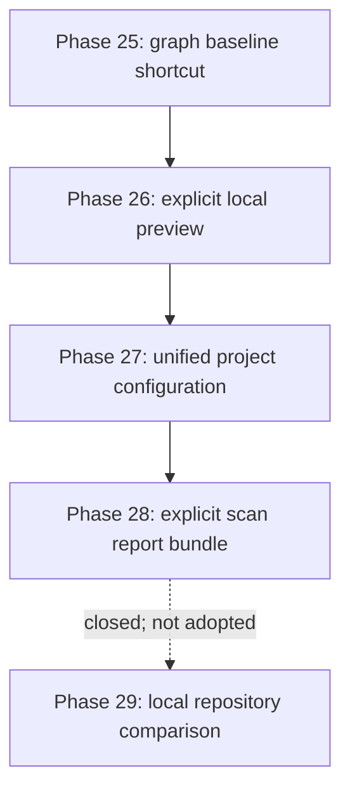

# Backend API Intelligence - Workflow Improvements Implementation Plan

## Purpose and authority

This is the implementing agent's execution plan for workflow improvements after the
completed analysis and reporting roadmap. It starts at Phase 25. The post-MVP roadmap
through Phase 23 is complete; Phase 24 was closed without implementation on 2026-08-24
and is not a dependency of this work.

The proposals were evaluated against the current CLI, strict artifact schemas,
deterministic publication, cancellation behavior, local-first operation, and the rule
that derived consumers cannot invent facts. Planning baseline: 2026-08-24.

No new source-control commands, refs, provider integrations, or related automation are
in scope. Existing scan behavior is unchanged. Repository comparison in this plan
means two explicit local directory paths.

---

# 1. Executive decisions

| Proposal                             | Complexity    | Decision                       | Final boundary                                                                                                                                                                                          |
| ------------------------------------ | ------------- | ------------------------------ | ------------------------------------------------------------------------------------------------------------------------------------------------------------------------------------------------------- |
| `graph --baseline`                   | S             | Adopt                          | Compute `ImpactDocument` in memory from one explicit baseline and the positional current analysis. Keep `--impact-results` for durable/audited workflows.                                               |
| Single-command repository comparison | L             | Closed; not adopted            | The projected orchestration/publication surface is not justified after adopting the baseline shortcut. Retain the standalone scan, diff, impact, and graph commands.                                    |
| `--open` / `-O`                      | S-M           | Adopt with safety changes      | Make preview an explicit CLI-only side effect after successful publication. Use a shell-free, injectable platform launcher and treat launch failure as a visible warning without deleting the artifact. |
| `scan --all` / `--with-graph`        | L as proposed | Partially adopt                | Add explicit `--with-graph`, `--with-controls`, and `--with-openapi <document>` selections. Reject ambiguous `--all`; OpenAPI cannot be generated honestly without a source document.                   |
| Project configuration                | M-L           | Adopt after schema unification | Evolve the existing strict policy configuration into one backward-compatible project configuration. Do not create a competing config file or execute JavaScript/TypeScript configuration.               |

Required Phases 25-28 total approximately **72-122 focused hours**. Phase 29's
historical **32-56 hour** estimate is excluded because the phase is closed.

## 1.1 Important modifications

- `graph --baseline` is a convenience path, not a replacement for `impact`. The
  standalone command remains the durable JSON/Markdown audit path.
- The composite command is named `compare` because `diff` and `impact` already consume
  analysis files. Its operands are always local repository directories, never inferred
  states.
- A comparison bundle writes `before/analysis.json`, `after/analysis.json`,
  `diff.json`, and `impact.json`; `impact-graph.html` is opt-in. Keeping these artifacts
  makes the result reproducible and debuggable.
- Node provides process-launching primitives, not a dedicated cross-platform
  default-browser API. Preview therefore needs a narrow platform adapter. It must use
  argument arrays with `shell: false`; report paths never enter a shell command string.
  See the official [Node child-process API](https://nodejs.org/api/child_process.html).
- `openBrowser` is deliberately excluded from configuration. Opening a desktop program
  must require `--open` on the current invocation so CI, automation, and a checked-in
  config cannot unexpectedly launch a GUI.
- Do not use a nonexistent `https://api-intel.dev/schema.json`. Ship a JSON Schema with
  the tool and document a local/install-relative `$schema` value. Runtime config loading
  never fetches the schema or any other network resource.
- Keep the established `api-intel-graph.html` filename for ordinary graph output. Do
  not introduce a second `graph.html` name for bundled scans.

## 1.2 Ideas not adopted

- `--all`, because its meaning changes as reporters are added and it hides required
  inputs such as an OpenAPI document.
- Automatic preview from configuration or by default.
- Destructive replacement of an entire output directory to simulate transactionality.
- Concurrent dual scans by default; doubling peak TypeScript-program memory is a poor
  trade for a convenience command.
- A second workflow config alongside the existing policy config.
- Any new repository-state discovery or implicit selection of comparison inputs.

---

# 2. Target workflow and dependency order



Phase 25 is the immediate high-value change. Phase 26 establishes one safe preview
boundary before multiple commands can request it. Phase 27 establishes precedence,
path, and compatibility rules before scan orchestration expands. Phase 28 builds the
shared artifact-planning primitives for multi-output scans. Phase 29 is closed without
implementation; the explicit standalone comparison workflow remains available.

## 2.1 Shared invariants

1. All analysis, diff, impact, policy, structured-export, and graph documents continue
   to pass their existing strict validators.
2. Convenience commands call existing domain functions. They do not duplicate
   comparison, impact, policy, export, or graph semantics in CLI code.
3. Inputs are fully loaded and all derived contents are validated/rendered before
   publication begins.
4. Every individual file is atomically replaced. A versioned bundle manifest, when
   present, is written last and is the completeness marker for a multi-file operation.
5. Cancellation before commit leaves valid prior artifacts untouched. Once commit
   starts, prepared files finish consistently with the existing publication rule.
6. Fact-affecting settings enter `analysisRun.configuration` and analysis identity.
   Output paths, report selection, graph display limits, and preview do not.
7. CLI flags override project configuration, which overrides built-in defaults.
8. No convenience feature executes target modules, starts NestJS, connects to a
   database, or performs a network request.

---

# 3. Phase 25 - In-memory baseline impact for `graph`

## Goal

Generate an impact-aware graph from two canonical analyses without requiring the user
to serialize an intermediate `impact.json`.

## Estimated effort

8-14 focused hours. Feasibility: high.

## CLI contract

```text
api-intel graph <current-analysis.json> --baseline <before-analysis.json> [graph options]
```

- Add `--baseline <analysis.json>` and short form `-b`.
- `--baseline` and `--impact-results` are mutually exclusive.
- The positional analysis is always the current/after side.
- Load and validate both canonical inputs with the existing input boundary, then call
  `analyzePotentialImpact(before, current)` directly.
- Pass the resulting validated `ImpactDocument` through the existing graph projection,
  integrity validation, CSP rendering, and atomic writer.
- Do not write `impact.json` from this convenience path.
- Keep the existing `impact` command unchanged for users who need a durable result or
  Markdown explanation.

## Required tests

- Baseline-generated HTML is byte-identical to HTML generated from the same serialized
  `impact.json`.
- Before/after direction is preserved for added and removed paths.
- Baseline plus explicit impact results fails as a usage error before publication.
- Invalid, failed, canceled, unsupported-version, and mismatched inputs map to the
  existing stable exit categories.
- Policy overlays still compose with in-memory impact.
- Cancellation and derivation failure preserve a prior graph file.
- The output directory contains no newly created `impact.json`.

## Exit gate

The example two-snapshot fixture produces the same impact graph through either input
path, and all existing graph/impact tests remain unchanged and passing.

## Completion record (2026-08-24)

- Implemented `--baseline <before-analysis.json>` and `-b` in
  `src/cli/commands/graph.ts`, including pre-I/O mutual exclusion with
  `--impact-results`, canonical input-state error mapping, and cancellation checks on
  both sides of synchronous impact derivation.
- Reused `analyzePotentialImpact(before, current)` in memory and passed its document
  through the unchanged graph projection, validation, CSP renderer, and atomic writer.
  The shortcut never publishes `impact.json`; the standalone `impact` command remains
  the durable-artifact workflow.
- Added `test/cli/phase25-graph-baseline.test.ts` for long/short flags, direction,
  byte-equivalence, policy composition, stable exits, cancellation, atomic
  preservation, and the no-intermediate-file guarantee. Added
  `test/unit/documentation/phase25-graph-baseline.test.ts` for the public contract and
  roadmap decisions.
- Updated `README.md`, `docs/cli-workflow.md`, and
  `docs/offline-graph-report.md`. Added the reproducible measurement record
  `docs/benchmarks/phase25-graph-baseline.md`.
- Five benchmark repetitions on Node.js 22.13.1/Windows x64 produced byte-identical
  528,478-byte graphs. Median baseline generation was 641.20 ms versus 1,252.65 ms for
  explicit `impact` then `graph`, a 48.81% local wall-time reduction, with no
  `impact.json` in baseline outputs.
- A compiled-CLI smoke test using paths containing spaces produced byte-identical
  548,572-byte baseline and serialized-impact reports and left no intermediate impact
  document in the baseline output.
- Verification passed: `pnpm run test -- --maxWorkers=1` (86 files, 217 tests),
  `pnpm run lint`, `pnpm run typecheck`, `pnpm run build`, and a targeted Prettier check
  over every Phase 25 source, test, documentation, benchmark, plan, and integrated
  golden artifact.
- The integrated golden was refreshed for the user's current example-app source
  formatting only after a normalized comparison proved its semantic payload unchanged;
  its deterministic clean-scan and reversed-discovery-order test passes.

---

# 4. Phase 26 - Explicit local HTML preview

## Goal

Open a successfully published graph in the user's desktop browser only when explicitly
requested.

## Estimated effort

10-18 focused hours. Feasibility: high on supported desktop platforms and explicitly
degraded in headless environments.

## CLI and effect boundary

```text
api-intel graph <analysis.json> --open
api-intel graph <analysis.json> -O
```

- Add one injectable `openLocalArtifact(absolutePath)` capability at the CLI I/O/runtime
  boundary; domain and output modules must not launch processes.
- Invoke it only after the graph writer has committed the final file.
- Use platform commands through `child_process.spawn()`/`execFile()` with `shell: false`,
  a hidden window where relevant, and the absolute path as one argument.
- Support Windows, macOS, and Linux. Unknown platforms and missing launchers produce a
  concise warning containing the already-published path.
- A preview failure does not remove the artifact and does not reclassify successful
  generation as analysis failure. It is reported as a partial-success warning while
  the command retains exit code 0.
- Do not add preview settings to project configuration.

## Required tests

- Platform command/argument selection uses injected process-launch fakes.
- Spaces, quotes, ampersands, and shell metacharacters remain a single non-shell path
  argument.
- Launch happens after publication and never happens when rendering/publication fails.
- Missing executable, headless environment, child error, and cancellation are visible
  without corrupting or deleting the graph.
- No real browser is opened by automated tests.

## Exit gate

Manual smoke tests on the available desktop platform open the exact generated file;
automated platform-adapter tests prove shell-free argument handling and graceful
degradation.

## Completion record (2026-08-24)

- Added the optional `CliIo.openLocalArtifact(absolutePath, signal)` effect and the
  `src/cli/local-artifact-preview.ts` adapter. Graph projection, rendering, and output
  modules remain process-free.
- Added `graph --open` and `-O`. Preview is invoked only after the atomic writer returns
  the committed absolute path. Successful launch is reported on stdout; any
  post-publication launch error is a warning containing that path and retains exit code 0. Pre-publication failures and cancellation preserve their existing exit behavior
  and never launch.
- Used `execFile()` with `shell: false` on every platform. Windows uses
  `rundll32.exe url.dll,FileProtocolHandler` with a hidden window, macOS uses
  `/usr/bin/open`, and graphical Linux uses `xdg-open`. Unsupported platforms and Linux
  sessions without `DISPLAY` or `WAYLAND_DISPLAY` fail explicitly at the preview
  boundary. The absolute artifact path remains one discrete argument even when it
  contains spaces or shell metacharacters.
- Added `test/unit/cli/local-artifact-preview.test.ts` and
  `test/cli/phase26-graph-open.test.ts` for platform selection, argument integrity,
  missing launchers, unsupported/headless environments, child errors, launch ordering,
  publication failure, and preview cancellation. All automated tests use fakes and do
  not open a browser.
- Updated `README.md`, `docs/cli-workflow.md`, and
  `docs/offline-graph-report.md`; added
  `test/unit/documentation/phase26-graph-preview.test.ts` for the published contract.
- A compiled Windows smoke test opened the exact generated report in the default
  browser in 1.43 seconds. The report represented 7 endpoints, measured 545,726 bytes,
  and had SHA-256
  `AAE15B373B4F6746FA8C45EE81AE30A4F3AE7769AA39C7A89DA28ECCE47DBEDD`. Its isolated
  temporary smoke directory was verified and removed afterward.
- Verification passed: `pnpm run test -- --maxWorkers=1` (89 files, 226 tests),
  `pnpm run lint`, `pnpm run typecheck`, `pnpm run build`, and a targeted Prettier check
  over every Phase 26 source, test, and documentation artifact.

---

# 5. Phase 27 - Unified strict project configuration

## Goal

Let a repository declare stable analysis and output defaults without introducing a
second configuration language or breaking existing policy files.

## Estimated effort

24-40 focused hours. Feasibility: high with explicit migration tests.

## Configuration decision

Evolve `api-intel.config.json` to version 2. Version 1 policy-only files remain valid
for `check`. Version 2 owns these categories:

```json
{
  "$schema": "./schemas/api-intel.config.schema.json",
  "version": 2,
  "analysis": {
    "maxCallDepth": 3,
    "rawSqlDialect": "postgresql-18"
  },
  "output": {
    "directory": ".api-intel"
  },
  "rules": {
    "require-guard-on-write-endpoint": "error"
  },
  "reports": {
    "graph": {
      "enabled": true,
      "maxNodesPerEndpoint": 120,
      "maxEdgesPerEndpoint": 180
    }
  }
}
```

The exact schema remains strict. `reports` begins with graph settings; Phase 28 may add
optional policy, controls, and OpenAPI recipes without changing existing version 2
documents.

## Discovery, paths, and precedence

- `scan <repository>` checks only `<repository>/api-intel.config.json`; it never walks
  parent directories.
- `--config <path>` selects an explicit file. `--no-config` disables exact-root
  discovery. Supplying both is a usage error.
- Config-relative input paths resolve from the config file's directory.
- An output directory from an auto-discovered config must remain inside the analyzed
  repository. An explicit CLI `--output` may intentionally select another location.
- CLI flags override config values. A conflicting pair of CLI flags remains an error;
  precedence must not silently choose between two explicit user instructions.
- `$schema` is editor metadata only. The loader never resolves or fetches it.
- Unknown keys, unknown rule IDs, invalid paths, and invalid ranges fail before scan.
- Normalized effective configuration is visible in `run.json`; only the existing
  fact-affecting analysis subset enters canonical analysis identity.

## Implementation boundary

- Create one project-config loader/normalizer and reuse the existing policy rule
  normalizer rather than maintaining parallel rule schemas.
- Keep version 1 fixtures byte-compatible.
- Add a bundled JSON Schema artifact and verify it against runtime acceptance/rejection
  fixtures.
- `scan --with-graph` and `reports.graph.enabled` may generate the graph from the
  in-memory analysis. `--open` remains an explicit invocation-only override.

## Required tests

- Missing config, exact-root discovery, explicit config, `--no-config`, and no parent
  traversal.
- Version 1 policy compatibility and strict version 2 category validation.
- CLI-over-config precedence for call depth, SQL dialect, output, and graph limits.
- Auto-config output escape rejection and explicit-output behavior.
- `$schema` never causes a network or filesystem read.
- Presentation-only changes do not change analysis identity or canonical facts.
- Configured graph output matches the standalone graph command for the same analysis.

## Exit gate

A repository can run `api-intel scan .` with a strict checked-in JSON config and obtain
the same canonical analysis and graph as the equivalent explicit CLI flags, while all
legacy policy configs continue to work.

## Completion record (2026-08-24)

- Added a single strict configuration contract split into shared policy-rule settings,
  version-2 project settings, and one loader. Existing version-1 policy files retain
  their rule syntax and normalized policy-results contract; `check` also accepts a
  version-2 file when `rules` is present.
- Added exact-root `api-intel.config.json` discovery plus explicit `--config` and
  `--no-config`. Discovery never traverses parents. The loader treats `$schema` as inert
  metadata, rejects unknown keys/versions/rules/ranges before analysis, resolves
  configured output relative to the config file, and prevents auto-discovered output
  from escaping the analyzed repository.
- Added deterministic CLI-over-config precedence for maximum call depth, the supported
  raw-SQL dialect, output, graph selection, and graph limits. Explicit invalid values
  remain errors rather than falling back. `scan --with-graph`, configured graph recipes,
  and invocation-only `--open` reuse the existing in-memory graph builder, renderer,
  atomic writer, and Phase 26 preview boundary.
- Extended version-2 `run.json` with strict `projectConfiguration` metadata containing
  source kind/path/version, effective analysis settings, resolved output, normalized
  rules, and graph settings. Only the existing analysis configuration enters the
  analysis-run identity; tests prove presentation-only changes leave canonical JSON
  byte-identical.
- Replaced the policy-only editor schema with a bundled version-1/version-2 union in
  `schemas/api-intel.config.schema.json`. It is generated from the runtime Zod contract
  by `scripts/generate-config-schema.mjs`; explicit completion of refined path and tuple
  constraints keeps editor acceptance aligned with runtime acceptance.
- Added `test/unit/config/project-config.test.ts`,
  `test/cli/phase27-project-config.test.ts`, and
  `test/unit/documentation/phase27-project-config.test.ts`, plus the compiled-smoke
  fixture `test/fixtures/project-config/example-v2.config.json`. Coverage includes
  missing/discovered/explicit/disabled config, no parent traversal, version migration,
  strict validation, path containment, precedence, schema parity, identity stability,
  configured preview ordering, and standalone graph equivalence.
- Added `docs/project-configuration.md` and updated README, CLI, architecture, policy,
  and PostgreSQL raw-SQL documentation. No runtime dependency was added.
- A compiled scan of the example repository with an explicit version-2 config completed
  in 3.45 seconds; standalone graph generation completed in 0.69 seconds. Both produced
  byte-identical 537,282-byte graphs with SHA-256
  `5F7E4B0FDA8FA0BEDB4FCC899F777DBED8AD8D0651AE38874D3CC3BB862C161E`. The validated
  `run.json` recorded source `explicit`, file version 2, depth 3, graph enabled, and
  40/60 display limits. The isolated smoke directory was removed afterward.
- Verification passed: `pnpm run test -- --maxWorkers=1` (92 files, 232 tests),
  `pnpm run lint`, `pnpm run typecheck`, `pnpm run build`, direct schema regeneration,
  and a targeted Prettier check over every Phase 27 artifact.

---

# 6. Phase 28 - Explicit multi-artifact scan bundle

## Goal

Scan once and derive a selected report bundle from the same in-memory validated
analysis without an ambiguous `--all` switch.

## Estimated effort

30-50 focused hours. Feasibility: medium-high; publication coherence is the main work.

## CLI contract

```text
api-intel scan <repository> --with-graph [--open]
api-intel scan <repository> --with-controls
api-intel scan <repository> --with-openapi <openapi.json>
```

- Markdown catalogue, contracts, and traces remain the normal scan outputs.
- `--with-graph` adds `api-intel-graph.html`.
- `--with-controls` adds `control-evidence.json` and `control-evidence.csv`.
- `--with-openapi <document>` adds the existing enriched copy and sidecar; the document
  path is mandatory and the source is never overwritten.
- Version 2 config gains equivalent optional report recipes. OpenAPI enablement always
  includes an explicit document path.
- If a policy recipe is explicitly enabled and `rules` are present, evaluate once,
  publish `policy-results.json`, and pass it to graph/controls. Policy violations retain
  the existing policy exit semantics after complete artifacts are published.
- `--open` is valid only when a graph is requested by CLI or configuration.
- Do not add `--all`.

## Publication design

- Refactor reporters into pure prepare/render steps plus existing validators.
- Build an artifact plan containing resolved destinations, contents, and hashes before
  writing any requested file.
- Reject duplicate destinations and source/output collisions before commit.
- Reuse the report-manifest cleanup rules for traces.
- Publish a strict `bundle.json` manifest last with requested reporters, artifact paths,
  content hashes, input snapshot IDs, and completion state. It is derived run metadata,
  not a new fact document.
- Preserve valid previous artifacts when preparation or cancellation fails.

## Required tests

- Every valid flag/config combination and all missing-input/conflict cases.
- Scan-once instrumentation proves derived reporters do not reload or rescan source.
- Bundled files are byte-identical to standalone command outputs for the same inputs.
- OpenAPI source immutability and all destination-collision cases.
- Policy pass/warn/error/unknown behavior with graph and controls overlays.
- Cancellation at preparation and commit boundaries, including prior-bundle survival.
- Deterministic bundle manifest apart from explicitly non-canonical run timing fields.

## Exit gate

One scan produces each explicitly requested artifact with standalone-equivalent bytes,
one final completeness manifest, no duplicate analysis, and no implicit external input.

## Implementation status (completed 2026-08-24)

- Added explicit `scan --with-controls` and `scan --with-openapi <openapi.json>`
  selection alongside the existing graph/preview flags. The CLI remains strict and
  deliberately rejects `--all`; OpenAPI is never discovered implicitly.
- Extended strict version-2 configuration with optional `policy`, `graph`, `controls`,
  and discriminated `openapi` report recipes. Policy enablement requires non-empty
  rules, OpenAPI enablement requires an explicit document, paths resolve from the
  selected config, CLI selection takes precedence, and the generated JSON Schema stays
  sourced from the runtime Zod contract.
- Refactored analysis, policy, graph, controls, and OpenAPI writers into shared
  prepare/render steps. A scan now validates and renders all requested bytes from one
  in-memory analysis and, when selected, one policy evaluation before any destination
  is replaced. The same serializers remain behind the standalone commands.
- Added a strict `bundle.json` schema and semantic validator. Its deterministic
  inventory records the selected reporters, analysis/OpenAPI input snapshot IDs,
  output-relative artifact paths, SHA-256 content hashes, byte sizes, and canonical or
  run-metadata stability. Required reporter artifacts and matching input identities are
  integrity-checked; the manifest excludes itself and is committed last.
- Added pre-commit duplicate, output-boundary, generated-manifest, and protected-input
  collision checks. OpenAPI source bytes remain immutable. Trace cleanup reuses the
  safe generated-report manifest, publishes its final state in the coherent plan, and
  removes only previously tracked stale traces after successful commit. Preparation or
  pre-commit cancellation preserves an existing complete bundle.
- Policy results are evaluated once, published as JSON, and shared directly with graph
  and controls. Warning findings retain exit code 0; blocking findings return exit code
  8 only after all artifacts and the complete bundle manifest have been published.
- Added focused Phase 28 unit, CLI, configuration, and documentation coverage for
  scan-once instrumentation, CLI/config selections, strict missing-input rejection,
  `--all` rejection, standalone byte equivalence, policy overlays and exit behavior,
  input immutability, destination collisions, deterministic inventory, and prior-bundle
  survival under cancellation.
- Added `docs/selected-scan-bundles.md` and updated README, CLI workflow, project
  configuration, architecture, runtime metadata, and the generated configuration
  schema. No runtime dependency was added.
- A compiled one-scan smoke run over `example-nestjs-app` completed with 7 endpoints,
  7 diagnostics, and a 537,284-byte offline graph. Its final manifest described 17
  artifacts and 2 input snapshots; independent SHA-256 and byte-size verification
  matched every entry. The isolated smoke output was removed afterward.
- Verification passed: `pnpm run test -- --maxWorkers=1` (95 files, 239 tests),
  `pnpm run lint`, `pnpm run typecheck`, `pnpm run build`, direct configuration-schema
  regeneration, and a targeted Prettier check over maintained source, tests,
  documentation, schemas, and plans. The repository-wide Prettier command additionally
  reports only pre-existing user-owned generated files under `.tmp`, which were not
  modified.

---

# 7. Phase 29 - Local repository comparison bundle (closed; not adopted)

## Adoption review outcome

Closed on 2026-08-24 without implementation. The Phase 25 baseline shortcut removes
the unnecessary intermediate impact file for the primary interactive workflow, while
the existing explicit scan, diff, impact, and graph commands preserve clear inputs and
auditable artifacts. A composite two-directory scanner would add disproportionate
configuration, memory, cancellation, collision, and multi-file publication complexity.
Reconsideration requires new measured demand and a separate explicit adoption review.

## Goal

Reduce repeated local two-directory comparisons to one command while preserving the
canonical snapshots and derived evidence needed to audit the result.

## Estimated effort

32-56 focused hours. Feasibility: medium-high after Phase 28.

## Go/no-go prerequisite

Proceed only if real use after Phases 25-28 still shows frequent manual paired scans.
If `graph --baseline` plus configured scan bundles are sufficient, close this phase
without implementation.

## CLI contract

```text
api-intel compare <before-directory> <after-directory> --output <directory> [--config <path>] [--graph] [--open]
```

- Require an explicit output directory because neither input repository naturally owns
  a two-sided comparison bundle.
- Scan before then after with the same normalized fact-affecting settings, bounding
  peak memory and preventing configuration differences from masquerading as source
  changes. `compare` does not auto-discover separate configs from each input: it uses
  built-in defaults or one explicit common `--config`.
- Permit explicit before/after `tsconfig` paths where necessary, but reject incompatible
  effective analysis configurations.
- Compute existing `DiffDocument` and `ImpactDocument` instances in memory.
- Always publish `before/analysis.json`, `after/analysis.json`, `diff.json`,
  `impact.json`, and a final `comparison-bundle.json` manifest.
- `--graph` publishes `impact-graph.html` from the after analysis plus the in-memory
  impact result. `--open` requires `--graph` and uses the Phase 26 launcher.
- Print stable endpoint, direct/transitive impact, unreachable-file, and artifact-path
  summaries.

## Deliberate boundaries

- Two explicit local directories only.
- No hidden repository copying or mutation.
- No watch mode, daemon, background cache, or automatic preview.
- No new comparison semantics; reuse `compareAnalysisDocuments()` and
  `analyzePotentialImpact()` exactly.

## Required tests

- Same, changed, partial, failed, canceled, and configuration-mismatch scans.
- Sequential scan instrumentation and shared configuration.
- Composite diff/impact/graph bytes match the equivalent standalone workflow.
- Output/input nesting, destination collision, existing bundle, and cancellation cases.
- `--open` dependency and preview-failure behavior.
- A compiled two-directory smoke benchmark with peak memory and total duration recorded.

## Exit gate

The example before/after directories produce a complete, reproducible comparison bundle
equivalent to the standalone four-step workflow, without changing either input tree.

---

# 8. Cross-phase verification

Every implemented phase must pass:

1. Focused positive, negative, ambiguity, integrity, cancellation, and CLI tests.
2. The complete test suite with one worker, lint, typecheck, production build, and
   formatting check.
3. Compiled-CLI smoke verification using paths containing spaces.
4. Byte-determinism checks against equivalent existing workflows.
5. No-network and no-target-execution checks.
6. Documentation updates to README, CLI workflow, architecture, and the affected
   feature guide.
7. A measured benchmark when a phase adds scanning, rendering, or process launch.
8. Dependency review before adding a package; the preferred preview design adds none.

---

# 9. Progress ledger

| Phase | Status                | Intended outcome                                             |
| ----: | --------------------- | ------------------------------------------------------------ |
|    24 | Closed                | Editor extension not adopted on 2026-08-24                   |
|    25 | Complete (2026-08-24) | In-memory baseline graph with byte-equivalent impact overlay |
|    26 | Complete (2026-08-24) | Safe explicit local HTML preview                             |
|    27 | Complete (2026-08-24) | Backward-compatible strict project configuration             |
|    28 | Pending               | Explicit scan-time graph/controls/OpenAPI bundle             |
|    29 | Closed                | Local repository comparison not adopted on 2026-08-24        |

When a phase completes, record the date, exact artifacts, test counts, commands, and
measured performance. A conditional phase may be closed without implementation when
its adoption evidence is insufficient.

---

# 10. Immediate next action

Phases 25-27 are complete and all exit gates pass. Phase 28 is the next eligible phase:
implement only the explicit coherent scan-time graph, controls, policy, and OpenAPI
bundle described above. Do not add `--all`, implicit external inputs, or Git-facing
behavior. Phase 29 is closed and is not part of the execution sequence.
