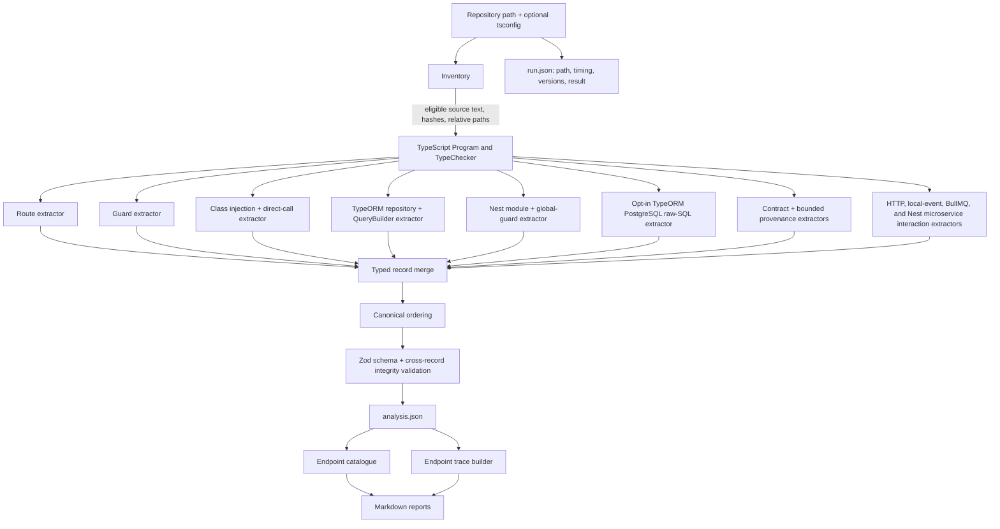
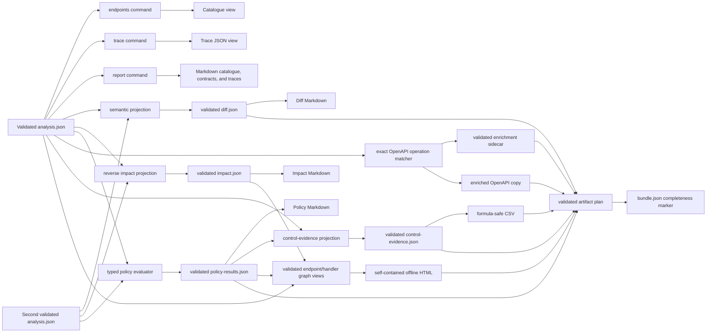
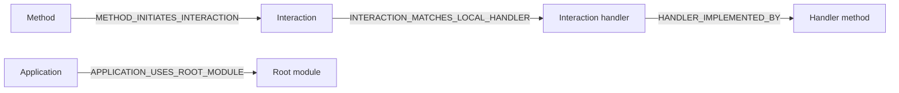

# Architecture

## Pipeline

The analyzer does not load target JavaScript modules. Inventory reads eligible source
bytes, then the TypeScript compiler creates syntax trees and a checker. Type
declarations from installed dependencies are used for semantic identity, but target
application code is never imported or evaluated.

## Stage responsibilities

### Safe inventory

Inventory resolves the repository boundary, normalizes repository-relative paths,
hashes source content, and excludes dependencies, VCS data, build output, coverage,
analyzer output, binaries, oversized files, and source symlinks. Eligible target source
is retained in memory so Program construction can reuse the indexed text.

### Semantic index

The TypeScript adapter parses one primary project and exposes a `Program`,
`TypeChecker`, compiler diagnostics, and an index of source files, imports, classes,
constructors, parameters, methods, decorators, and symbols. Package decorator identity
uses resolved imports and declaration files rather than raw names.

### Narrow extractors

Extractors emit typed records, evidence, assertions, and diagnostics. Each relationship
has a stable rule ID. The route extractor establishes endpoint-to-handler facts before
the guard extractor attaches direct declarations. Class and call extraction proves
constructor member bindings and direct calls. TypeORM extraction proves entity/table,
repository/entity, repository-method table access, and bounded QueryBuilder state/table
relationships. QueryBuilder analysis publishes the same method/table predicates and
never publishes generated SQL or a query AST. The separate raw-SQL extractor proves
TypeORM receivers and static sources, then delegates to the pinned PostgreSQL 18
dialect adapter. Its bounded visitor publishes only physical table directions; parser
AST and SQL text stay private. Module extraction proves bounded
imports/providers/exports/controllers plus `APP_GUARD` and direct bootstrap global
registrations. Unsupported or ambiguous behavior is preserved without inventing a
resolved edge.

Interaction extractors prove package-backed HTTP clients, configured in-process
events, the bounded BullMQ queue/worker surface, and bounded Nest microservice
producers/handlers. They publish initiation and local
candidate assertions through the same merge/validation boundary. Queue candidates
remain open-world and distributed-conditional; no extractor contacts a network or
broker.

The Nest contract extractor inventories supported request decorators and declared or
checker-derived response shapes. It resolves referenced in-repository class/interface
fields without executing mapped-type or validator code. TypeORM persistence extraction
also publishes bounded entity-column declarations and literal option states. These
records are declaration metadata only. The provenance passes may link their field
identities through same-method explicit write sinks and immutable argument-to-parameter
frames over already proven direct calls. Call depth, expression depth, origin sets, and
frame counts are bounded. Reachability alone creates no value flow, and the passes do
not claim exact stored values, runtime validation, naming-strategy output, or
serialization behavior.

### Merge, canonicalization, and validation

Equivalent records from independent extractors are merged by stable ID, with unequal
collisions rejected. Canonicalization sorts records, roles, and evidence references and
recursively orders object keys. Validation then applies both the runtime schema and
cross-record constraints: reference kinds, global ID uniqueness, evidence hashes,
ranges, declaration roles, predicate endpoint kinds, evidence requirements, global
registration linkage/order, and global-state consistency.

Only validated analysis can cross the publication boundary.

## Canonical data versus derived reports

`analysis.json` is the fact source. Endpoint catalogues, traces, module visibility,
and effective guards are deterministic views over canonical assertions and global
registration records; they cannot infer additional routes, calls, guards, module
edges, or table access. This is why `report` can regenerate Markdown without rescanning
source.

`run.json` is intentionally separate. It contains the absolute input path, timestamps,
duration, tool/compiler versions, effective configuration, result state, and run-level
diagnostics. Normalized repeatability comparisons remove its volatile fields.
For CLI scans it also records project-config provenance, effective analysis values,
resolved output, normalized rules, and selected policy/graph/controls/OpenAPI settings.
Only the fact-affecting analysis configuration contributes to the canonical analysis
ID; presentation settings do not.

Two canonical analyses may also enter the comparison boundary. The comparator projects
snapshot-independent semantic tuples, reports collisions instead of guessing, and
publishes a separately versioned `DiffDocument`. Before/after canonical IDs remain in
that document only as audit references. The validated diff, rather than either source
analysis directly, is the sole input to diff Markdown.

The impact projection separately derives source additions, removals, and content-hash
changes from those two canonical inputs. It traverses before and after assertion graphs
with cycle and configured-depth bounds and publishes a separately versioned
`ImpactDocument`. Direct handler/guard changes, reachable changed methods, entity/table
connections, changed persistence facts, and relevant uncertainty remain distinct.
Changed but unreachable source files are reported rather than silently discarded. The
validated impact document is the sole input to impact Markdown.

The policy evaluator consumes the current canonical analysis and, only for diagnostic
comparison, an optional baseline through the semantic diff boundary. Seven fixed,
versioned rules produce explicit pass/fail/unknown/not-applicable results in a separate
validated `PolicyResultsDocument`. Strict JSON configuration selects rules and
severity; it cannot execute code, query arbitrary graph shapes, alter analysis depth
after scanning, or invent facts. Policy Markdown is derived only from that validated
result document.

The structured-export boundary is another derived consumer. OpenAPI enrichment maps
operations only by exact normalized method/path, records ambiguity and misses in a
separately versioned sidecar, and modifies a copy rather than the source document.
The control-evidence projection emits exactly one row per canonical endpoint and may
attach only validated policy results from the same snapshot. Its JSON is authoritative
for that export; CSV is a deterministic, formula-neutralized rendering. Neither
exporter creates canonical records, scans source, or fills gaps with inferred facts.

The offline graph projection consumes validated analysis plus optional same-snapshot
policy and impact documents. It reuses endpoint catalogue, endpoint and interaction-
handler traces, effective-guard, and request-provenance views; it cannot import
extractor internals or create canonical relationships. Every endpoint and canonical
interaction handler receives one bounded scene with explicit omitted counts.
The renderer safely embeds the validated view and pinned Cytoscape browser asset in one
HTML file, authorizes exact inline bytes with CSP hashes, blocks connections, and
provides a semantic table fallback. The HTML performs no source scan or client-side
analysis.

## Evidence and uncertainty

Every resolved assertion references one or more evidence records. Evidence points to a
hashed source file, uses one-based end-exclusive coordinates, and may include a bounded,
redacted convenience snippet. The source hash, not the snippet, anchors integrity.

Assertions distinguish `resolved`, `ambiguous`, `unresolved`, and `unsupported`.
Diagnostics carry stable codes for gaps that cannot honestly be represented as a
relationship. A successful partial scan uses `completed_with_gaps`; absence of a fact
is never silently converted into a positive claim.

## Publication and cancellation

Standalone artifacts are staged beside their destinations and renamed only after
complete writes. A scan first prepares and validates every selected artifact, including
hashes and protected-input collision checks, then stages the coherent plan.
`bundle.json` is committed last and is the only completeness marker. A generated-report
manifest tracks only tool-owned traces so stale generated reports can be removed after
a successful commit without touching unrelated files. Cancellation before commit
removes staging files and does not replace an existing complete bundle.

## Extension boundary

The current implementation stops at the patterns in [Supported Static-Analysis
Patterns](supported-patterns.md). Polymorphic/callback request flow, dynamic or
non-PostgreSQL SQL, pipes/interceptors/serialization behavior, unsupported HTTP
clients and general RxJS data flow, persistence history, monorepos, unsupported
messaging transports, PDF certification, fuzzy OpenAPI matching, hosted graph
services, unbounded repository-wide rendering, and AI narrative belong to later
phases.
New facts should enter through a deterministic
extractor and the same canonical validation boundary before any reporter consumes them.

### Analysis v5 interaction, branch, and authorization boundary

The current scanner supports `outbound_http`, `in_process_event`, `job_queue`, and
`microservice_message`. The chronology below
explains how that current boundary evolved; statements scoped to an earlier phase are
historical, not current capability claims.

Phase 30 adds an inert interaction topology without adding an interaction extractor:

That was the Phase 30 publication state: empty application/interaction/handler
collections and no supported or enabled interaction kinds. It let schema, integrity,
ordering, comparison semantic keys, and generic adjacency stabilize before HTTP or
event facts existed. V1/v2 normalized views still mark interaction families
`unavailable`; they are not treated as a proven empty scan.

Phase 31 activates only `outbound_http`. A dedicated checker-backed extractor runs
after class-call extraction and before persistence extraction, publishes eager
Axios/fetch/Undici interactions and method-initiation assertions, and merges them
through the same canonical ordering and integrity boundary. Application and handler
collections remain empty, and the other three reserved kinds remain unsupported.

Phase 32 extends that same kind with a separate Nest `HttpService` extractor. It
proves constructor member bindings, classifies supported RxJS activation ancestors,
and evaluates bounded symbolic ConfigService/environment target structure without
reading values. `axiosRef` reuses the eager request contract. Cold construction,
proven activation, unsupported activation, target resolution, and external boundary
remain independent canonical dimensions.

Phase 33 activates `in_process_event`. A package-proven extractor inventories HTTP
application roots, supported EventEmitter module registration, injected
`EventEmitter2` producers, and independent `@OnEvent()` handler declarations. Exact
identity matches become one-to-many candidate assertions; registration state remains
orthogonal and only proven registered handlers contribute endpoint causal table
effects. Endpoint and handler-rooted traversal use separate interaction-hop,
ordinary-call-depth, fan-out, and global-state bounds with path-aware cycle
termination.

Activation, process/broker boundary, dispatch timing, and handler registration are
separate states. A local-handler edge means a supported static candidate and cannot
prove delivery. Endpoint traces, Markdown, impact adjacency, semantic comparison, and
graph scenes consume local event paths.

Phase 34 completes the bounded-local milestone. Statically resolved
`EventEmitterModule.forRoot()` wildcard configuration gives handler targets an
explicit pattern/delimiter; a deterministic segment matcher implements `*` and `**`
and retains every matching exact/wildcard listener without ranking. V3 endpoint
traces publish separate synchronous, local-interaction, distributed-conditional,
outbound, and incompleteness fields. Comparison/impact, catalogues, control evidence,
OpenAPI extensions, and graph schema 3 consume those validated facts. Existing
guard-on-write policy and `dbReads`/`dbWrites` remain synchronous by definition.

Distributed Gate D0 freezes isolated BullMQ and Nest microservice topology fixtures,
pinned declaration surfaces, and strict semantic expectation manifests. Phase 35 now
activates only `job_queue`: package-proven `@InjectQueue()`/`Queue.add()` calls match
same-queue `@Processor()` classes extending `WorkerHost` as local queue-wide
candidates. Crossing that edge always yields `distributed_conditional` effects across
a broker/worker boundary. Producer-only and consumer-only topologies are normal;
delivery and remote consumers are not inferred.

Phase 40 preserves the queue-wide handler candidate while adding separate analysis-v4
dispatch, branch-selector, and branch-effect records. Exact producer jobs select only
compatible exact/common/unmatched effects. Unsupported control flow retains effects
under an unknown residual selector. Comparison, impact, Markdown, structured exports,
and graph views consume those records through independently versioned schemas; no
derived view upgrades a candidate edge into broker delivery.

Phase 41 preserves the v4 branch substrate and adds two orthogonal analysis-v5
collections: authorization metadata and metadata-to-guard enforcement relationships.
Extraction runs after direct guard/module facts so a composite wrapper can contribute
an exact guard declaration while a configured mapping can reference an already proven
endpoint or application-global guard. Metadata values are reduced to redacted shape.
The report, comparison, policy, and graph layers consume the relationship state without
turning metadata into a guard or claiming runtime authorization.

Phase 36 activates `microservice_message`. It inventories direct microservice and
bounded hybrid roots, static TCP/Redis/RMQ/Kafka transports, checker-proven
`ClientProxy.send()`/`emit()` producers, canonical scalar/plain-JSON patterns, and
controller pattern handlers. Exact candidates require matching mode, application,
pattern, and transport. Event candidates may fan out; duplicate request handlers are
ambiguous and non-traversable. Every downstream handler effect remains
`distributed_conditional`; no broker topology, delivery, acknowledgement, or remote
consumer is inferred.
